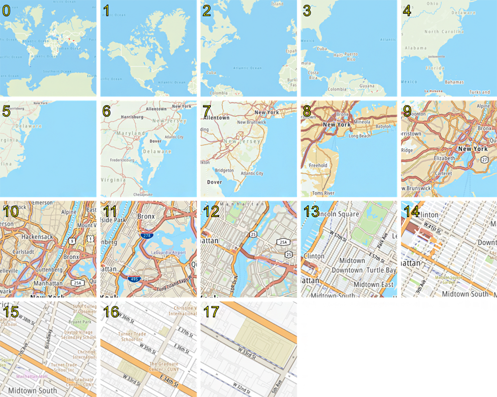
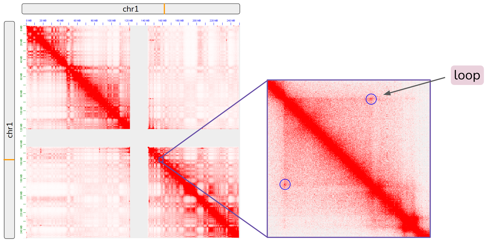
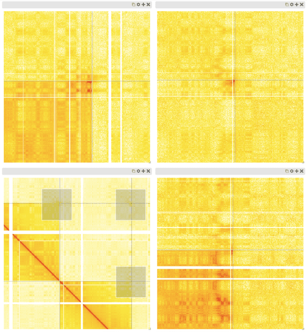
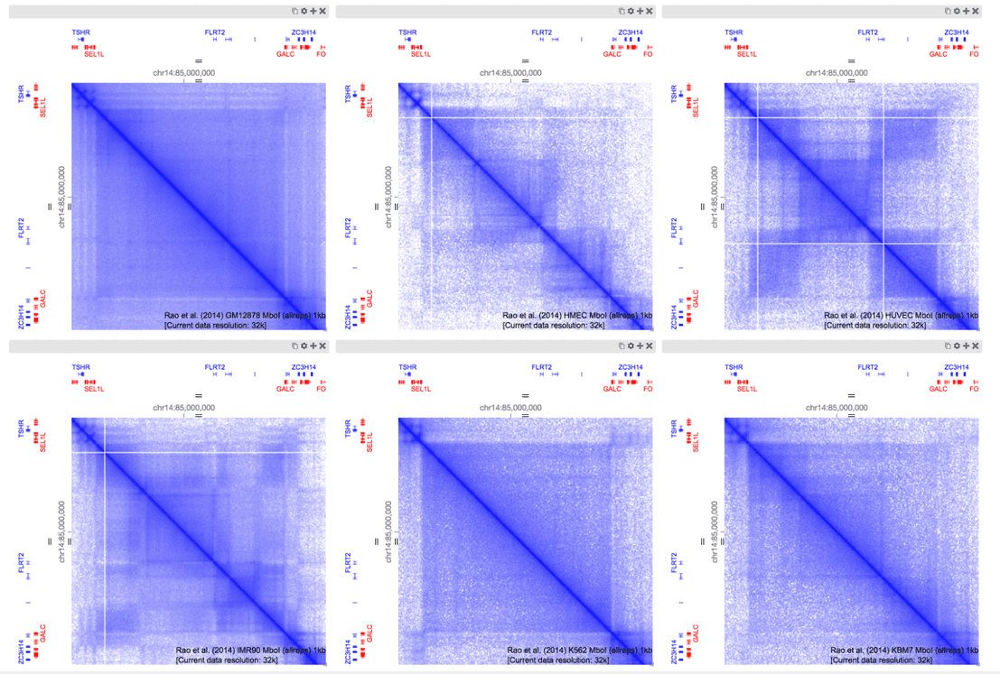
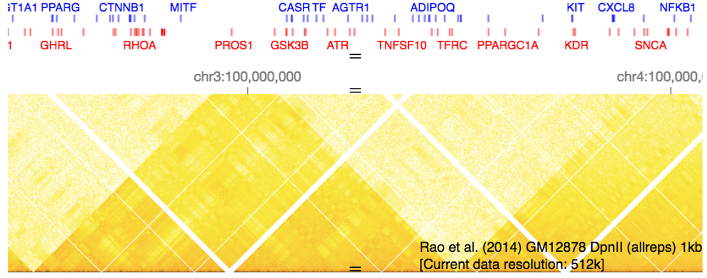
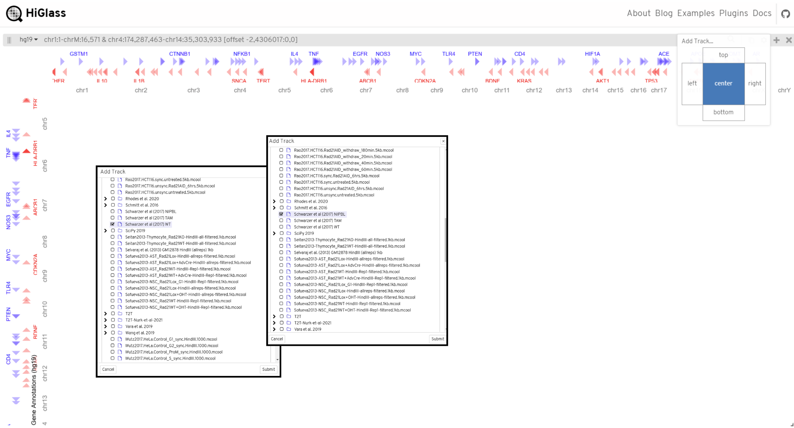
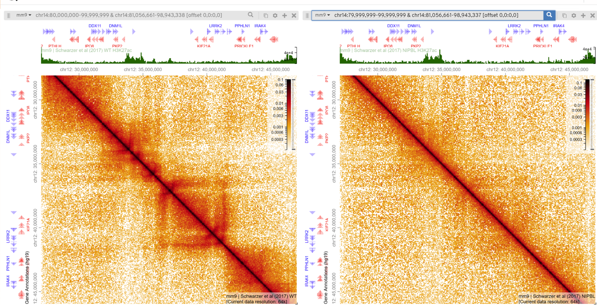

#  HiGlass: Visualizing Hi-C Assays
Group 2: Michael Chan, Kyra Fetter, Dhruv Khatri
1. [Introduction](#1)
2. [Overview](#2) 
    2.1. [Why HiGlass?](#21) 
    2.2. [How It Works](#22) 
    2.3. [Hi-C Background](#23)
3. [Tracks and Views](#3)
4. [Preparing Data for HiGlass](#4) 
    4.1. [2D Tracks](#41) 
    4.2. [1D Tracks](#42)

5. [HiGlass in Action: Case Study](#5)

## 1. Introduction

The past decade has seen unprecedented growth in the number of publicly available chromosome conformation capture (3C) datasets (Hi-C, HiChIP, etc.) released, in addition to corresponding 1D genomic datasets (ChIP-seq, ATAC-seq, etc.) produced due to efforts spearheaded by large consortiums like the 4D Nucleome Network and the ENCODE Project, alongside those of individual labs [8,9]. This explosion in data output has prompted the need for sophisticated, seamless, and accessible data visualization tools in order to enable researchers to efficiently and effectively compare functional genomics and epigenomics datasets across multiple cell types, treatments, and conditions. 

HiGlass, developed in 2018 by the [HIDIVE Lab](https://hidivelab.org/) at Harvard Medical School [2], aims to address this need. HiGlass is an open source visualization tool for exploring large genomic datasets such as Hi-C contact matrices, enabling the visual interrogration of chromatin organization at multiple scales including compartments, TADs, and loops, among others, alongisde information from other high-throughput assays examining, for example, chromatin accessibility or transcription factor binding patterns [2]. 

> Check out the tool for yourself at https://higlass.io 

## 2. Overview

#### Why HiGlass?

The growing complexity and scale of genomic datasets in recent years have led to a surge in advanced visualization tools. Libraries like D3.js and tools such as Vega and Juicebox have been widely adopted, providing researchers with accessible and effective ways to create static and interactive visualizations. However, as datasets have grown to unprecedented sizes, these methods can struggle with performance at scale due to the need to load the entire dataset into memory [7].

The challenge is particularly evident with the advent of Hi-C contact matrices, which map spatial interactions within the genome. These matrices can contain billions of data points at multiple resolutions, pushing traditional tools beyond their limits [4].

> Further reading on Hi-C contact matrices and the assay itself is provided in the **Hi-C Background** section.

HiGlass is explicitly designed to tackle these issues. Inspired by online map tools like Google Maps, HiGlass seamlessly integrates zooming, panning, and synchronized views to allow the exploration of genomic data at multiple scales without sacrificing performance or responsiveness [2]. 

#### How It Works
HiGlass relies on sophisticated downsampling and splicing techniques to efficiently handle large-scale datasets [7]. These methods reduce the dataset's resolution for broad-scale views while preserving high-resolution details for focused exploration.

To dynamically load and render data in manageable chunks, HiGlass uses a tiling approach much like online maps load tiles of geographical data. Additionally, it leverages generic functions to enable flexible integration of custom data types and visualization modules, extending its utility beyond Hi-C matrices to other genomic and multi-dimensional data types.

> More details about these techniques can be found in the HiGlass team's blog posts.

#### Hi-C Background

Hi-C is a high-throughput chromosome conformation capture (3C) assay developed initially in 2009 [10]. An *in situ* Hi-C protocol was introduced in 2014 [3]. In brief, Hi-C is performed as follows: cells are first cross-linked with formaldehyde, resulting in covalent links between segments of chromatin that are proximal in 3D space. DNA is then digested with a restriction enzyme. The 5’ ends are filled with nucleotides, one of which is biotinylated. The resulting fragments are ligated. Then, a Hi-C library is created by shearing the DNA and selecting fragments with biotin tags using streptavidin beads. The library is finally sequenced using paired-end sequencing [3].  

Hi-C can report chromatin interactions between all loci pairwise (all-by-all). These include both interchromosomal and intrachromosomal interactions and may be structural (define TAD boundaries and often marked by CTCF) or regulatory (connect cis-regulatory elements to their target genes) [1]. 

Interactions are typically represented as a contact matrix, with one axis as the genome, the other as the same genome, and each cell containing the number of times those two portions of the genome were caught in close proximity. The genome is binned in sizes ranging from 5kb to 50kb and the contact frequency between any two bins is represented on a color scale. Points of focal enrichment represent chromatin loops, as shown below: 

## 3. Tracks and Views

HiGlass offers extensive view and track options to facilitate Hi-C data visualization, allowing researchers to customize their viewing experience based on their experimental conditions and data attributes.

### Views
Dynamic viewing capabilities allow for the efficient comparison of different conditions and changes within samples. For example, a researcher may desire to zoom into select regions of the contact matrix and make comparisons. This is readily achievable by creating multiple views which maintain the current state of the heatmap while also displaying the zoomed regions as separate matrices. Other methods often require zooming in the same matrix window and screenshotting to make comparisons, which is supoptimal. An example is shown below with three zoomed in windows showing telomere clustering, while one window provides the original view [6]: 

Additionally, users may desire to view the same region across multiple conditions simultaneously. Linked views facilitate this by allowing the user to load in multiple datasets and create side-by-side views. As the views are linked, actions performed in one window such as moving to explore the contact map will induce the same movement in the other windows. The example below makes use of linked views to explore structural differences between six different cancer cell lines [6]: 

### Tracks
There are various 1D and 2D tracks suitable for each data type and experimental condition [6]:

<table>
 <tbody>
    <tr>
        <th>Track</td>
        <th>Description</td>
        <th>Uses</td>
        <th>Example</td>
    </tr>
    <tr>
        <td>Bed-like (1D)</td>
        <td>Displays genomic features as horizontal bars or boxes</td>
        <td><ul><li>Visualizing ChIP-seq data or enriched regions</li><li>Highlighting structural variants or genomic intervals</li><li>Displaying annotations like enhancers or regulatory regions</li></ul></td>
        <td></td>
    </tr>
    <tr>
    <td>Gene annotations (1D)</td>
    <td>Shows gene labels and structures (exons, introns) and annotations along the genome</td>
    <td><ul><li>Representing gene structures (ex: exons, introns)</li><li>Annotating coding and non-coding genes</li></ul></td>
    <td></td>
    </tr>
    <tr>
    <td>Chromosome labels (1D)</td>
    <td>Labels chromosomes and corresponding boundaries</td>
    <td><ul><li>Whole-genome or multi-chromosome visualization</li></ul></td>
    <td></td>
    </tr>
    <tr>
    <td>Line/Point/Bar (1D)</td>
    <td>Visualizes numerical data</td>
    <td><ul><li>Viewing SNP densities, expression levels, or epigenetic modifications</li><li>Visualizing quantitative signals from genomic experiments (ex: ATAC-seq, RNA-seq)</li></ul></td>
    <td></td>
    </tr>
    <tr>
    <td>Heatmap (2D)</td>
    <td>Two-dimensional matrix visualization of interactions</td>
    <td><ul><li>Visualizing genome-wide interaction maps (ex: Hi-C)</li><li>Representing pairwise similarity or contact frequencies between loci</li></ul></td>
    <td></td>
    </tr>
    <tr>
    <td>Horizontal heatmap (2D)</td>
    <td>Represents interactions or scores as a heatmap along one axis</td>
    <td><ul><li>Showing continuous data, such as methylation levels or histone modifications</li><li>Visualizing genome-wide scores, like conservation or mutation rates</li></ul></td>
    <td></td>
    </tr>
    <tr>
    <td>Horizontal rectangle domains (2D)</td>
    <td>Displays genomic regions as rectangles along the genome</td>
    <td><ul><li>Displaying topologically associating domains (TADs) or chromatin loops</li><li>Annotating large-scale structural features in the genome</li></ul></td>
    <td></td>
    </tr>
    <tr>
    <td>Chromosome grid (2D)</td>
    <td>Highlights chromosome boundaries in grid form</td>
    <td><ul><li>Visualizing inter-chromosomal contact frequencies</li><li>Identifying structural patterns, such as translocations or rearrangements</li></ul></td>
    <td></td>
    </tr>
 </tbody>
</table>

## 4. Preparing Data for HiGlass
Preparing data from Hi-C experiments or annotations from ChiP-seq and RNA-seq experiments for import into HiGlass is a straightforward process. This guide outlines the essential tools and steps required to format and import your data into HiGlass successfully. 

### 2D Tracks
For visualization of chromatin contact structures from Hi-C sequencing data.

#### Tools required:  
Python (3.x)  
HiC-Pro  
Bowtie2 or BWA  
Cooler (Python library)  
Samtools (Optional)  

#### Steps:

1. Map reads in sequencing data to reference genome using Bowtie2 or BWA, here we will use Bowtie

`bowtie2 -x <reference_index> -1 <read1.fq> -2 <read2.fq> -S <output.sam> --very-sensitive -p <threads>`

- To run Bowtie, the reference genome needs to be indexed

  `bowtie2-build reference.fasta genome_index`

2. (Optional) Convert .sam file output into .bam file for downstream steps using Samtools

`samtools view -S -b input.sam > output.bam`

3. Convert reads into mapped pairs using HiC-Pro to generate contact matrix

`hic-pro -i <input_dir> -o <output_dir> -c <config_file>`

- HiC-Pro config file contains specific parameters such as genome size, restriction enzyme cut sites, and paths to required tools. Click here for more information: https://github.com/nservant/HiC-Pro/blob/master/config-hicpro.txt 

4. Use contact matrix output from HiC-Pro to make .cool files for HiGlass import by running Cooler

`cooler cload --field count bins.bed matrix.txt output.cool`

- bins.bed: BED file defining genomic bins from HiC-Pro 
- matrix.txt: matrix file from HiC-Pro 
- output.cool: name of the .cool file 

5. Import into HiGlass

### 1D Tracks
For viewing annotations from ChiP-seq or RNA-seq data to supplement contact map.

#### Tools required:  
Python (3.x)  
Bedtools  
Samtools (optional)  

#### Steps:

1. Complete respective analysis pipeline through genome alignment step. Obtain the .bam file for subsequent steps.

2. (Optional) Convert mapped reads in .sam file output into .bam file using Samtools.

`samtools view -S -b input.sam > output.bam`

3. Use Bedtools to convert .bam file to .bedgraph file.

`bedtools genomecov -ibam input.bam -bg > output.bedgraph`

4. Import into HiGlass

## 5. HiGlass in Action: Case Study

To explore the capabilities of HiGlass, we will examine a case study based off of the [Schwarzer, W., et al., 2017 Nature paper](https://www.nature.com/articles/nature24281). In this paper, they studied the effect of depleting NIBPL, a cohesin co-factor essential to chromatin loop formation through loop extrusion, on 3D genome architecture in adult mouse hepatocytes. 

First, begin by navigating to the HiGlass web app homepage: 

We will load two 2D tracks, one for wildtype (WT) and one for NIBPL knockdown. To do so, select "Add Track", the center panel, and choose our files of interest (add link to download here): 

This is what the HiGlass visualization should look like after both tracks have been added (WT on the left and NIBPL knockdown on the right): 

One of the novel features of HiGlass is its ability to create linked views, where zooming in or out or dragging a track in one view automatically scales or shifts the other views in sync. We can link the two views by selecting the settings icon in one of the views, clicking "Lock zoom and location with", and then choosing the other view: 

We can also add additional 1D tracks. Let's add a ChIP-seq signal track to each view. To do so, select the plus icon to add a new track, choose the top panel, and select the correct track file from the list: 

This is what the views look like once the 1D tracks have been added (see the green signal track above each contact map): 

Just like Google Maps, we can now zoom in on particular regions of interest on our contact maps. As an example, let's inspect the 20mb region on chr14. Enter the coordinates shown below into one of the search bars (we can do this for either view, as they are linked). Then select the search icon and zoom in to this region:  

Note the differences between the WT and NIBPL knockdown contact matrices: in the NIBPL knockdown, there is a clear loss of loops and TAD structures along the downward diagonal. From this region, we can infer that loop extrusion may not be able to occur as effectively in the absence of the NIBPL cohension loading factor. 

# References

[1] Fujita, Y., & Yamashita, T. (2021). Alterations in Chromatin Structure and Function in the Microglia. Frontiers in Cell and Developmental Biology, 8. https://doi.org/10.3389/fcell.2020.626541 

[2] Kerpedjiev, P., Abdennur, N., Lekschas, F., McCallum, C., Dinkla, K., Strobelt, H., Luber, J. M., Ouellette, S. B., Azhir, A., Kumar, N., Hwang, J., Lee, S., Alver, B. H., Pfister, H., Mirny, L. A., Park, P. J., & Gehlenborg, N. (2018). HiGlass: Web-based visual exploration and analysis of genome interaction maps. Genome Biology, 19(1), 125. https://doi.org/10.1186/s13059-018-1486-1 

[3] Rao, S. S. P., Huntley, M. H., Durand, N. C., Stamenova, E. K., Bochkov, I. D., Robinson, J. T., Sanborn, A. L., Machol, I., Omer, A. D., Lander, E. S., & Aiden, E. L. (2014). A 3D Map of the Human Genome at Kilobase Resolution Reveals Principles of Chromatin Looping. Cell, 159(7), 1665–1680. https://doi.org/10.1016/j.cell.2014.11.021 

[4] Risca, Viviana I., and William J. Greenleaf. "Unraveling the 3D genome: genomics tools for multiscale exploration." Trends in Genetics 31.7 (2015): 357-372. https://doi.org/10.1016/j.tig.2015.03.010 

[5] Schwarzer, W., Abdennur, N., Goloborodko, A., Pekowska, A., Fudenberg, G., Loe-Mie, Y., Fonseca, N. A., Huber, W., Haering, C. H., Mirny, L., & Spitz, F. (2017). Two independent modes of chromatin organization revealed by cohesin removal. Nature, 551(7678), 51–56. https://doi.org/10.1038/nature24281 

[6] https://higlass.io/examples 

[7] https://blog.higlass.io

[8] 4D Nucleome Program | Understand 4D DNA Organization. (n.d.). 4D Nucleome Web Portal. Retrieved December 8, 2024, from https://4dnucleome.org/

[9] ENCODE. (n.d.). Retrieved December 8, 2024, from https://www.encodeproject.org/

[10] Lieberman-Aiden, E., van Berkum, N. L., Williams, L., Imakaev, M., Ragoczy, T., Telling, A., Amit, I., Lajoie, B. R., Sabo, P. J., Dorschner, M. O., Sandstrom, R., Bernstein, B., Bender, M. A., Groudine, M., Gnirke, A., Stamatoyannopoulos, J., Mirny, L. A., Lander, E. S., & Dekker, J. (2009). Comprehensive mapping of long range interactions reveals folding principles of the human genome. Science (New York, N.Y.), 326(5950), 289–293. https://doi.org/10.1126/science.1181369

