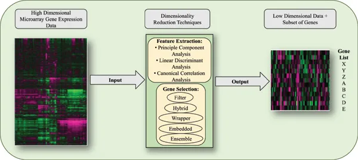
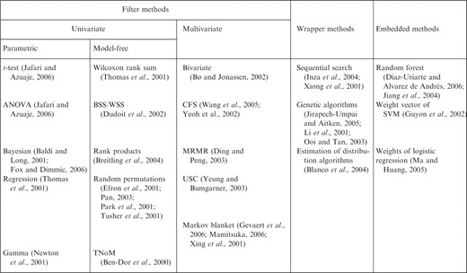
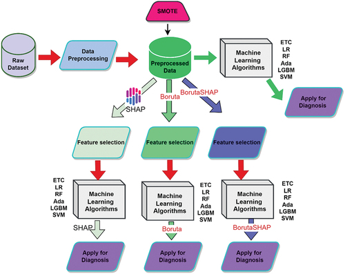
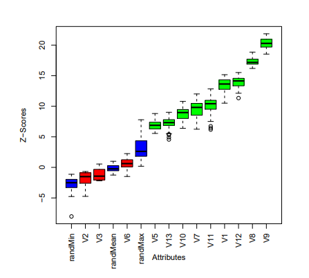

# Feature Selection Techniques in Bioinformatics - Boruta 
#### Team 10: Kathyrn Chen, Gavin Simmons, Sriya Paleti

1. [Why is Feature Selection Important](#why-is-feature-selection-important)
2. [How is Feature Selection Done](#how-is-feature-selection-done)
3.  [Potential Applications In Bioinformatics](#potential-applications-in-bioinformatics)
4. [Boruta: A Wrapper Method For Feature Selection](Boruta-A-Wrapper-method-for-feature-selection)
5.  [Conclusion](#conclusion)
6.  [Sources](#sources-cited)

Within machine learning, high-dimensional datasets can make it difficult to fit appropriate models and perform effective analysis. One technique that can be used to address this issue is feature selection, which can be defined as the process of identifying and selecting the most significant features (predictors with the highest correlation) in a dataset for use in predictive model construction. Our paper aims to give an overview of what feature selection is, why it is useful, how it may be done, and how it can be applied in bioinformatics, as well as touching on Boruta, a commonly used feature selection tool that excels in bioinformatics contexts.

## Why is Feature Selection Important?
Feature selection plays a valuable role in the classification pipeline, as it addresses challenges of a dataset that commonly hinder model performance, including high dimensionality, redundancy, and high dependency within data. In comparison to other dimensionality reduction techniques (i.e. Principal Component Analysis, or PCA, which is based on projection, or information theory, which is based on compression, etc.), feature selection doesn’t alter the representation of the variables, but merely selects a smaller subset of them.
By shrinking the size of the dataset to be analyzed, feature selection can greatly improve the model by reducing computational cost, improving accuracy, decreasing noise, enhancing interpretability, and reducing overfitting. However, there are some potential issues to be aware of. Since it involves additional processing of the data, feature selection introduces an additional layer of complexity within the modeling task that may require troubleshooting. Likewise, the optimal parameters for the feature subset may not generalize to full, original feature set, so if an important feature is removed, this could compromise the results of the model.  

## How is Feature Selection Done?

### Data Cleaning

Before carrying out feature selection, data cleaning and imputation are important steps. Some common problems to be addressed are as follows:
- Features that have zero variance, where they have constant values across samples should be removed as they don’t contribute to selection.
- Missing values are common in bioinformatics datasets and can be addressed by either removing features or imputing them. Imputation techniques like mean imputation can substitute these missing values using statistical values based on the data.

### Feature Scaling

Feature scaling can also be used to decrease bias in classification tasks where features with larger values may over-contribute to the model performance. Feature scaling standardizes or normalizes the values of features, for example Min-Max Normalization, so that features are more comparable and the model is more accurate .

### Techniques in Feature Selection

#### Filter Methods

Filter methods evaluate the relevance of features independently of a model. These methods utilize a variety of statistical tests to rank features based on their relationship with the target variable. Since filter methods don’t need to run the model to select features, they are computationally effective and therefore commonly used when dealing with large datasets with many features. Correlation Coefficients are an example of using univariate filter methods to assess the linear relationship between features and target variables. However filter methods ignore classifier interaction and many are univariate [1], meaning they evaluate features independently, without considering feature to feature interaction which can lead to oversimplification.

#### Wrapper Methods:

Wrapper methods select features by training models on different feature subsets and evaluating model performance at each combination. Some examples of this are Recursive Feature Selection (which is explained later) and Forward Selection, where starting from 0 features, features are added to the model one at a time until the model performance stops improving. Since wrapper methods directly evaluate feature subsets, they outperform filter methods in terms of accuracy but in turn, they are more computationally expensive and prone to overfitting.

#### Embedded Methods:

Embedded methods select features during the model training process. The model will predict the most relevant features based on the feature relationship with the target variable as it learns. An example is LASSO. This method applies a penalty during the regression process, shrinking coefficients of less important features to a zero value so that the subset of features selected will be the most relevant. Since embedded methods require the model to be run multiple times on feature subsets, they tend to be faster than wrapper methods yet accurate as they still interact with the classifier. However, embedded methods are less interpretable and adaptable across different algorithms.


## Potential Applications in Bioinformatics
Generally, many bioinformatics datasets tend to have high dimensionality and small sample sizes, making feature selection a valuable technique for effective analysis. This section will describe some examples of biological datasets for which feature selection can be particularly useful, before examining the task of microarray analysis in more detail.

### Broad Areas of Interest 
There are many datasets commonly analyzed in bioinformatics where feature selection can be applied. Mass spectrometry is one area where feature selection is pertinent, since the input dataset, a mass spectrum of a biological sample, is typically high-dimensional and very sparse. Mass spectrometry measures the relative abundance of ions detected in a sample based on their mass-to-charge ratio (i.e. m/z values). Feature selection techniques like univariate statistical tests or supervised methods (such as LASSO) can help identify the most informative peaks, ultimately assisting with tasks like disease diagnosis or protein-based biomarker profiling.

\
*Example of dataset generated through mass spectrometry*, [Source](https://www.sigmaaldrich.com/US/en/technical-documents/technical-article/analytical-chemistry/mass-spectrometry/mass-spectrometry-ms) 

Sequence analysis is another major focus of bioinformatics, and the field contains two main problems of interest:

**Content analysis** focuses on broad characterization of a sequence, meaning that tasks require the selection of pertinent subsequences from a much larger complete sequence. Common problems include prediction of subsequences with high tendency to code for proteins (coding potential prediction), prediction of protein function from sequence, and prediction of promoter regions or microRNA targets. Markov models, SVMs, and other filtering techniques are a few of the approaches that have been utilized for such tasks.\
**Signal analysis** involves identifying important, often conserved motifs in a sequence, such as gene structural elements or regulatory elements. A popular method is to use regression techniques to identify regulatory motifs, then use feature selection to search for the motifs that maximize fit to the regression model. Embedded SVM techniques, genetic algorithms, and other filtering techniques have also been applied to signal analysis problems.

Furthermore, SNP analysis is an area of great interest within bioinformatics. Around 7 million known SNPs exist in the human genome, and while having this large database is valuable for applications like disease-gene association studies, it cannot easily be analyzed in its entirety. Feature selection can be used to determine a smaller, but still informative subset of SNPs, through techniques such as genetic algorithms, SVMs, k-nearest neighbors, or decision trees. 

One final potential use case is text and literature mining. Feature selection has been applied to text classification tasks in general, but existing text mining techniques can be refined to suit biological or biomedical contexts.

### Microarray Data 
To discuss one application of feature selection in greater depth, microarray research is an area where feature selection is an important part of the analysis pipeline. Microarrays are primarily used to determine gene expression in a given biological sample. They contain thousands of DNA probes, which are bound by complementary sequences in the sample. By quantifying binding activity through fluorescence, the resulting dataset provides measures of gene expression,  enabling a myriad of downstream research, such as genetic variation analysis, SNP detection, or measures of drug sensitivity. These applications make microarrays especially pertinent in the field of cancer research, where they might be used to classify cancer types or distinguish between cancerous and noncancerous samples.

However, since each sample tests hundreds of thousands of variables (gene probes) at once, analysis of this data tends to be very computationally expensive. There is a big need for dimensionality reduction to make microarray analysis viable. 

\
*Visualization of microarray data preprocessing pipeline. Feature selection is used to reduce the dataset to a smaller subset, reducing computational expense and refining the model*, [Source](https://benthamsciencepublishers.wordpress.com/2018/05/07/editors-choice-gene-selection-using-high-dimensional-gene-expression-data/) 

Many techniques have been developed to perform feature selection on microarray datasets, incorporating filtering, wrapping, and embedded techniques. The table below summarizes key references for various types of feature selection techniques applied to microarrays, but some popular methods include t-tests, Wilcoxon rank sum, genetic algorithms, and random forests. Further research into effective methods for feature selection for microarray data is still ongoing.

\
*Types of feature selection techniques used for microarray analysis*, [Source](https://academic.oup.com/bioinformatics/article/23/19/2507/185254) 

To highlight one benchmark method, in 2002, Guyou et al. published a paper in the journal Machine Learning, proposing a feature selection called SVM-RFE (Support Vector Machine based on Recursive Feature Elimination), which has since become regarded as a leading algorithm for feature selection of microarray data. The method first ranks genes (features) by training support vector machine models, then selects key genes through backward feature elimination, which recursively discards the most unimportant feature. While typically effective, the process is extremely time consuming. Since then, various methods have attempted to address the high time requirement, and other challenges faced by SVM-RFE, such as its inability to account for the probable hidden correlation between features.

To improve feature selection techniques for microarray data going forward, future research efforts may focus on optimization of the statistical methods (i.e. addressing class imbalance, reducing recursion times, etc.), incorporating representation-based methods such as image processing or computer vision, and utilizing more sophisticated biological information, such as consideration of interactions between genes in the dataset. 

## Boruta: A Wrapper Method for Feature Selection
Boruta and Boruta_py are wrapper based feature selection tools, especially effective in bioinformatics due to their notable ability to work on high dimensionality datasets, which are commonly encountered in the field. The Random Forest Classification wrapper was designed to identify all relevant features in the dataset by iteratively removing features that are less relevant than random probes as calculated by statistical tests. 

There are multiple modes of implementation, both a R package and a Python package(Boruta_py). Focusing on Boruta_py, once installed, all you have to do is import it using ```from boruta import BorutaPy```. You then need to initialize a random forest estimator, which can be done as follows, ```rf = RandomForestClassifier(n_estimators=100, max_depth=5, random_state=42)```. Finally you can initialize your Boruta object:
```
boruta_selector = BorutaPy(
    estimator=rf,
    n_estimators='auto',  # Automatically determine optimal number of trees
    perc=100,             # Use all shadow features for comparison
    random_state=42
)
```
With ```boruta_selector```, you are able to use it with other scikit-learn methods including:
  - fit(X, y)
  - transform(X)
  - fit_transform(X, y)

\
*Machine learning pipeline utilizing Boruta*, [Source](https://www.tandfonline.com/doi/full/10.1080/0954898X.2024.2331506)

### How Boruta Works
  1. Creates Shadow Features: Boruta creates randomly ordered copies of each feature to serve as the benchmark for figuring out if an original feature  is signifant to the target. This makes it so that the only features selected are those that have signficance scores significantly greater than the random noise that was created.
  2. Signficance Score Calculation: The model is trained, calculating the significance scores of the real and shadow features.
  3. Compares and Decides: Compares the significance scores of the real features to that of the shadow features, to decide which features are relevant. Those that significantly outperform the shadow scores are accepted and remain in the dataset, while those that do not are denied and removed.
  4. Repeat: The previous three steps are repeated until all of the features are decided to have been important or irrelevant. 

\
*Box plot Boruta results from Ozone data. Red and Green signify Z scores of rejected and accepted features, blue represents minimal, average and maximum Z score for the shadow attributes*, [Source](https://www.jstatsoft.org/article/view/v036i11) 

### Advantages and Drawbacks of Boruta
Boruta has a lot of advantages for identifying relevant features, including that it is abililty to comprehensively select all features that contribute to the target class, however one drawback here is that Boruta can only find all features, essentially it cannot find an optimal subgroup of features for predicting the target feature. By nature of the random forest classification model and the shadow features, Boruta is very strong against noise, and also is able to capture non-linear, more complex relations between features. However, not all datasets are optimal for random forrests, and would be better suited with a different model, as well as Boruta can be computationally expensive especially as it is often ran on large datasets. Overall, Boruta is a very powerful tool given the right context, but it is not an end all be all solution, there are different scenarios where it would be better to use a different feature selection technique, but it is still good to have in the arsenal.

### Bioinformatics Application
Boruta is well-suited for helping to answer bioinformatics questions as it does can handle especially large datasets. Some examples of topics it excels in include:
  - SNP Analysis: Boruta can help to identify SNPs relevant to the biological question at hand
  - Proteomics: For mass spectrometry datasets, Boruta can identify important ion peaks for biomarker discover
  - Gene Expression Analysis: Boruta can identify genes taht are most important for the biological question trying to be answered

## Conclusion
As discussed, feature selection is a technique that proves invaluable in many facets of bioinformatics, as it can greatly reduce computational complexity and processing time, as well as strengthen models by filtering out noise. Developing stronger methods for more effective feature selection is undoubtedly a promising area for countless problems within biological (and non-biological) research.

## Sources cited:
[1] Yvan Saeys, Iñaki Inza, Pedro Larrañaga, A review of feature selection techniques in bioinformatics, Bioinformatics, Volume 23, Issue 19, October 2007, Pages 2507–2517, https://doi.org/10.1093/bioinformatics/btm344 

[2] D. Theng and K. K. Bhoyar, "Feature Selection Techniques for Bioinformatics Data Analysis," 2022 International Conference on Green Energy, Computing and Sustainable Technology (GECOST), Miri Sarawak, Malaysia, 2022, pp. 46-50, doi: 10.1109/GECOST55694.2022.10010541. 

[3] Guyon, I., Weston, J., Barnhill, S. et al. Gene Selection for Cancer Classification using Support Vector Machines. Machine Learning 46, 389–422 (2002). https://doi.org/10.1023/A:1012487302797

[4] Li Z, Xie W, Liu T (2018) Efficient feature selection and classification for microarray data. PLoS ONE 13(8): e0202167. https://doi.org/10.1371/journal.pone.0202167

[5] Scikit-Learn-Contrib. “Scikit-Learn-Contrib/Boruta_py: Python Implementations of the Boruta All-Relevant Feature Selection Method.” GitHub, github.com/scikit-learn-contrib/boruta_py

[6] Kursa, M. B., & Rudnicki, W. R. (2010). Feature Selection with the Boruta Package. Journal of Statistical Software, 36(11), 1–13. https://doi.org/10.18637/jss.v036.i11

[7] Ejiyi, C. J., Qin, Z., Ukwuoma, C. C., Nneji, G. U., Monday, H. N., Ejiyi, M. B., … Bamisile, O. O. (2024). Comparative performance analysis of Boruta, SHAP, and Borutashap for disease diagnosis: A study with multiple machine learning algorithms. Network: Computation in Neural Systems, 1–38. https://doi.org/10.1080/0954898X.2024.2331506
