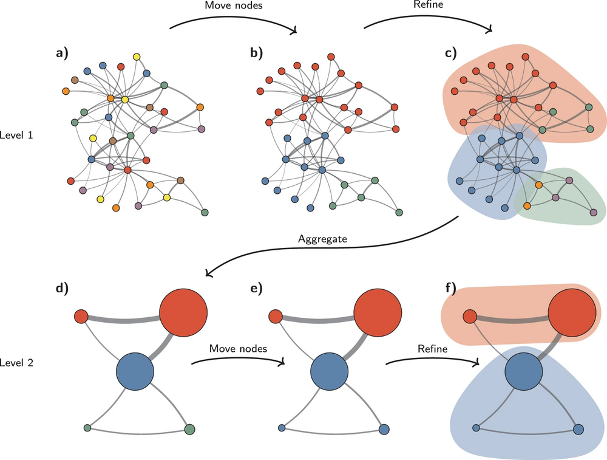
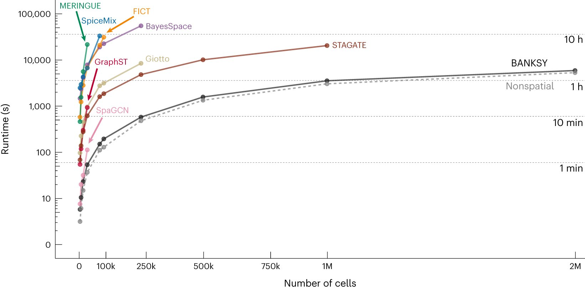
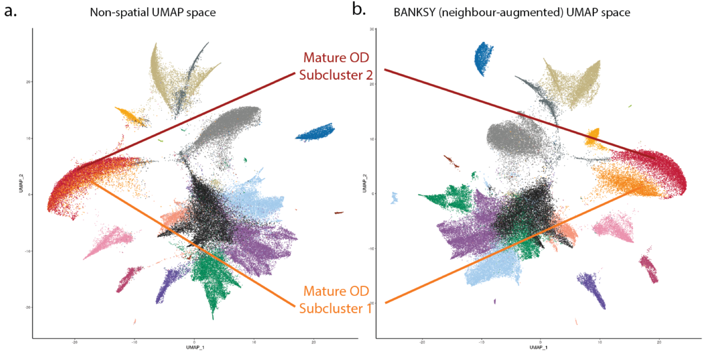
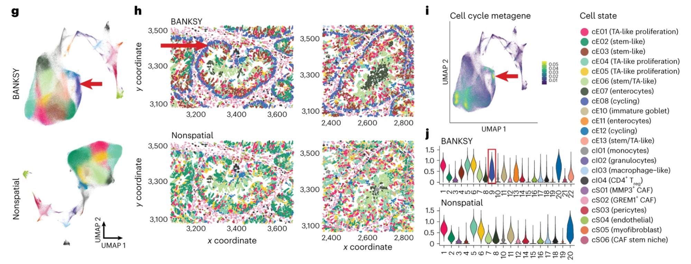

# **BANKSY**

## **Intro to Spatial Omics**

Spatial omics studies molecules in their native tissue, which reveals the molecular profiles of cells. This is critical for understanding how tissue structures are organized and how cells interact within their microenvironments. However, there are two major challenges in this field.

First, clustering cells into types and distinguishing tissue domains are typically treated as two separate problems, and often requires different algorithms to address each task. Second, as datasets grow to include millions of cells, most spatial algorithms simply cannot meet the computational demand.

This reveals the need for a more unified and scalable approach, which is exactly what BANKSY provides.

## **Methodology**  

BANKSY improves upon these non-spatial clustering algorithms by not only considering how similar cells are, but also how similar each cell’s neighbors are.

This is achieved by adding neighborhood features to the traditional gene-cell expression matrix. These features represent the gene expression patterns of a cell's neighbors, with one key metric being the “weighted mean neighborhood,” which captures the average transcriptomic activity around each cell.

BANKSY then constructs a graph with cells as nodes and their similarities as edges. Afterwards, it efficiently clusters the cells using the Leiden algorithm, which starts by treating each node as its own cluster and iteratively moving nodes between clusters to maximize modularity: a measure of how well nodes in a network are grouped together. The process repeats until optimal clusters are formed. The following image is a visual representation of this.



## **Advantages of BANKSY**

* Can simultaneously cluster cells into types and tissue domains  
* Improved cell-type assignment in noisy data  
* Can distinguish subtly different cell-types based on microenvironment  
* Can identify spatial domains sharing the same microenvironment  
* Highly scalable for large datasets  
* Not as dependent on precise parameter tuning  
* Can be used for spatial quality control



This image compares the runtimes of common spatial cell-type clustering algorithms, clearly   
demonstrating that BANKSY is far more scalable than any other spatial algorithm. It can handle nearly twice as many cells as the second-best algorithm, in less time. Surprisingly, it is also as scalable as a standard non-spatial clustering algorithm.

## **Analysis Pipeline**

Input: A spatial omics dataset consisting of gene or protein expression profiles, each linked to precise coordinates within the tissue sample.

1. Data Processing and Quality Control:  
     
   BANKSY preprocesses the data by removing poor-quality cells caused by sequencing artifacts or insufficient depth. It then normalizes batch effects and sequencing depth differences, ensuring comparable expression metrics across individual datasets or subpopulations.

2. Cell typing and feature selection:  
     
   After preprocessing, BANKSY selects key features, such as genes or proteins, to enhance cell type distinction. It identifies discrete cell types using both non-spatial and spatially informed clustering methods.

3. Segmentation of the tissue domain:  
     
   BANKSY then maps the spatial organization of cell types, segmenting tissue into domains with unique cellular configurations and expression patterns. By integrating spatial and molecular data, it reveals how different cell types interact and form functional tissue structures beyond their boundaries.

4. Integration into visualization and reporting:   
     
   In the final step, BANKSY integrates cell-type classifications and tissue domains to produce comprehensive, interpretable outputs. It generates detailed spatial maps of cell types through domains and summary reports, translating complex data into actionable insights. These outputs support hypothesis generation and guide experimental validation, advancing the understanding of tissue structure and function.

## **Demo**  

### Installation

Install the *Banksy* package with Bioconductor.

``` r
BiocManager::install('Banksy')
```

### Load Relevant Packages

Load *BANKSY*. We’ll also load other packages for normalization, quality control, and data manipulation / visualization.

``` r
library(Banksy)

library(SummarizedExperiment)
library(SpatialExperiment)
library(scuttle)

library(scater)
library(cowplot)
library(ggplot2)
```

### *BANKSY* Pipeline

We’ll use mouse hippocampus data here.

``` r
data(hippocampus)
gcm <- hippocampus$expression
locs <- as.matrix(hippocampus$locations)
```

Perform quality control and normalization using a SpatialExperiment object.


``` r
se <- SpatialExperiment(assay = list(counts = gcm), spatialCoords = locs)

# QC based on total counts
qcstats <- perCellQCMetrics(se)
thres <- quantile(qcstats$total, c(0.05, 0.98))
keep <- (qcstats$total > thres[1]) & (qcstats$total < thres[2])
se <- se[, keep]

# Normalization to mean library size
se <- computeLibraryFactors(se)
aname <- "normcounts"
assay(se, aname) <- normalizeCounts(se, log = FALSE)
```

Compute the neighborhood matrices for *BANKSY*. k_geom is used to calculate and set the number of spatial neighbors. `lambda=0` corresponds to non-spatial clustering, and `lambda=0.2` corresponds to *BANKSY* cell-type clustering.

``` r
lambda <- c(0, 0.2)
k_geom <- c(15, 30)

se <- Banksy::computeBanksy(se, assay_name = aname, compute_agf = TRUE, k_geom = k_geom)
```

Next, perform clustering on the BANKSY matrix.

``` r
set.seed(1000)
se <- Banksy::runBanksyPCA(se, use_agf = TRUE, lambda = lambda)
se <- Banksy::runBanksyUMAP(se, use_agf = TRUE, lambda = lambda)
se <- Banksy::clusterBanksy(se, use_agf = TRUE, lambda = lambda, resolution = 1.2)
```

Visualise the output for non-spatial clustering (`lambda=0`) and BANKSY clustering (`lambda=0.2`).

``` r
cnames <- colnames(colData(se))
cnames <- cnames[grep("^clust", cnames)]
colData(se) <- cbind(colData(se), spatialCoords(se))

plot_nsp <- plotColData(se,
    x = "sdimx", y = "sdimy",
    point_size = 0.6, colour_by = cnames[1]
)
plot_bank <- plotColData(se,
    x = "sdimx", y = "sdimy",
    point_size = 0.6, colour_by = cnames[2]
)

plot_grid(plot_nsp + coord_equal(), plot_bank + coord_equal(), ncol = 2)
```


## **Sample Outputs**

Mouse Hippocampus data (from demo above):


The left image displays the non-spatial clustering output, while the right image shows BANKSY's clustering results. BANKSY identified two additional clusters (15 and 16), uncovering subtle cell-type distinctions missed by the non-spatial approach. This highlights BANKSY's strength in capturing finer details by incorporating spatial relationships between cells.

Mature Oligodendrocyte (OD) cell data:'



As indicated by the red and orange lines, BANKSY was able to distinguish between Subclusters 1 and 2, which the non-spatial algorithm failed to do. This highlights the added value of spatial context in BANKSY's approach, enabling more accurate and detailed clustering that is essential for understanding complex tissue structures.

Human Colorectal Cancer Data:



The red arrows represent the cycling epithelial cell cluster detected only by BANKSY’s clustering. These are epithelial cells that are actively undergoing the cell cycle, and are thus of high interest in cancer studies.

## **Applications to Personalized Medicine**

BANKSY is highly effective at mapping the various cell types within a tumor, including immune cells, stromal cells, and cancer cells. It also excels at identifying tissue domains associated with tumor progression. This has numerous applications, such as enhancing our understanding of tumor heterogeneity by revealing the diverse cellular compositions within a single tumor. This is crucial for advancing personalized medicine within oncology.

Through BANKSY, we can also better understand the cellular responses to different drugs, paving the way for more effective treatments. Similarly, by analyzing cellular reactions to diseases, BANKSY helps identify potential biomarkers. Its speed and precision also enable more accurate tissue testing, supporting the creation of personalized medicines tailored to individual patients.

## **References**

1. Singhal, V., Chou, N., Lee, J. *et al.* BANKSY unifies cell typing and tissue domain segmentation for scalable spatial omics data analysis. *Nat Genet* 56, 431–441 (2024). [https://doi.org/10.1038/s41588-024-01664-3](https://doi.org/10.1038/s41588-024-01664-3)  
     
2. Prabhakar Lab. *Banksy* \[Software\]. GitHub. [https://github.com/prabhakarlab/Banksy](https://github.com/prabhakarlab/Banksy)

3. Wikipedia contributors. *Leiden algorithm*. Wikipedia, The Free Encyclopedia. Retrieved December 10, 2024, from [https://en.wikipedia.org/wiki/Leiden\_algorithm](https://en.wikipedia.org/wiki/Leiden_algorithm)

4. Agency for Science, Technology and Research (A\*STAR), Singapore. (2024, May 6). Researchers develop new AI tool for fast and precise tissue analysis to support drug discovery and diagnostics. *Phys.org*. [https://phys.org/news/2024-05-ai-tool-fast-precise- tissue.html](https://phys.org/news/2024-05-ai-tool-fast-precise-tissue.html)

5. Allam, M., Hu, T., Lee, J. *et al.* Spatially variant immune infiltration scoring in human cancer tissues. *npj Precis. Onc.* 6, 60 (2022). [https://doi.org/10.1038/s41698-022-00305-4](https://doi.org/10.1038/s41698-022-00305-4)
