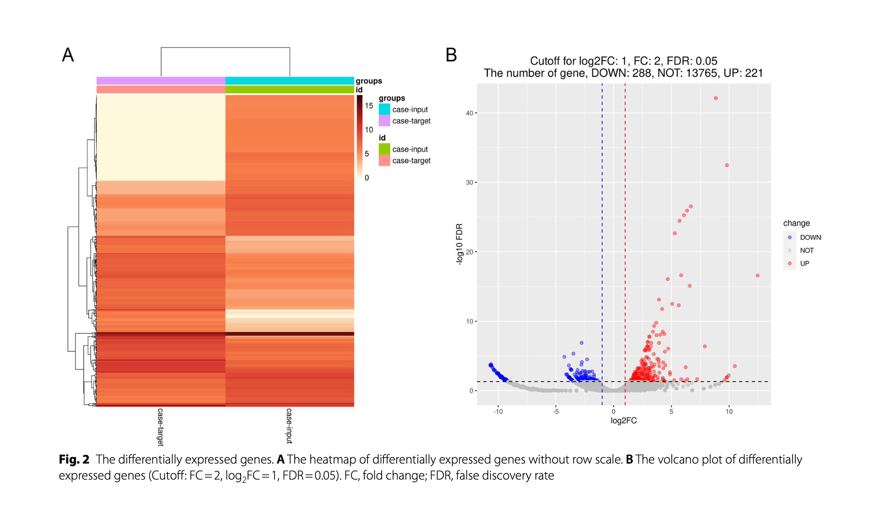

# ChIRP-Seq: Chromatin Isolation by RNA Purification Sequencing
- Haley Fernandez
- Itai Lavi
- Nir Reitner

## Table of Contents
- - [What is ChIRP-seq?](#what-is-chirp-seq)
- [Case Study: "Exploration and bioinformatic prediction for profile of mRNA bound to circular RNA BTBD7_hsa_circ_0000563 in coronary artery disease"](#case-study-exploration-and-bioinformatic-prediction-for-profile-of-mrna-bound-to-circular-rna-btbd7_hsa_circ_0000563-in-coronary-artery-disease)

# What is ChIRP-seq?

## Quick Refresher on ChIP-seq:
**ChIP-seq (Chromatin Immunoprecipitation Sequencing)** is a technique that combines chromatin immunoprecipitation with high-throughput DNA sequencing to identify the binding sites of DNA-associated proteins, such as transcription factors or histones, across the genome. It is widely used to study gene regulation, epigenetic modifications, and protein-DNA interactions.

### Steps of ChIP-seq:
1. **Crosslinking**: Cells are treated with formaldehyde to crosslink proteins to DNA, preserving protein-DNA interactions.
2. **Chromatin Fragmentation**: Chromatin is isolated and sheared into smaller fragments, typically by sonication or enzymatic digestion.
3. **Immunoprecipitation**: An antibody specific to the target protein is used to isolate the protein-DNA complexes.
4. **Reversal of Crosslinks**: The crosslinks between protein and DNA are reversed, and the DNA is purified.
5. **Library Preparation and Sequencing**: The DNA fragments are prepared into a sequencing library and subjected to high-throughput sequencing.
6. **Data Analysis**: Sequencing reads are aligned to a reference genome, and peaks are identified to locate protein-DNA interaction sites.

---

## What is ChIRP-seq?
**ChIRP-seq (Chromatin Isolation by RNA Purification Sequencing)** is very similar to ChIP-seq but is used to analyze RNA-DNA interactions across the genome. This technique identifies the genomic binding sites of specific RNAs, such as long noncoding RNAs (lncRNAs), by isolating the DNA-bound RNA molecules and their associated chromatin complexes, followed by high-throughput DNA sequencing. It is often used to gain insights into how RNA molecules regulate gene expression and chromatin architecture.

### Steps of ChIRP-seq:
1. **RNA Capture**: Specific biotin-labeled probes are designed to hybridize to the RNA of interest.
2. **Chromatin Isolation**: Crosslinked chromatin complexes are fragmented.
3. **Pulldown**: The RNA-probe complexes, along with associated DNA and proteins, are captured using streptavidin beads.
4. **DNA Purification**: Crosslinks are reversed, leaving the associated DNA purified.
5. **Sequencing and Analysis**: Purified DNA is sequenced, and the reads are mapped to the genome to identify RNA-DNA interaction sites.

---

## Case Study: "Exploration and bioinformatic prediction for profile of mRNA bound to circular RNA BTBD7_hsa_circ_0000563 in coronary artery disease"

This case explored the bioinformatic prediction for the profile of mRNA bound to the circular RNA BTBD7_hsa_circ_0000563. Using an alternative approach, ChIRP-sequencing was used to interrogate these ribonucleoprotein complexes and subsequently employ functional assays to explore how these candidate mRNAs directly impact the disease process. This led to the identification of 221 mRNAs that bound the circular RNA. This case study highlights the power of ChIRP-sequencing to investigate RNA-mediated regulatory networks and downstream pathway effects in association with CAD.

### Key Findings:
1. **Objective**: To investigate the role of the circular RNA BTBD7_hsa_circ_0000563 in coronary artery disease by identifying mRNAs bound to it and analyzing their functional significance in disease progression.
2. **Methodology**:
   - ChIRP-sequencing was used to isolate RNA-chromatin complexes and analyze their regulatory potential.
   - Bioinformatic tools and functional assays identified 221 mRNAs interacting with the circular RNA, showcasing its impact on RNA-mediated regulatory networks.
3. **Visual Data**:
   - **Heatmap**: Highlights clear expression differences between the target and control groups, validating the isolation of specific RNA-binding partners.
   - **Volcano Plot**: Quantifies significantly upregulated mRNAs, providing evidence of RNA-mediated transcriptional regulation.
4. **Impact**:
   - Demonstrates the utility of ChIRP-sequencing in studying RNA-mediated regulatory mechanisms in diseases like CAD.
   - Highlights the role of circular RNAs in regulating downstream pathways and their impact on disease progression.

### Figures:
*Figure 2*: 

- Figure 2 shows the differentially expressed genes identified through the ChIRP-Seq. The heatmap provides a qualitative outlook on the RNA binding, the volcano plot shows the quantitative data of the experiment. 
1. **Heatmap**:
   - Visualizes expression differences between BTBD7 circular RNA and control groups.
   - Shows the relative expression levels of mRNAs that were captured by the ChIRP-Seq assay in the target group
   - Each column represents the individual conditions while the rows correspond to a certain gene
   - The red symbolizes upregulation while the blue symbolizes downregulation which is indicative of how much of these mRNAs are present
   - Confirms the successful isolation of RNA-chromatin complexes with minimized background noise.
2. **Volcano Plot**:
   - Displays a subset of significantly upregulated mRNAs among 221 identified targets.
   - P-value is the statistical significance shown compared to the log2 fold changes (magnitude of expression change) for mRNAs
   - On the x-axis, you can see the log2FC (Log2 fold changes) which shows either the upregulation (right) or the downregulation (left) in the target group compared to the control group
   - On the y-axis, it is the -log10P which is representative of the statistical significance of the change
   - Provides quantitative evidence of the circular RNA’s regulatory role in coronary artery disease.

### Implications:
This case study highlights the potential of ChIRP-sequencing in unraveling RNA-mediated regulatory mechanisms. By mapping RNA-chromatin interactions and analyzing their role in regulating gene expression and chromatin dynamics, we are closer to understanding the mechanisms behind diseases and their progression.

*"Exploration and bioinformatic prediction for profile of mRNA bound to circular RNA BTBD7_hsa_circ_0000563 in coronary artery disease"* [(https://doi.org/10.1186/s12872-024-03711-7)](https://doi.org/10.1186/s12872-024-03711-7).

---

# References
- [Illumina Sequencing Method Explorer - ChIRP-seq](https://www.illumina.com/science/sequencing-method-explorer/kits-and-arrays/chirp-seq.html)
- Guo, N., Zhou, H., Zhang, Q. et al. Exploration and bioinformatic prediction for profile of mRNA bound to circular RNA BTBD7_hsa_circ_0000563 in coronary artery disease. BMC Cardiovasc Disord 24, 71 (2024). https://doi.org/10.1186/s12872-024-03711-7
