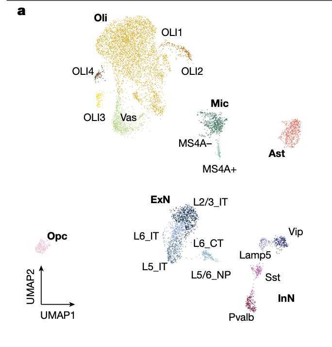
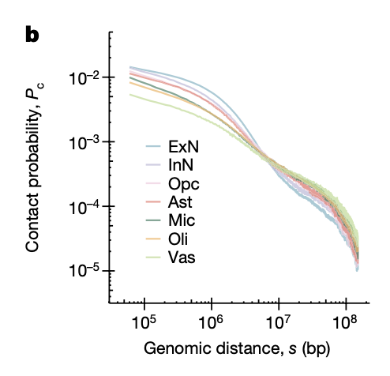
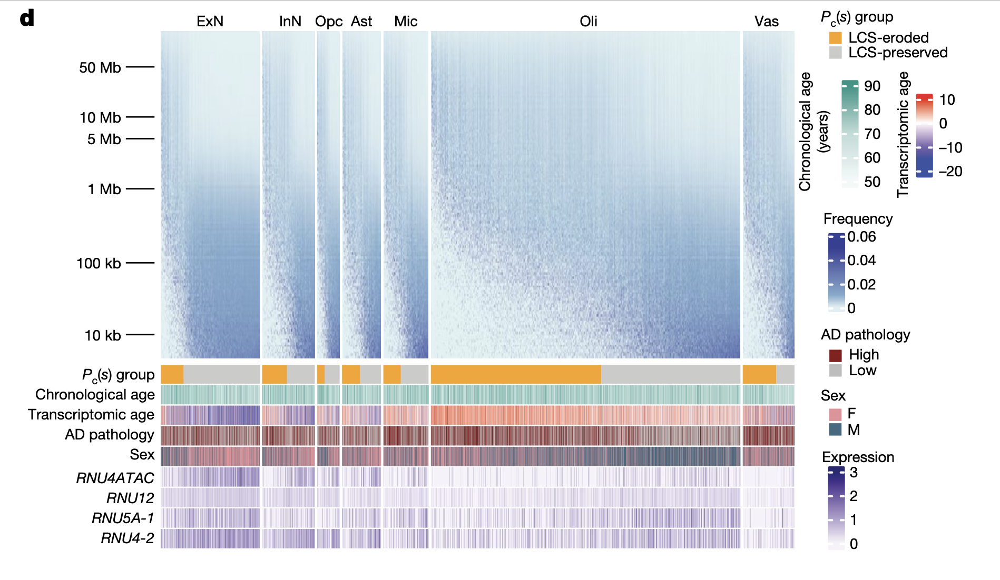
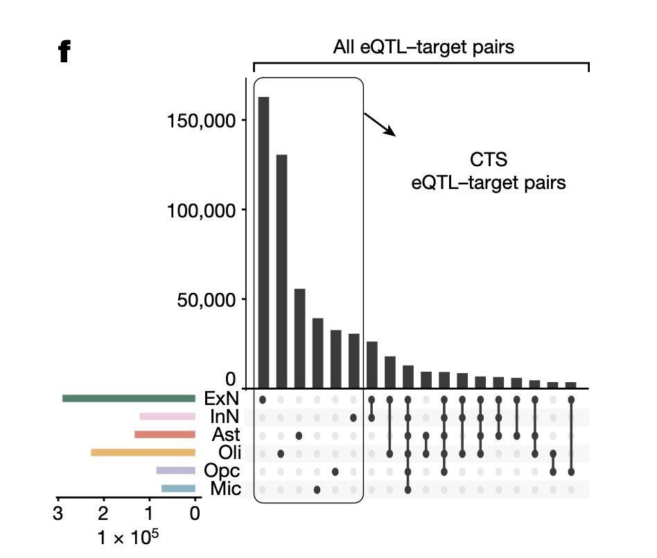

# BENG 183 Final Project

## Data Analysis

The MUSIC technique provides a comprehensive workflow for analyzing chromatin and RNA interactions at the single-cell level. It combines RNA and fragmented DNA into a single sequencing library, enabling simultaneous profiling of:
	•	Gene expression
	•	Multiplex chromatin interactions
	•	RNA-chromatin associations

### Data Analysis Pipieline

#### Preprocessing and Demultiplexing

Preprocessing begins with extracting raw sequencing data, followed by quality control to remove low-quality reads and contaminants. Demultiplexing assigns RNA and DNA sequences to their respective nuclei using unique cell barcodes. This step ensures that all data from a single cell are accurately linked, enabling downstream analyses of chromatin interactions, RNA associations, and gene expression.

#### Integration of Multimodal Data
After demultiplexing, RNA and DNA data are integrated to analyze relationships between gene expression and chromatin architecture. The integration step enables the simultaneous study of chromatin conformation, RNA-chromatin interactions, and transcriptional activity at the single-cell level, revealing complex cellular processes and heterogeneity.

#### RNA–Chromatin Interaction Analysis
This step focuses on identifying and mapping RNA-chromatin associations, leveraging molecular barcoding to link RNA molecules to their interacting chromatin regions. These interactions are analyzed to uncover regulatory roles, such as RNA-guided chromatin organization or transcriptional regulation, providing insights into the functional genome organization.

#### Clustering and Cell Type Identification
Single-cell data are clustered based on chromatin interaction patterns and transcriptomic profiles. This analysis identifies distinct cell types and states, offering insights into the cellular composition of tissues. This step is crucial for understanding how chromatin architecture and gene expression vary across cell populations.

#### Validation and Comparative Analysis
To ensure the robustness of findings, results are validated against complementary datasets and established methods, such as bulk sequencing. Comparative analysis between conditions (e.g., different ages, disease states) highlights biological variations, such as alterations in chromatin interactions or gene expression profiles. 

### Role of Docker and Snakemake

    
    

Docker and Snakemake play crucial roles in streamlining and automating the data analysis pipeline in MUSIC, ensuring reproducibility, scalability, and efficiency. Here’s how each contributes to the process:

#### Docker: Ensuring Reproducibility and Portability
1. Containerization: Docker provides an isolated environment to package and run all software dependencies, tools, and libraries required for the MUSIC pipeline. This ensures that the analysis can be consistently reproduced across different computing environments, from local machines to cloud platforms.
2. Standardized Environment: By encapsulating the pipeline in a Docker image, all collaborators can use the exact same versions of software tools (e.g., Python, bioinformatics packages), eliminating issues caused by system differences.
3. Ease of Deployment: Docker simplifies the setup process, allowing researchers to quickly deploy the pipeline without needing to manually install and configure individual dependencies.
#### Snakemake: Workflow Management and Automation

1. Pipeline Automation: Snakemake automates the execution of the MUSIC pipeline by defining a set of rules that specify how input data is transformed into output results (e.g., demultiplexing, alignment, clustering). It automatically determines which steps need to be executed based on file dependencies.
2. Parallelization: Snakemake supports efficient parallel execution of tasks, which is critical for handling large datasets in the MUSIC pipeline, such as single-cell RNA and chromatin interaction sequencing data.
3. Error Handling and Logging: It ensures that errors in one step are captured and do not affect downstream processes. Comprehensive logs for each step allow users to debug issues efficiently.
4. Scalability: Snakemake scales seamlessly from running on a single laptop to high-performance computing clusters or cloud-based environments, making it ideal for both small-scale testing and large-scale analyses.
5. Modularity and Flexibility: Researchers can easily extend or modify the workflow by updating Snakemake rules to incorporate new tools or analyses.

#### Combined Benefits

Using Docker and Snakemake together enhances the MUSIC pipeline by combining the portability of Docker with the automation and scalability of Snakemake. Docker ensures that the same computational environment is available across systems, while Snakemake provides an organized and efficient way to execute complex workflows. Together, they ensure the MUSIC pipeline is robust, reproducible, and efficient, allowing researchers to focus on data interpretation rather than technical implementation.

### Data Analysis 
MUSIC analysis 14 postmortem samples of human frontal cortex from tissue donors aged 59 years and above. 

This UMAP graph illustrates the clustering of single cells from the human frontal cortex based on RNA expression profiles obtained through the MUSIC technique. Each point represents an individual cell, grouped into distinct clusters corresponding to major cell types such as oligodendrocytes (Oli), excitatory neurons (ExN), inhibitory neurons (InN), astrocytes (Ast), microglia (Mic), oligodendrocyte precursor cells (Opc), and vascular cells (Vas). Subclusters within these groups (e.g., OLI1–OLI4, L2/3\_IT, MS4A+ and MS4A–) highlight the heterogeneity of cell states and functions.

This analysis demonstrates MUSIC’s ability to resolve cellular diversity and identify functionally distinct subpopulations at single-cell resolution. It reveals biologically meaningful distinctions, such as layer-specific excitatory neuronal subtypes and microglial states, providing insights into the molecular and functional organization of the frontal cortex. This clustering approach is critical for exploring the cellular basis of brain function and pathology, such as age-related changes or disease-specific alterations.

This graph shows the relationship between genomic distance (s) and chromatin contact probability (P\_c) for different cell types in the human frontal cortex, including excitatory neurons (ExN), inhibitory neurons (InN), astrocytes (Ast), microglia (Mic), oligodendrocytes (Oli), oligodendrocyte precursor cells (Opc), and vascular cells (Vas). The P\_c values decrease with increasing genomic distance, reflecting the expected trend where shorter-range chromatin interactions are more frequent than long-range ones.

The curves reveal subtle cell type-specific differences in chromatin organization. For example, excitatory neurons exhibit more frequent short-range chromatin interactions compared to other cell types, while oligodendrocytes show relatively lower short-range contact probabilities. These variations highlight the influence of chromatin architecture on cell-type-specific functions and gene regulation, demonstrating the power of MUSIC to explore chromatin conformation at single-cell resolution. This analysis provides insights into how chromatin interactions vary across cell types and their potential contributions to cellular heterogeneity and functional specialization.

This panel represents the heterogeneity of chromatin contact probabilities (P\_c) across genomic distances (ranging from 10 kb to 50 Mb) for different cell types in the human frontal cortex, including excitatory neurons (ExN), inhibitory neurons (InN), oligodendrocyte precursors (Opc), astrocytes (Ast), microglia (Mic), oligodendrocytes (Oli), and vascular cells (Vas). The heatmaps display the frequency of chromatin contacts at different genomic scales for each cell type, showing variation in chromatin architecture within and between cell types.
Below the heatmaps, metadata annotations link chromatin contact patterns to key biological characteristics, such as:
1. $p_c$Group (LCS-eroded vs. LCS-preserved): Cells are categorized based on whether they exhibit preserved or eroded local chromatin structure (LCS). LCS-eroded cells show reduced short-range contacts, often associated with transcriptional aging.
2. Chronological Age and Transcriptomic Age: While chronological age reflects the donor’s age, transcriptomic age (indicated by red to blue color gradient) estimates the molecular “age” of each cell based on gene expression patterns.
3. AD Pathology: Cells from samples with high Alzheimer’s disease (AD) pathology (dark red) show a greater association with LCS erosion, particularly in ExN, InN, and Ast cell types.
4. Sex: Differences between male (blue) and female (pink) cells are noted, reflecting potential sex-specific chromatin contact dynamics.
5. Gene Expression: The expression levels of small nuclear RNA genes (e.g., RNU4ATAC, RNU12) are highly correlated with preserved chromatin structure (LCS-preserved cells), highlighting their role in maintaining chromatin organization.

This graph highlights the correlation between expression quantitative trait loci (eQTLs) and chromatin contacts across different cell types in the human brain. It distinguishes all eQTL–target pairs (total bar heights) from cell-type-specific (CTS) eQTL–target pairs (boxed subset). CTS pairs represent eQTLs that regulate target gene expression uniquely in specific cell types, showcasing the role of chromatin interactions in driving cell-specific gene regulation. Excitatory neurons (ExN) and inhibitory neurons (InN) contribute the most to CTS eQTL–target pairs, reflecting the strong influence of chromatin contacts on gene expression in neurons.

This analysis demonstrates that eQTLs are enriched in chromatin contacts that overlap with their target gene promoters within the same cell type. This enrichment indicates that cell-type-specific chromatin architecture plays a critical role in enabling the functional effects of eQTLs. By linking eQTLs to chromatin organization, the data provide a deeper understanding of how chromatin structure contributes to the diversity of gene regulation across cell types, shedding light on mechanisms underlying cellular function and disease susceptibility.