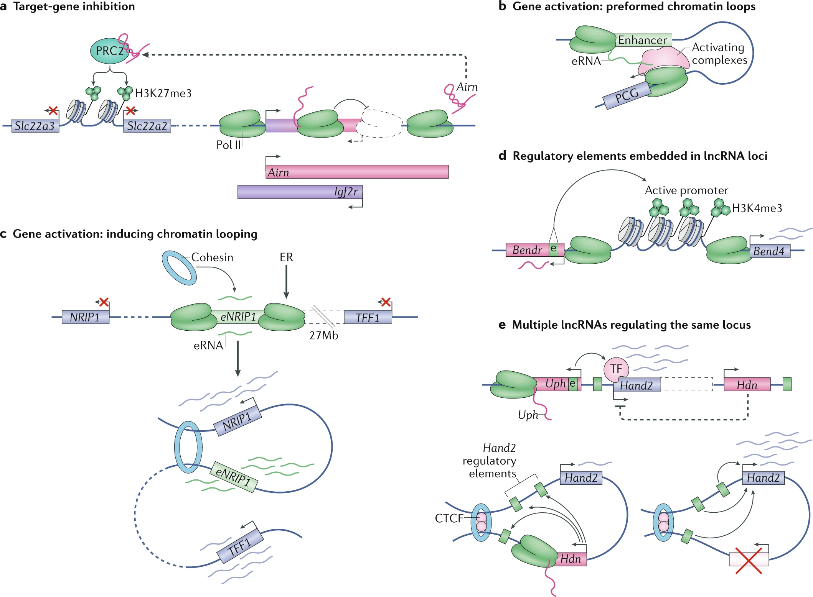
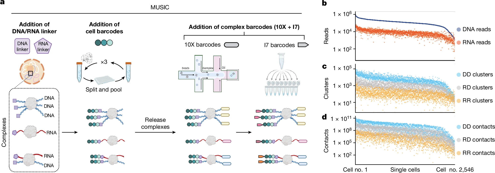

# Introduction

## Overview of the MUSIC Technique

The [MUSIC (multinucleic acid interaction mapping in single cells) technique](https://www.nature.com/articles/s41586-024-07239-w) enables simultaneous profiling of multiplex chromatin interactions, gene expression, and RNA-chromatin associations within individual nuclei. It provides single-cell resolution insights into the heterogeneity of chromatin complexes, which include both DNA and chromatin-associated RNA, advancing our understanding of chromatin organization and its functional implications.

## Importance and Applications

MUSIC has been applied to study cortical cell types and their states in the aging human brain. It revealed correlations between chromatin interaction patterns, ageing transcriptomic signatures, and Alzheimer’s disease pathology. This technique is particularly significant for its ability to map chromatin architecture and transcriptional landscapes in complex tissues at a cellular level, with implications for aging research, disease pathology, and cellular heterogeneity analysis.

## Background and Motivation

The three-dimensional genome organization plays a key regulatory role in gene expression, yet its impacts remain incompletely understood. Existing multimodal technologies like Hi-C and ChIA-Drop provide critical insights but lack the capacity to profile RNA-chromatin interactions at single-cell resolution. MUSIC bridges this gap, capturing the complexity of chromatin interactions and their associations with transcriptional states.

Long non-coding RNA (lncRNA) can directly interact with chromatin, regulate gene expression, and help with recruitment of chromatin modifiers. MUSIC technique can help with characterization of these interactions. In the article, a specific type of RNA-chromatin interaction was mentioned: the XIST lncRNA (X inactive specific transcript). It regulates gene expression by inactivating one of the X chromosomes which results in the formation of Barr bodies in the female. 

## Why MUSIC?

## Current Challenges in Profiling Chromatin Interactions

Despite advances in chromatin conformation and gene expression profiling techniques, limitations persist in integrating RNA-chromatin associations at single-cell resolution. Existing approaches, such as Hi-C and iMARGI, primarily focus on DNA-DNA interactions or bulk-level RNA-DNA associations, failing to address multiplex chromatin interactions within individual cells.

Despite advances in chromatin conformation and gene expression profiling techniques, limitations persist in integrating RNA-chromatin associations at single-cell resolution. Existing approaches, such as Hi-C and iMARGI, primarily focus on DNA-DNA interactions or bulk-level RNA-DNA associations, failing to address multiplex chromatin interactions within individual cells.

Comparative Analysis with Other Techniques (Hi-C, iMARGI, ChIA-Drop):

Hi-C: Captures pairwise chromatin interactions but lacks multiplex capabilities and single-cell resolution.  
iMARGI: Maps RNA-chromatin interactions but operates on bulk samples and does not resolve single-cell complexity.  
ChIA-Drop: Detects multiplex interactions but lacks the integration of RNA-chromatin association profiling at single-cell resolution.  
MUSIC surpasses these methods by integrating multiplex DNA and RNA interactions within single nuclei.

| Feature | MUSIC | Hi-C | iMARGI | ChIA-Drop |
| :---- | :---- | :---- | :---- | :---- |
| **Primary Output** | Chromatin interactions RNA–chromatin associations, gene expression | Chromatin interactions (pairwise DNA-DNA) | RNA–chromatin associations (bulk) | Multiplex chromatin interactions (bulk) |
| **Resolution** | Single-cell and single-complex | Bulk or ensemble | Bulk | Single-complex |
| **Multiplex Capability** | DNA-DNA, RNA-DNA, RNA-RNA multiplexing | Pairwise only DNA-DNA | Pairwise only RNA-DNA | DNA-DNA, bulk-level multiplexing |
| **Sensitivity to RNA Interactions** | High (direct RNA-DNA mapping) | None | High | Moderate    |

## Methodology

MUSIC employs a dual-barcoding strategy:

1. Unique cell barcodes label RNA and fragmented DNA within the same nucleus.  
2. Complex barcodes, barcodes that are unique to each molecular complex, enable the identification of co-complexed RNA and DNA molecules.

The workflow includes constructing sequencing libraries, differentiating RNA and DNA inserts, and analyzing molecular complexes. This innovative approach facilitates high-resolution mapping of chromatin architecture and transcriptional activity within individual cells.

## Reference:  
Statello, Luisa, et al. “Gene Regulation by Long Non-Coding RNAs and Its Biological Functions.” Nature Reviews Molecular Cell Biology, vol. 22, no. 2, 1 Feb. 2021, pp. 96–118, www.nature.com/articles/s41580-020-00315-9, [https://doi.org/10.1038/s41580-020-00315-9](https://doi.org/10.1038/s41580-020-00315-9).  

Johannes Köster, "Sven Rahmann, Snakemake—a scalable bioinformatics workflow engine" Bioinformatics, Volume 28, Issue 19, October 2012, Pages 2520–2522, [https://doi.org/10.1093/bioinformatics/bts480](https://doi.org/10.1093/bioinformatics/bts480)

Merkel, D. (2014). "Docker: lightweight linux containers for consistent development and deployment". Linux Journal, 2014(239), 2. [https://www.linuxjournal.com/content/docker-lightweight-linux-containers-consistent-development-and-deployment](https://www.linuxjournal.com/content/docker-lightweight-linux-containers-consistent-development-and-deployment)