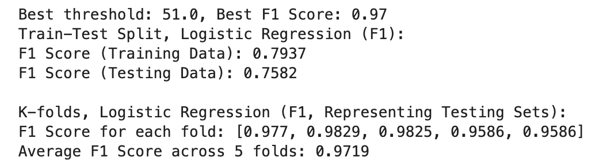
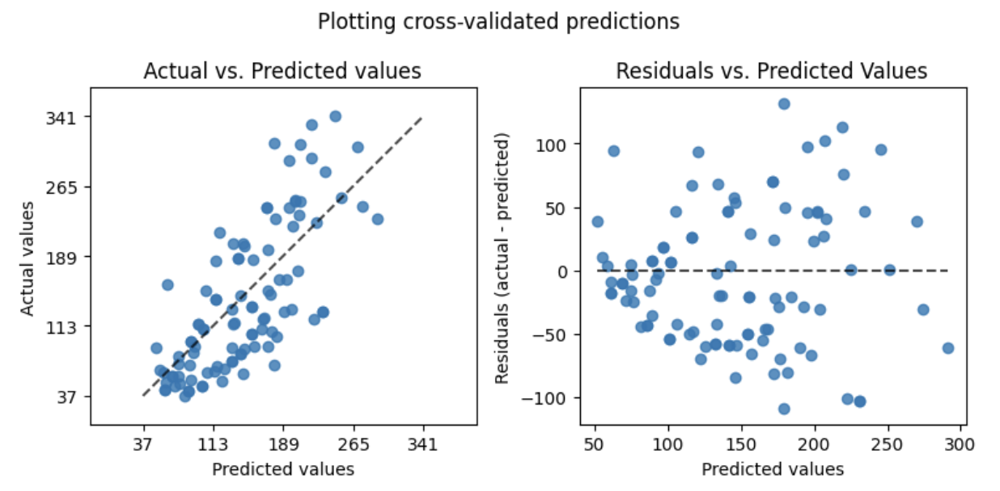

# Cross Validation Evaluation: R^2/ F1 Scoring Tool

## Overview

#### What is Cross-Validation?
Cross-validation, K-folds specifically, is a validation technique used to train and test data for prediction models. This validation technique addresses the limitations of single train-test split, as it is a better estimate of model performance due to its reduced impact on data splitting location. This is especially true for imbalanced datasets, where one class could have fewer samples than another.

#### Cross-validation (K-folds) Summary:
1. The dataset is divided into k equal parts (folds)
2. The model is trained k times, each time using k-1 folds for training and the remaining fold for testing.
2. Rotation after each train and test split occurs, so a separate fold is used for testing each time- all k folds get tested once.

#### Single Train-Test Split Summary:
1. Split the data into two parts
2. Train one part of the data, use this model to test the other part.

#### Benefits of K-Folds:
Cross-validation (K-folds) provide a better estimate of model performance by testing on different parts of the data. This reduces the impact of data splitting on the results, leading to a more reliable evaluation.

However, this technique comes with runtime as a tradeoff, for K-fold cross-validation requires more computational time as the model needs to be trained k times.

#### Why is Cross Validation Evaluation Important?
Cross-validation evaluation can provide a comprehensive model performance assessment of training and validation techniques such as single train-test split and k-folds cross validation; this assessment provides insight into how well the data was used to make a predictive model, essentially how the testing and predictive parts of these approaches fit. 
This evaluation is also important because it recognizes and displays the tradeoffs between different validation techniques.

## Tool Goals

The goal of our Cross Validation evaluation tool is to run both Single train-test split and K-folds Cross Validation on an input dataset, and generate both R^2 and F1 scores to evaluate the performance between the validation techniques. 

## Instructions

#### 1. Install Packages

To install necessary packages, paste the following command in the terminal:
```
pip install imbalanced-learn numpy pandas scikit-learn matplotlib
```
#### 2. Running the Script

To run the Python script in VSC/Github, enter the following command in the terminal:
```
python F1R2figsINPUT.py
```
After this, the script will prompt the user for a file path. Enter the input file's path into the terminal. 
```
"Enter path to the CSV: "
```
The following example provides the filepath to csv file dataset1.csv, located inside TestingSets folder within the directory.
```
# Example:
TestingSets/dataset1.csv
```

Jupyterhub allows the user to view generated plots from evaluation. Copy script into Jupyter notebook and run to observe output plots if needed.


#### 3. Evaluating the Output
The following output will record the R^2 and F1 values for each train-test split and k-fold generated from the input dataset. The following is an example output derived from imput file dataset1.csv:
```
$ python F1R2figsINPUT.py
Enter path to the CSV: TestingSets/dataset1.csv
 
 
R^2 Evaluation:
 
Train-Test Split, Linear Regression R^2 Training Data: 
0.00013016622712969106
Train-Test Split, Linear Regression R^2 Testing Data: 
-0.03326427777288421
 
 
K-folds, Linear Regression: 
R² Score for each fold: [np.float64(-0.002), np.float64(-0.0049), np.float64(-0.0092), np.float64(-0.1091), np.float64(-0.019)]
Average R² across 5 folds: -0.03
 
 
F1 Evaluation:
 
Best threshold: -0.9226599999999999, Best F1 Score: 0.97
Train-Test Split, Logistic Regression (F1):
F1 Score (Training Data): 0.5149
F1 Score (Testing Data): 0.5106
 
 

K-folds, Logistic Regression (F1, Representing Testing Sets):
F1 Score for each fold: [0.9529, 0.9899, 0.9691, 0.9899, 0.9688]
Average F1 Score across 5 folds: 0.9741

```


### Code Implementation Introduction
A variety of code packages may be used to implement cross-validation, however, we chose to use the following:
```
import pandas as pd
import numpy as np
import matplotlib.pyplot as plt
import sklearn.linear_model #LinearRegression, LogisticRegression
import sklearn.model_selection #train_test_split, KFold, cross_val_score
import sklearn.metrics #PredictionErrorDisplay, f1_score
from sklearn.preprocessing import StandardScaler
from imblearn.over_sampling import SMOTE
from sklearn.datasets import load_diabetes
```

The most important packages used here are `sklearn.linear_model` and `sklearn.model_selection`. The former allows for the implementation of regression models, which we use to test and compare both train-test splits and k-fold methods that are described in the latter package. 

### Modeling and Testing
As stated above, two tests were run: a train-test split and a k-fold cross validation, both using a linear regression model to keep things consistent. A ratio of 80% training data and 20% testing data was chosen for the train-test split, while a five fold cross-validation was chosen as it would essentially compute the average of five 80:20 train-test splits (since different fifths of the data acts as the testing portion).

To compare both of these algorithms, we used their R<sup>2</sup> values. The R<sup>2</sup>, also known as the coefficient of determination, is the variance of a dependent variable based on the independent variable. In our case, it measures how well the data fits the regression line. Simply, data points closer to `1` will fit the regression line better, while data points further from `1` will fit the regression line worse. 

Another metric to compare both algorithms is an F1 score. F1 scores are used to compute the accuracy of a model, that is, the amount of times that an algorithm makes a correct prediction of a dataset. It does this by getting the harmonic mean of precision scores (fraction of true positive vs. true positive + false positive) and recall scores (fraction of true positive vs. true positive + false negative). The F1 score ranges from `0` to `1`, where `0` represents poor performance and `1` represents perfect performance. 

We compared feature labels, which includes attributes like, age, sex, BMI, and blood pressure, to target labels, which are a quantitative measure of diabetes progression one year after baseline to generate predictions and their R<sup>2</sup> values. 

### Thresholds for F1:
To accurately analyze F1 scores on vastly different datasets regarding different sampling, values, and distributions, we automated the selection of threshold by choosing an optimal percentile value after testing the data on a large range of percentile values. When a high percentile value is selected, this results in higher true positives and higher sensitivity to false positives, whereas a low percentile value indicates lower false positives but lower sensitivity to true positives. The threshold selection process demonstrates the trade-off between precision and recall, as the resulting F1 score represents both.  

The automation of thresholds for F1 scoring enabled us to select optimal threshold boundaries for any valid input dataset, thus improving the model's performance across both train-test splits and k-folds. By applying a wide range of thresholds based upon percentile ranges on the dataset and then selecting the most effective one, this script is able to determine the optimal cutoff for F1 calculation. 

First, the script tests the range of the percentile values (5% to 95%) on the input dataset using a for loop in the Python script. For each iteration of this loop, this script calculates all of the F1 values and represents their effectiveness as a mean score in a temporary variable. If the average mean score of F1 values from this percentile is larger than the current best iteration, then this variable is replaced and the optimal threshold value is recorded. 

#### Importance:
Allowing the model to adjust is very important, as it is able to analyze different characteristics and distributions of data, hence improving its reliability as a tool for others to use. By optimizing the F1 score, this script enhances the overall performance in comparing the F1 scores and therefore effectiveness in classification between train-test split and k-fold evaluation.


The R<sup>2</sup> value for cross-validation is higher than the R<sup>2</sup> value for the train-test split alone. In other words, there is less variance from the regression line using cross validation. 




The F1 score for cross-validation is higher than the F1 score for the train-test split alone. In other words, the cross-validation algorithm performs better than cross-validation due to its higher precision and recall. 





The plots are consistent with this fact. Points in the train-test split are more spread out and further from the regression line, while values for cross-validation appear more congregated and closer. Further, the residuals vs. predicted values plot for the train-test split shows maximum y-value points with differences of above `200` whereas the residuals vs. predicted values plot for the cross-validated predictions shows maximum y-value points with a difference of around `100`. This indicates that there is less of a difference in the cross-validated predictions compared to the train-test split predictions. 


### Public Dataset References:

Titanic:
https://www.kaggle.com/datasets/fossouodonald/titaniccsv


Childhood Allergies: Prevalence, Demographics. 
https://www.kaggle.com/datasets/thedevastator/childhood-allergies-prevalence-diagnosis-and-tre

Other reference 
Liedes, H. (2023). Prediction and Monitoring of Progression of Alzheimer’s Disease : Multivariable approaches for decision support. https://core.ac.uk/download/553298606.pdf

 Wikimedia Foundation. (2024c, November 25). Cross-validation (statistics). Wikipedia. https://en.wikipedia.org/wiki/Cross-validation_(statistics)#:~:text=Cross%2Dvalidation%20includes%20resampling%20and,model%20will%20perform%20in%20practice. 


