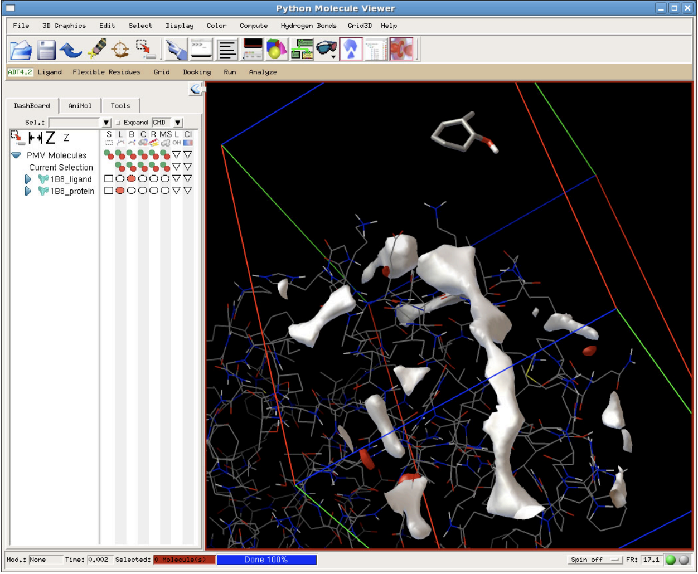
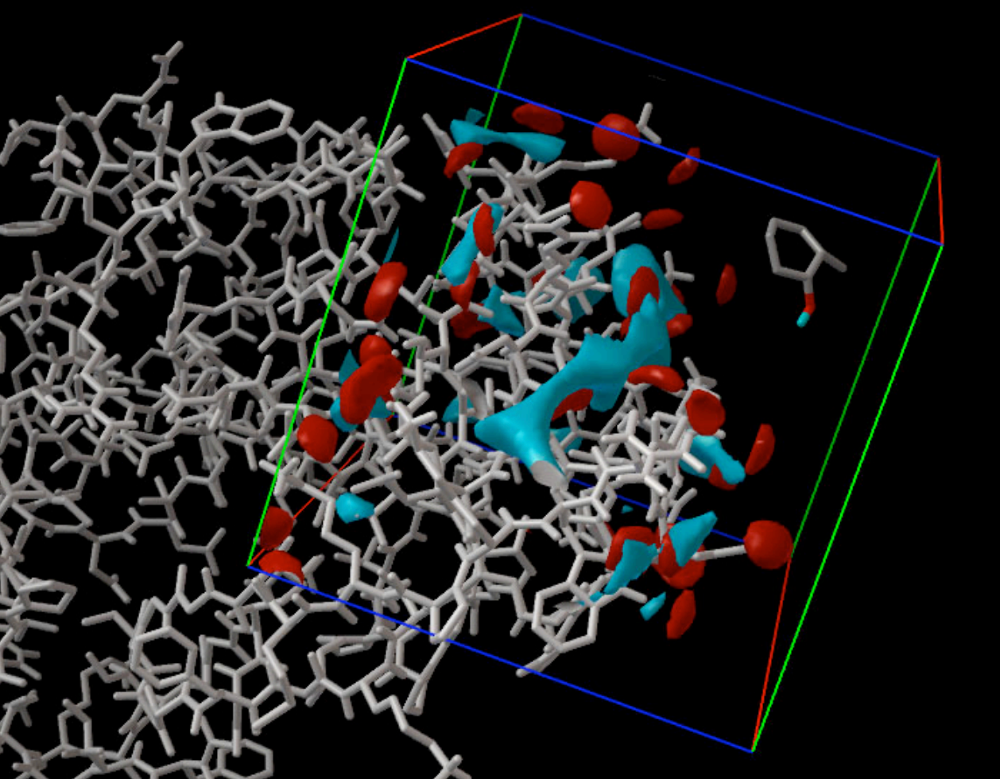
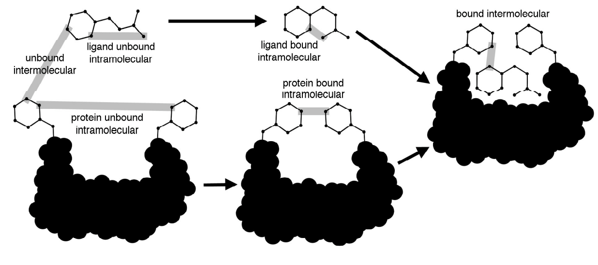

### Introduction
We are Natalie Norstad, Sahana Rangarajan, and Ian McNellis. We are group 22, and this is the report for our BENG 183 Final Project on AutoDock!

### About AutoDock
AutoDock is a suite of molecular docking prediction tools that are useful in modeling interactions between proteins and ligands. AutoDock is most commonly used for drug development, but can be applied towards various biotechnical research projects including x-ray crystallography, combinatorial library design, chemical mechanism studies, protein-protein docking, lead optimization, virtual screening, and structure-based drug design. Given the vast number of conformations and possible interactions between proteins and ligands, molecular docking is notoriously difficult to solve and predict. Thankfully, the development of computational tools like AutoDock allows us to quickly make testable predictions about the most energetically favorable docking interactions, which makes drug development significantly more time and cost-efficient.

### Components of AutoDock
AutoDock includes 3 main components for making and analyzing molecular docking predictions:
    
**AutoDockTools**: 
Serves as the graphical user interface for AutoDock.
Allows you to modify or create the coordinate files needed for AutoGrid to perform pre-calculations.
Provides different visualization methods for your target molecules and for the predicted docking interactions.  

**AutoGrid**: 
Performs the pre-calculations necessary for AutoDock to predict docking.

    
**AutoDock**: 
Simulate docking with protocols that match different prediction needs.
For example:
Conformation Search
Number of Evaluations
Model for the Unbound Ligand
Redocking Studies for Validation
AutoDock includes adjustable parameters that allow you to make custom protocols for special cases.

### How does AutoDock Predict Molecular Docking?
Using AutoDockTools, we make coordinate files for our target molecules. The coordinate files include information about the atoms and intermolecular forces within each of our target molecules.

Using these coordinate files as input, AutoGrid embeds the target molecules into a grid, where each point in the grid represents an atom. Then, different energy metrics are calculated for each grid point, and these calculations are output into AutoGrid files.

AutoGrid uses information from the coordinate and Autogrid files, as well as constants and calculations from known protein-inhibitor complex interactions in order to establish a "semi-empirical" free-energy force field around our target molecules. There are four contributions to the force field: dispersion and repulsion potential, hydrogen bond potential, electrostatic potential, and desolvation potential. Together, these components take into account carbon atom interactions, oxygen-hydrogen interactions, and interactions between oppositely charged atoms. The image below shows an example of how the energy of the force field changes as the different forces change.

Then, binding predictions are made within this force field in a two-step process.

**Step 1**: The protein and ligand begin in unbound states, and intramolecular energetics of the transition from both molecules to the bound state are calculated.

**Step 2**: The intermolecular energetics for the protein and ligand in their bound states are calculated.

Combined calculations from these 2 vital steps are used to identify sites with high binding potential between the protein and ligand

### Workflow
1. Prepare Coordinates: AutoDock requires a special type of file as input called a PDBQT file, which is an extended format of a PDB file. This format contains information about polar hydrogen atoms, partial charges, atom types, and the movement of flexible molecules. This is critical for AutoDock analysis given that AutoDock calculates the energies of molecular interactions between the ligand and receptor molecules. In general, there will be separate files for the ligand and receptor molecules. There can be additional files if there are portions of the receptor that are flexible. The files can be modified via AutoDockTools to add further information about the molecules. These modifications can include information about charge or hydrogen atom placement, as well as rotational bond location. 
2. Run AutoGrid: AutoGrid creates grid maps corresponding to the energies of each atom or functional group in the molecule of interest. There are three outputs from AutoGrid. The first is the ASCII-formatted grid map that will be used as input for AutoDock. The second output is a summary of the grid maps, and the final output describes the coordinates of the grids in Cartesian space. 
3. Run AutoDock: Running AutoDock requires three inputs: the grid maps for each atom type in the ligand, the PDBQT file for the ligand, and finally a docking parameter file that gives AutoDock information about the files and parameters of the docking. The docking parameter file can be created using AutoDockTools. Users will often dock a ligand multiple times to get multiple docked conformations of the complex. 
4. Evaluate Results: AutoDock outputs docking results into the docking log file. AutoDockTools can be used to help analyze this data. The contents of this file includes a clustering analysis of of the docked conformations, as well as coordinates for the best predicted conformation in each cluster. The quality of conformation is determined via a free energy scoring function. There are many different commands within AutoDockTools that allow the user to get further analysis of many aspects of the output which is discussed further below. 

### Basic Usage Instructions:  
**Creating AutoGrid files with AutoGrid**:  
In the terminal, run:  
    `autogrid4 -p macro.gpf [-l macro.glg]`  

`-p gpf_filename` specifies the grid parameter file.

*Optional inputs*:  
`[-l glg_filename]` specifies the log file. If no log file is specified, output will be in the terminal.  

**Running AutoDock**:  
In the terminal, run:  
    `autodock4 [-i][-u][-t] -p lig.dpf [-l lig.dlg]`

`-p dpf_filename` specifies the docking parameter file.

*Optional inputs*:  
`[-i]` ignore grid map header errors  
`[-u] [-h]` provide usage instructions  
`[-t]` parse PDBQT files for torsion definitions, then stop  
`[-v]` print version information  
`[-l dlg_filename]` specifies the log file. If no log file is specified, output will be in the terminal  

*AutoDock Programs*:
1. The first protocol is a conformation search which most often utilizes a Lamarckian Genetic Algorithm. There are other search algorithms including Genetic Algorithms and Simulated Annealing. However, the Lamarckian Genetic Algorithm is the most efficient search algorithm with up to 10 rotatable bonds in the ligand.
2. The second protocol is the number of evaluations. It modulates the amount of computational power utilized to solve the problem. This protocol would change the algorithm used to solve the problem based on the computing power permitted. For example, a ligand might be assigned fewer rotating bonds or the binding site might be found using a divide and conquer strategy.
3. This protocol creates a model for the unbound ligand to estimate the amount of free energy the ligand has to bind to the target protein.
4. There are also re-docking studies for validation which can be used to validate different docking methods. The success of the the experimental docking can validated by using a known docking model to compare the energetic efficiency with.

**Analyzing Results with AutoDockTools**:  
AutoDock produces a docking log file that can be explored with the 'analysis' command to create a cluster analysis of the different docking conformations and will write the coordinates of conformation with best predicted energy in every cluster. Additionally, AutoDockTools allows for analysis of different aspects of this output. AutoDock not only provides visualization of the molecular interactions, but also more advanced visualization tools, including color coding areas of the complex by the predicted energy of the interaction. There is also an option to visualize the grid maps created by AutoGrid. Some examples of these commands are:\
'Analyze>Dockings>ShowInteractions' - highlights the interactions between ligand and receptor\
'Analyze>Conformations>PlayRankedByEnergy' - will play how autodock found different docking conformations  in the order they were found then ranked by energetic efficiency\
'Analyze>Clusterings>Show' - displays clustered conformations\
'Analyze>Clusterings>ReclusterOnSubset' - reclusters docking conformations based on a smaller subset of atoms than initial clustering\

### Resources
The AutoDock user guide is linked here: [pdf guide](https://autodock.scripps.edu/wp-content/uploads/sites/56/2021/10/AutoDock4.2.6_UserGuide.pdf) and is also included in our resources folder.

Tutorials:  
[*Molecular Docking for Beginners*](https://www.youtube.com/watch?v=k6tqCeDIwEk)

Sources:  
[*A simple click by click protocol to perform docking: AutoDock 4.2 made easy for non-bioinformaticians*](https://pmc.ncbi.nlm.nih.gov/articles/PMC4669947/)
[their github](https://github.com/ccsb-scripps/AutoDock-GPU)
