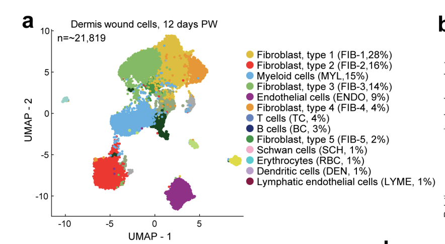
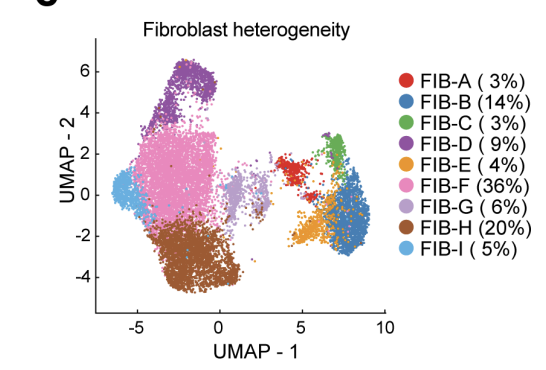
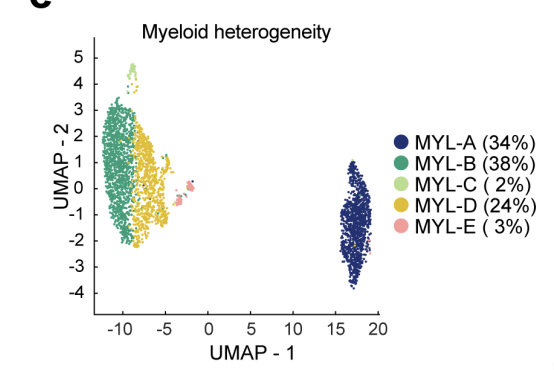
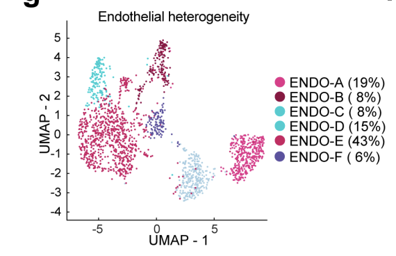
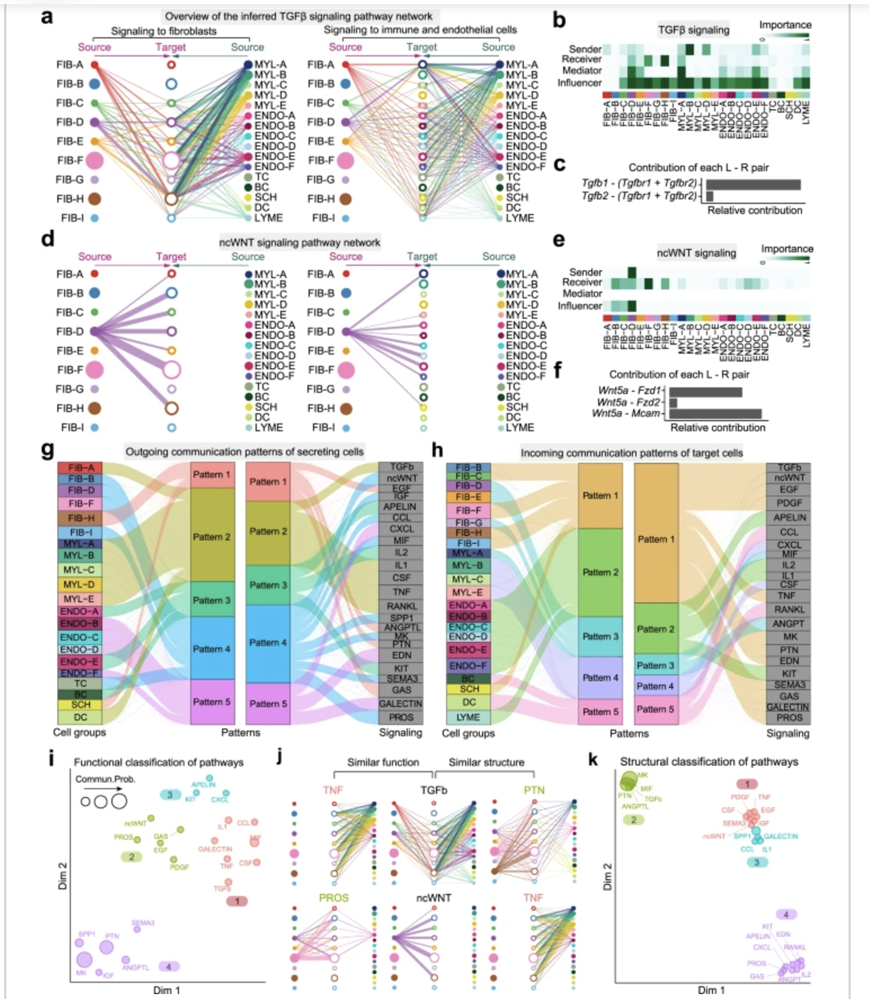

# CellChat: An R Toolkit For Inference and Analysis of Cellular Signaling

## Background: Cellular Signaling

Intercellular communication is fundamental to the coordination of cellular behaviors within tissues and organisms. Through the exchange of extracellular signaling molecules, ligands, receptors, and their cofactors regulate essential processes including development, tissue repair, and immune responses. These interactions occur via autocrine, paracrine, and juxtacrine mechanisms, and together create intricate networks of molecular interactions that are vital for maintaining homeostasis, driving pathological changes, among other functions. While single-cell RNA sequencing (scRNA-seq) has revolutionized our ability to profile cellular diversity and gene expression, understanding how these cells interact through communication networks remains a significant challenge. Many existing tools for analyzing such interactions focus primarily on one ligand/one receptor gene pairs and thus fail to capture the complexities of heteromeric molecular structures and signaling cofactors. This is despite the fact that information regarding gene expression that may elucidate such intercellular communications is intrinsically contained by the same scRNA-seq used by these other tools. To bridge this gap in deciphering global communication among cells in an organism, we hereby share CellChat, an R toolkit that provides more comprehensive interpretations of this same scRNA-seq data.

## An Overview of CellChat

CellChat exists as both an open-source R toolkit and a web-based explorer, both of which are designed to infer, analyze, and visualize intercellular communication networks. This paper will primarily focus on the former R toolkit when discussing application and workflow, although the underlying theory and much more is applicable to both.

By integrating transcriptomic data with a meticulously assembled database of the known structural composition of ligand-receptor interactions, CellChat enables researchers to reconstruct the complex signaling networks that underpin complex cellular behaviors. This database leverages multiple types of such interactions, including multimeric ligand-receptor complexes, soluble agonists and antagonists, and stimulatory and inhibitory membrane-bound co-receptors. CellChat then employs a statistical framework in accordance to the law of mass action to identify significant ligand-receptor interactions, allowing it to build weighted, directed graphs that represent cell-cell communication. These graphs illustrate the probability and strength of communication events between different cell groups. Such analyses enable identification of specific signaling roles played by each cell population, as well as generalizable rules of intercellular communications within complex tissues.

The software creates a plethora of visualization tools, including circle plots, bubble plots, and hierarchical diagrams, to help researchers intuitively explore how cells contribute to various signaling pathways. In addition to visualization, CellChat provides a powerful quantitative analysis that identifies key signaling sources, targets, and mediators within a network. These features enable the discovery of input and output signaling patterns that reveal how cells coordinate to produce or respond to specific signals. Furthermore, by comparing networks across different datasets, CellChat can identify conserved or context-specific pathways, making it highly valuable for comparative studies.

## Workflow

The CellChat workflow involves a series of preparation, computation, and analysis steps. An overview of these steps can be seen in figure 1. CellChat is built on top of CellChatDB, a database composed of known ligand-receptor complexes, signaling pathways from the KEGG Pathway database, and cell interactions from experimental studies. All of these interactions are further manually classified into functional signaling pathways. All downstream analysis regarding cellular interactions and pathway analysis utilizes CellChatDB. CellChat expects a labeled single-cell RNA sequencing dataset as input. Alternatively, the user can provide a dataset without labels, but with a low-dimensional mapping of the data such as principle component analysis. CellChat will then construct and label cell groups based on the distance and connectivity within the low-dimensional mapping. Differentially expressed genes per cell group in the input single-cell RNA sequencing data is determined through the Wilcoxon rank sum test with an alpha of 0.05. Communication between cell groups is quantified through assigning a probability value to each interaction. This is modeled by the law of mass action. Significant interactions are determined through a custom statistical test that randomly relabels and recalculates cellular interaction group probabilities. Weighted directed graphs are used to represent the network of significant interactions, and the hierarchical plot, circle plot, and bubble plot are visual graph representations that are provided by CellChat. Cellchat also provides a suite of quantitative analysis tools that utilize graph theory, pattern recognition, and manifold learning in an unsupervised manner. Four tools provided allow for the identification of signaling sources and targets from network analysis, prediction of incoming and outgoing signal for a specific cell group through patter recognition approaches, clustering of signaling pathways within the data by utilizing manifold learning with both topological and functional perspectives, and identification of conserved pathways across multiple datasets with joint manifold learning. The resulting output includes visual representations as well as the computed quantification. Outside of the analysis tools mentioned above, further downstream analysis can be done with output from the prior step. Thus, independent or collaborator tools can exist for post-CellChat analysis. Overall, CellChat provides a relatively comprehensive pipeline for driving biological discovery of cellular interaction from single-cell RNA sequencing data.

## Application
Let's see how CellChat works by applying the tool on a dataset. We will work with a day 12 mouse skin wound tissue dataset from scRNA-sequencing. This dataset contains roughly 22,000 cells. Through UMAP clustering, the 22,000 cells are clustered into 25 cell groups (Figures 1,2,3,4). Some main cell groups are the fibroblast cells (9 groups), the myeloid cells (5 groups) and the endothelial cells (6 groups).

*UMAP clustering of cells in the datasets, resulting in 13 distinct cell groups*

From figure 1, further clustering was done on the fibroblast cells, myeloid cells, and endothelial cells, which yieled additional subgroups of each of these cell groups (figures 2, 3, 4)

*UMAP clustering of fibroblast cells, the clustering yielded 9 different clusters within the fibroblast cell type*

*UMAP clustering of myeloids cells, the clustering yielded 5 different clusters within the myeloid cell type*

*UMAP clustering of endothelial cells, the clustering yielded 6 different clusters within the endothelial cell type*

Within this dataset, CellChat found 60 ligand-receptor pairs, which are categorized into 25 different signaling pathways, like 	TGF-$\beta$, non-canonical WNT (ncWNT), TNF, etc. Here, we will focus on the TGF-$\beta$ and ncWNT pathways. Output from CellChat feature several visualizations that help identify roles of cells in the pathway and communication patterns between cells, and classification of signaling pathways based on function and structural similarity. 

*Output of CellChat from the dataset. Visuals include communication patterns between cell types in the TGF-$\beta$ and ncWNT pathways (A, D), roles of each cell type in the pathway (B, E), categorization and classification of cells and signaling pathways into distinct patterns (G, H), and classification of pathways based on similarity in function or structure (I, J, K)*

**Transforming Growth Factor Beta (TGF-$\beta$) Pathway:**
From the output, we can see that myeloid cells are the dominant source of ligands (visual A), and fibroblast cells are the main "receivers". Other ligand sources include fibroblasts, endothelial cells and other cell types. Other "receiver cells" can be seen in the right graph of visual A, these include mainly endothelial cells and other cell types. From visual B, we can see that the MYL-B group is a strong source of ligands (i.e dark green as a sender), while MYL-A is a strong mediator and influencer, indicating that MYL-A is a gatekeeper in the pathway.

The findings from these visuals for TGF-$\beta$ indicate that the pathway is a highly complex and redundant pathway, with multiple sources of ligands that can target a variety of cell types. Additionally, visual C also indicate that there are 2 ligands in the pathway, *Tgfb1* and *Tgfb2*, although *Tgfb1* is the dominating ligand in this pathway.

**Non-canonical WNT (ncWNT) Pathway:**
From the visuals, it appears that the FIB-D group is the only source of ligand for this pathway. These ligands target other fibroblast subgroups, as well as endothelial subgroups, one myeloid group and other cell groups. This suggest that this pathway is distinct and non-overlapping, unlike the TGF-$\beta$ pathway.

**Categorization and Classification of Cell Groups and Pathways**:
In visuals G and H, we can see the outgoing (cells as senders) and incoming (cells and receivers) communication patterns generated by CellChat. For each, there are 5 patterns identified. Cell groups are grouped into one of the 5 patterns, and each pattern is associated with some signaling pathways. For example, under the outgoing communication patterns, pattern 2 contains mainly myeloid cell groups, and this pattern contains the TGF-$\beta$ pathway, which we previously knew that myeloid cells were the main source of ligands. On the other hand, pattern 4 captures the outgoing signaling pattern of fibroblast cells, in multiple pathways such as ncWNT, CCL, MIF, etc. Patterns 3 and 5 capture endothelial cells' behavior as source of ligands for signaling pathways like APELIN, IL2, CXCL, EDN, etc.

Under the incoming signaling patterns, pattern 1 and 3 capture the receiving fibroblasts associated with some pathways like TGF-$\beta$, ncWINT, EGF, etc, while pattern 2 captures endothelial cells as receivers in signaling pathways APELIN, IL2, etc. Pattern 4 captures the behavior of myeloid cells as receivers and associate them with the CXCL and CSF pathways.

From the outgoing and incoming patterns, we can examine the complexity of these patterns and how different cell groups may use multiple or few of the same/different signaling pathways. Additionally, looking at both incoming and outgoing patterns also give insights into whether signaling pathways are autocrine or paracrine. For example, in the outgoing patterns, the MK pathway is associated with pattern 4 which groups mainly fibroblast cells. In incoming patterns, the MK pathway is associated with pattern 1, which is again grouped with fibroblast cells, indicating that this pathway is autocrine within fibroblasts.

**Clustering and Classification of Pathways by Similarity**: CellChat can group pathways based on function (i.e behavior/purpose of pathway) or structure (ligand source/receiver). In visual I, CellChat separated the pathways into 4 groups. The first cluster represents inflammatory pathways like TGF-$\beta$ and TNF. The second group contains autocrine signaling pathways between fibroblasts, like ncWNT and EGS. The third group contains signaling pathways from endothelial cells, such as CXCL and APELIN. Group 4 contains pathways that are "high" in signaling connectivity, like MK, PTN and SPP1.

Through grouping by function, CellChat aids in the classification of poorly studied pathways. By grouping lesser-known pathways with more known ones, functions of these lesser-known pathways can be inferred with the group that they are associated with. 

On the other hand, grouping by structure also yielded 4 groups. Grouping structure relies on the sender/receiver infrastructure and assign signaling pathways to group based on similarity in that aspect. Group 1 contained pathways that have few senders and lots of receivers, like ncWNT. Group 2 contained pathways with lots of senders and receivers, like TGF-$\beta$. Group 3 contained pathways with lots of senders but few receivers, like CCL and IL1. Lastly, group 4 contain pathways with few senders and receivers, like PROS and IL2.

Grouping based on structural similarity reveals how cells utilize a signaling pathway as a sender and as a receiver.

## Conclusions and Further Readings

CellChat has made a significant contribution to the field of intercellular communication research by bridging the gap between scRNA-seq data and signaling network reconstruction. This has enabled researchers to transition from profiling cellular diversity on a pairwise level to understanding how cells interact at a global level. Leveraging an advantage over many precious approaches, CellChat takes into consideration the complexity of multimeric ligand-receptor interactions and cofactors, and produces biologically relevant predictions. The ability to compare communication networks across conditions further enhances its utility for both basic and translational research.

Furthermore, the release of CellChat v2 presents a significant advancement by integrating multiple spatially resolved transcriptomics datasets into its analytical framework. This update allows researchers to incorporate spatial proximity into the analysis of cell-cell communication. With this integration, CellChat furthers its ability to combine computational methods with transcriptomic and spatial data, making it a great tool for researchers who seek to uncover the complex networks that drive cellular behavior. By shedding light upon deeper insights into these cellular dynamics, CellChat has the potential to inform therapeutic strategies and advance our understanding of complex biological systems. 

**Links**  
- [CellChat R Toolkit GitHub Repository](https://github.com/jinworks/CellChat)  
- [CellChat Web Explorer](http://www.cellchat.org/)
