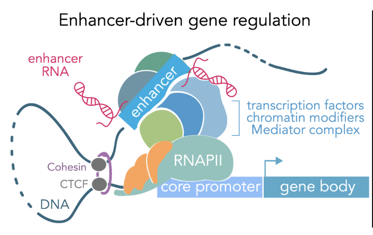
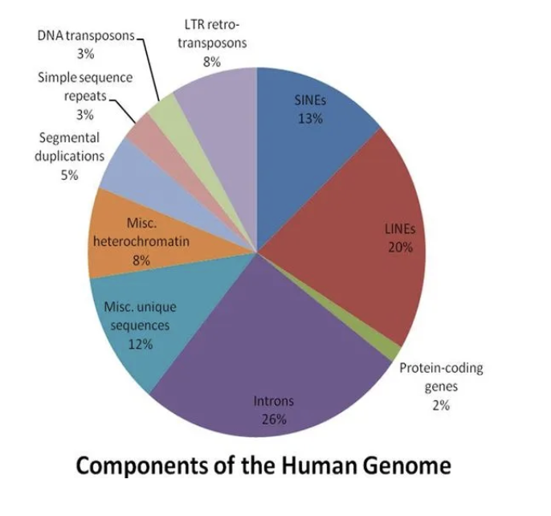
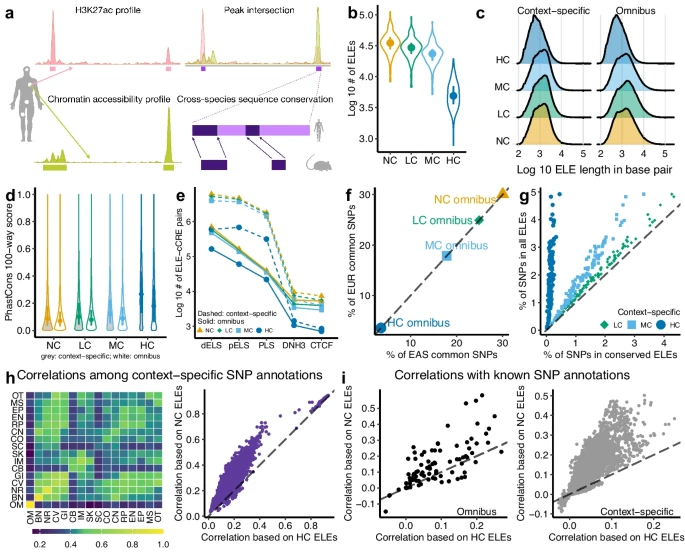
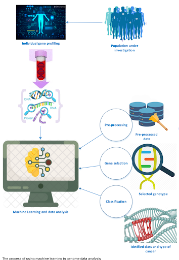
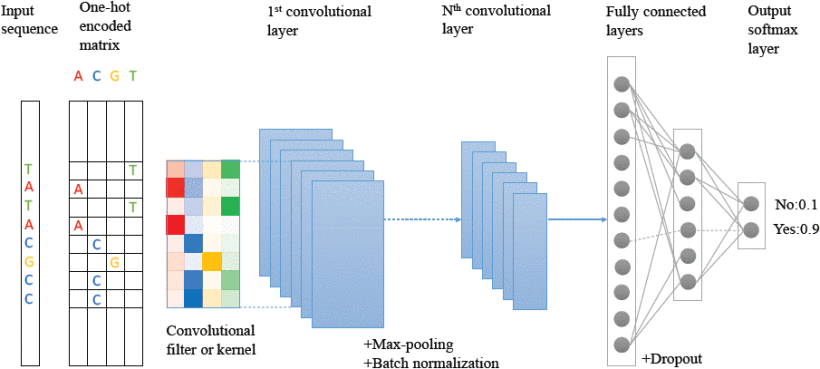
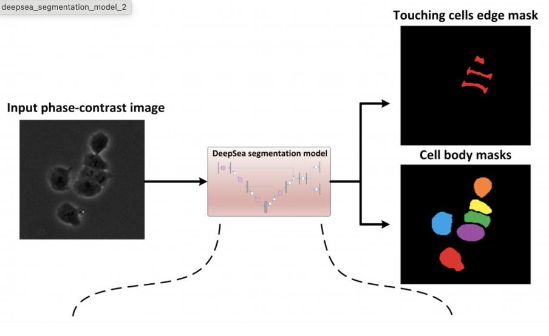
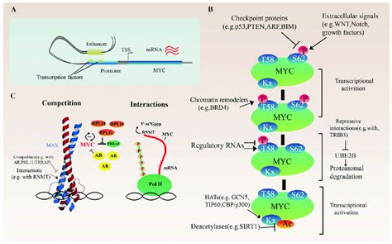
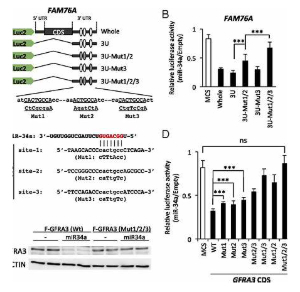
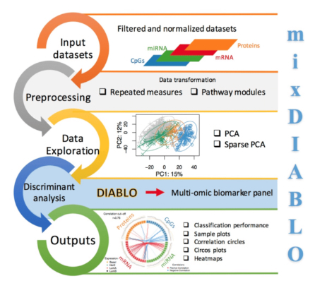

# Detecting Non-coding Mutations with AI
### Team 26: Alan Li, Dennis Chan, Sahil Iyer

---

## Table of Contents

-   [The Noncoding Genome: Why Does It Matter?](#the-noncoding-genome-why-does-it-matter)
-   [Why Are Noncoding Mutations Hard to Study?](#why-are-noncoding-mutations-hard-to-study)
-   [AI-Driven Analysis of Noncoding Genomic Regions](#ai-driven-analysis-of-noncoding-genomic-regions)
    -   [GWAS & AI for Noncoding Regions](#gwas--ai-for-noncoding-regions)
    -   [CNNs for Enhancer Prediction](#cnns-for-enhancer-prediction)
    -   [AI-Driven Mutation Impact Prediction Workflow](#ai-driven-mutation-impact-prediction-workflow)
-   [DeepSEA: Predicting Functional Impact of Noncoding Variants](#deepsea-predicting-functional-impact-of-noncoding-variants)
-   [Real-World Impacts of AI in Noncoding Mutations](#real-world-impacts-of-ai-in-noncoding-mutations)
-   [Current Limitations of AI in Noncoding Genomics](#current-limitations-of-ai-in-noncoding-genomics)
-   [Next Steps](#next-steps)
-   [Summary and Takeaways](#summary-and-takeaways)

### The Noncoding Genome: Why Does It Matter?

The human genome is around 98% noncoding DNA. This Includes enhancers, promoters, introns, and other regulatory regions. It is thought to control when and where genes are expressed. Noncoding mutations may disrupt regulatory networks, leading to diseases such as cancer, neurological disorders, and developmental abnormalities. The TERT promoter mutation is an example of this that activates telomerase expression in cancer cells. Enhancers regulate transcription by acting over large distances, while promoters, located closer to genes, are essential for initiating transcription. Mutations in these critical regions can disrupt transcription factor binding, altering gene expression. Additionally, epigenetic marks such as histone acetylation further influence noncoding DNA function by modifying its regulatory activity.

In figure 1 you can see how it illustrates how enhancers, which are often located far from their target genes, interact with promoters and transcription machinery through DNA looping to regulate gene expression.

### Why Are Noncoding Mutations Hard to Study?

There is a lack of functional annotation. There is limited coverage of functional elements in noncoding regions in databases like ENCODE. For example, only a subset of enhancers and promoters have experimental validation, leaving many regions uncharacterized. This lack of data makes it difficult to assess whether a noncoding mutation impacts gene regulation or is benign. The gene regulation mechanisms are also very complex. The noncoding mutations often act through long-range interactions an example of this are enhancers affecting genes hundreds of kilobases away. These interactions depend on chromatin conformation and 3D genome organization, which require specialized experimental tools like Hi-c to resolve.

The Genome-Wide Association Studies have identified thousands of noncoding variants associated with diseases, like diabetes and alzheimers. However, these studies only provide statistical correlations; they don’t explain the molecular mechanism of how a mutation leads to disease. An instance of this was A GWAS variant near the FTO gene was linked to obesity but later found to act through a distant enhancer regulating IRX3 & 5 expression. Lastly, High-throughput sequencing produces massive datasets, and analyzing noncoding regions requires advanced computational models and AI tools to scale effectively.

In figure 2 you can see that there is a chart showing the genomic distribution of mutations, coding vs. noncoding

### AI-Driven Analysis of Noncoding Genomic Regions

Noncoding DNA, once dismissed as "junk," is now recognized as crucial for gene regulation. Understanding its function and the impact of mutations presents a significant challenge. Recent advancements combine genome-wide association studies (GWAS) and artificial intelligence (AI) to illuminate these genomic regions.

#### GWAS & AI for Noncoding Regions

Figure 3

A GWAS study by Zhu et al. (2024) investigated mutations in conserved enhancer-like elements (ELEs), identifying 313 ELEs with regulatory activity across species. These ELEs showed enrichment in tissue-specific heritability and causal variants for complex traits, prioritizing genes for conditions like BMI and schizophrenia previously missed by GWAS. AI further enhances this analysis by processing large datasets to predict noncoding region function and mutation impact.

Figure 4

#### CNNs for Enhancer Prediction

Figure 5

Convolutional Neural Networks (CNNs) excel at predicting enhancer regions. DeepEnhancer (Min et al., 2017), for example, uses CNNs trained on FANTOM5 and ENCODE data to outperform traditional methods and identify key sequence motifs, highlighting the power of deep learning in genomic analysis.

#### AI-Driven Mutation Impact Prediction Workflow

Predicting mutation impact with AI involves:

1. **Inputting** genomic and epigenomic data.
2. **Preprocessing** (encoding sequences, normalizing data).
3. **Integrating** data.
4. **Training/applying** CNNs and/or transformers.
5. **Predicting** mutation impact on gene regulation.
6. **Deriving** functional insights.

### DeepSEA: Predicting Functional Impact of Noncoding Variants

DeepSEA is an advanced tool designed to predict chromatin accessibility, transcription factor binding, and histone modifications. It operates by analyzing 1,000-base-pair genomic sequences with or without mutations as input. Using convolutional neural networks the model identifies sequence features linked to epigenetic changes and outputs the probability of functional disruption caused by mutations. A notable application of DeepSEA is in cancer genomics, where it is used to identify noncoding driver mutations that may contribute to disease. The architecture of DeepSEA’s CNN includes an input layer that encodes sequences as one-hot vectors, convolutional layers that detect sequence motifs, and an output layer that predicts changes in chromatin accessibility or transcription factor binding. This integration of AI into genomics enables researchers to better understand the functional impact of noncoding mutations.

Figure 6 demonstrates the DeepSEA segmentation model, which processes input phase-contrast images to identify and segment cellular components, producing outputs like edge masks and cell body masks.

### Real-World Impacts of AI in Noncoding Mutations

AI is changing our understanding of the noncoding genome regions, at one time referred to as "junk DNA," to recognize their key roles in both disease and regulatory mechanisms. The same AI has been instrumental in cancer genomics, where it has uncovered such mutations in enhancers or promoters serving to upregulate oncogenes, including that now well-recognized TERT promoter mutation contributing to uncontrolled cellular proliferation. Consequently, AI has made research into rare diseases possible by revealing non-coding mutations involved in diseases such as Rett Syndrome and autism. These advances, while continuing to improve our understanding of the mechanisms behind the disease, also point toward possible diagnostic and therapeutic directions.

Consequences also extend to drug development, where the identification of non-coding regulatory regions by AI was steered toward finding new therapeutic targets. Artificial intelligence has also been applied in the prediction of non-coding mutations leading to the overexpression of oncogenes such as MYC, crucial in tumor progressions. Predictions are usually subjected to validation through experimental procedures, such as CRISPR screens or luciferase assays, thereby linking computational predictions with functional biologic analysis. This synthesis has currently demonstrated that AI-generated insights into the non-coding genome can guide and extend therapeutic development with effects. A striking example of such a noncoding enhancer mutation is one driving MYC overexpression that has been validated through luciferase assays-really showing off the power of AI in dissecting complex genetic interactions.

Figure 7: Diagram illustrating the regulatory role of enhancer and promoter interactions in oncogene activation, focusing on MYC. This includes transcriptional activation influenced by chromatin remodelers, regulatory RNAs, and extracellular signals, demonstrating how enhancer mutations can drive oncogene expression.

Figure 8: Experimental validation of noncoding mutations using luciferase assays. The results highlight the functional impact of mutations in regulatory regions, such as FAM76A and GFRA3, showcasing their role in gene expression and potential contributions to oncogene activation.

### Current Limitations of AI in Noncoding Genomics

There are a few major limitations to AI in noncoding genomics. First, there is a real risk of bias within the data. The training datasets are usually biased toward well-annotated populations or genomic regions, thus reducing the power of AI models. This may result in mistakes or the loss of signals while applying the models to a diverse population or less-well-characterized regions of the genome. Types of machine learning biases included prejudice, sample, measurement, exclusion, and algorithm biases. Another limitation is the interpretability and explainability of the models of artificial intelligence, specifically for those relying on complex architecture, such as CNNs. This often means the models act like "black boxes" in which it always remains hard for the researchers to understand the actual basis for their predictions.

Experimental validation also poses a considerable barrier. While artificial intelligence is able to predict functional noncoding mutations, experimental validation requires long and tedious methods such as CRISPR or luciferase assays. Without robust validation, the reliability of AI-driven insights is yet to be determined. Such challenges call for the development of explainable AI approaches, such as attention mechanisms that could highlight which genomic regions most influence the model predictions. Explainable AI holds potential for improvement in interpretability, thus informing key regions for experimental follow-up and consequently overcoming a lot of the current limitations to make AI predictions actionable.

### Next Steps

Future developments in artificial intelligence in the field of noncoding genomics are based on the integration of novel technologies and approaches in order to address the current challenges. One of the most promising directions involves multi-omics integration, putting together the insights from DNA sequencing, RNA sequencing, and ATAC-seq toward a holistic view of gene regulation. By integrating different types of datasets, researchers can build more robust and accurate AI models that better capture the complex interplay between multiple layers of regulation.

Another improvement concerns the aspect of real time that these AI models introduce, such as the nanopore variation classification models that can provide immediate information, marking a breakthrough in diagnostics and enabling immediate decisions in clinical and research practice.

Of course, another important area in development is the models of explainable artificial intelligence. Formulation of methods for explaining the underlying reason for the prediction made by AI will instill more trust in these systems and enable applicability to precision medicine and research studies involving genomics. As these tools start getting put to use, it will be much clearer to researchers just how the non-coding areas influence health and disease, providing game-changing insights.

Figure 9: Overview of the mixDIABLO workflow for multi-omics integration, showing steps from input datasets through preprocessing, data exploration using PCA, and discriminant analysis to generate outputs like multi-omic biomarker panels and visualizations such as correlation circles and heatmaps.

### Summary and Takeaways

AI will finally unlock the true potential of the noncoding genome to be therapeutically translated with wide-ranging implications for precision medicine and genetic research. AI has started to revolutionize the knowledge of cancer and rare disease mechanisms and the identification of therapeutic targets by characterization of non-coding mutations and deciphering their functional consequences. While challenges still exist regarding data bias, model interpretability, and required experimental validations, efforts toward explainable AI and multi-omics integration are very promising in solving these issues. The greater the inclusiveness of AI in the fulfillment of non-coding genomics, the greater the investments that have to be made in data, explanation of models, and details of experimental procedures. With the help of prediction and validation, much can be learned about functional non-coding mutations; these can probably also revolutionize diagnosis and therapy in the field of complex diseases. The better AI gets, the more likely this field of study at the crossroads of AI and genomics will lead to new concepts being discovered and opening new therapeutic options.

### References
1. [Zhu, X., Ma, S., & Wong, W. H. (2024). Genetic effects of sequence-conserved enhancer-like elements on human complex traits. *Genome Biology, 25*(1), 1–20.)](https://doi.org/10.1186/s13059-023-03142-1)

2. [Min, X., Zeng, W., Chen, S., & Chen, N. (2017). DeepEnhancer: Predicting enhancers by convolutional neural networks. *Bioinformatics, 33*(21), 3482–3490.)](https://doi.org/10.1109/BIBM.2016.7822593)

3. [Quang, D., Chen, Y., & Xie, X. (2015). DANN: A deep learning approach for annotating the pathogenicity of genetic variants. *Nature Methods, 12*(10), 931–933.)](https://doi.org/10.1038/nmeth.3545)
