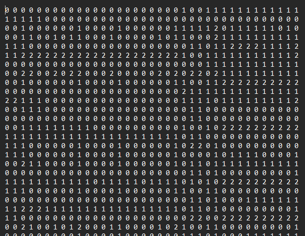
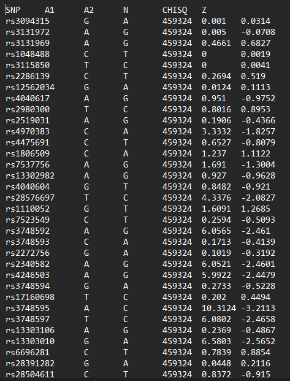
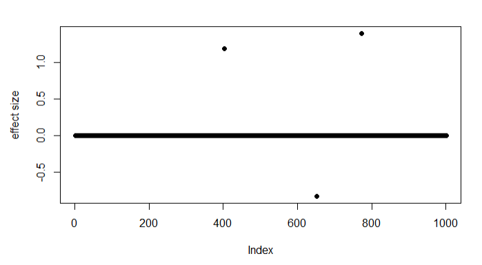
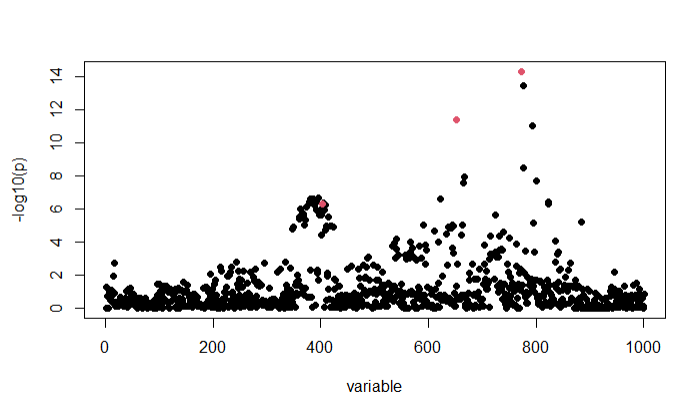
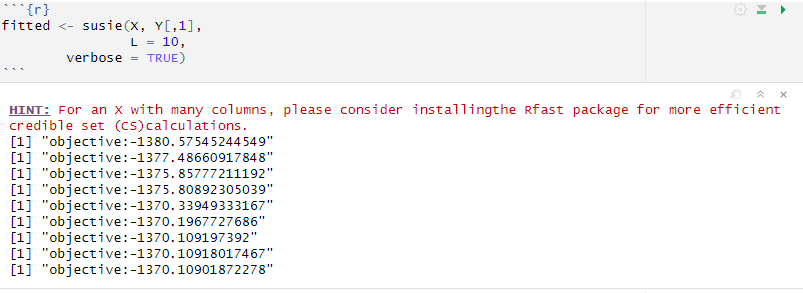
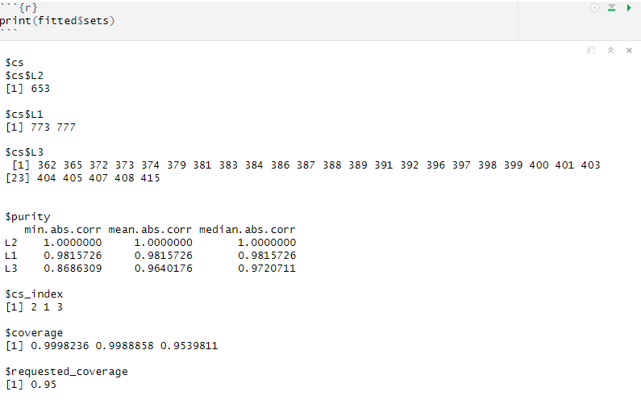
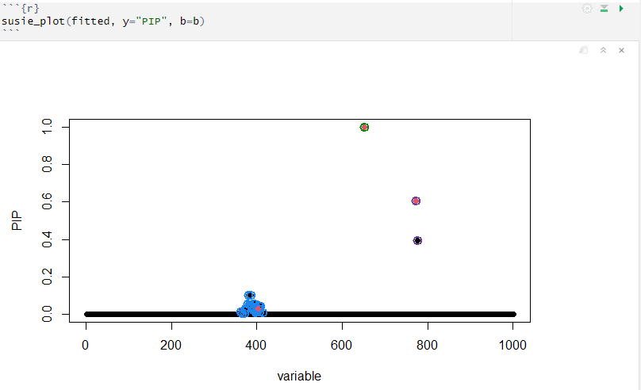

## **Introduction to SuSiE Analysis for Genomics Applications**

---

### **Section 1: Introduction to SuSiE Analysis** 

### 1.1 What is SuSiE?

The ‘sum of single effects model,’ more commonly known by the acronym SuSiE, is a statistical framework widely used in genomic bioinformatics for fine-mapping complex traits. 

### 1.2 Why Does SuSiE Matter?

With the advent of massive genomic datasets in the early 2000s, it became possible to identify causal SNPs for specific phenotypes on an unprecedented scale; this process is known as “fine-mapping.” Fine-mapping is the bridge between correlation and causation in genomics research; while genome-wide association studies (GWAS) narrow the vast space of possible SNPs into a relatively small subset correlated with a specific phenotype, fine-mapping narrows that subset down even further to pick out the SNPs which actually cause that phenotype. On the wet lab side, fine-mapping also vastly decreases the number of SNPs that need to be experimentally tested to find a causal mechanism.

Fine-mapping is difficult largely because of linkage disequilibrium—when multiple SNPs are close to each other, they tend to be inherited together during meiosis, making it difficult to disentangle which are causal and which are merely correlated due to their proximity to the true causal SNPs. Historically, statistical methods for fine-mapping have often struggled to handle uncertainty, or have done so in ways that are difficult to interpret. SuSiE was created as an alternative approach; instead of selecting just the most likely causal SNP from each set of SNPs in linkage disequilibrium (LD blocks), or independently quantifying the likelihood that each SNP is causal (the posterior inclusion probability), SuSiE generates small “credible sets” of SNPs, where each credible set is expected to contain at least one causal SNP and roughly corresponds to a region of high linkage disequilibrium. Providing fine-mapping information as credible sets instead of cherry-picked variants allows genomic researchers to make follow-up research decisions without having to worry that they’re missing relevant information. Furthermore, SuSiE’s innovative statistical methods–in particular its use of single-effect regression (SER) models and iterative Bayesian stepwise selection (IBSS)–make it highly efficient compared to other fine-mapping methods. Due to its computational efficiency and the ease with which its results can be interpreted, SuSiE has become a staple in the field of genomic bioinformatics since its publication in 2020\.

### 1.3 Key Concepts

This write-up will explain the mechanics of SuSiE analysis from a bioinformatics perspective, emphasizing practical considerations over statistical theory. However, for those interested in the statistical methods which form the core of SuSiE, key concepts are defined below to facilitate further reading.

**Prior Probability Distribution**

- The initial probability distribution which represents, for each SNP, the estimated likelihood that said SNP is causal. During regression, this distribution is updated according to Bayes’ rule and the model structure to form the posterior probability distribution.

**Posterior Probability Distribution**

- The final probability distribution which represents, for each SNP, the estimated likelihood that said SNP is causal. In SuSiE, multiple posterior probability distributions are generated, then each is truncated to form a credible set.

**Credible Set**

- A set of SNPs which probably contains at least one causal SNP. Specifically, a level *p* credible set will have at least probability *p* of containing at least one causal SNP.

**Effect Vector**

- A vector representing the estimated effects (regression coefficients) of each SNP on the phenotype of interest.

**Single-Effect Regression (SER)**

- A simple statistical model that uses an effect vector in which all but one regression coefficient is 0 and a prior distribution which assigns nonzero probability-of-being-causal to each SNP. Fitting an SER model is computationally simple and produces a prior distribution which can easily be translated into a single credible set (of arbitrary level *p*).

**Sum of Single-Effects Regression**

- A statistical model comprising linear combinations of effect vectors from SER models. Decomposing the trained (post-regression) model into individual effect vectors allows for easy tabulation of credible sets.

**Iterative Bayesian Stepwise Selection (IBSS)**

- The regression procedure which is used to fit a sum of single-effects model. IBSS is similar to previous iterative regression approaches, but incorporates Bayesian uncertainty during stepwise variable selection.

---

### **Section 2: Workflow and Key Steps in SuSiE Analysis**

### 2.1 Input Data Requirements

* Genotype matrix   
  * This is a matrix of people x SNPs  
  * Each value is 0,1, or 2, representing the number of copies of that SNP  
* Summary statistics (e.g., GWAS results)  
* Vector of phenotype information (if no summary stats)

Example genotype matrix

Example GWAS summary statistics

* The genotype matrix may be stored as a bed file (as this one is), and if so will have the row and column information stored in other files. The genomics software PLINK utilizes a trio of .bed-.bim-.fam files, each with the same name but different file extension, to keep track of separate pieces of information that correspond to each other.   
* You can read this trio of files into R with the package “plink2R”  
* In the GWAS summary stats matrix each SNP is indicated with an rsID

### 2.2 Workflow

* Preprocessing:  
  * Filter SNPs based on MAF (Minor Allele Frequency). This allows you to remove low frequency SNPs to reduce noise. Due to these SNPs being rare (eg. MAF \< 0.01) it is hard to detect effects without a very large sample size.  
  * Linkage Disequilibrium (LD) pruning can be performed to remove SNPs that are highly correlated. SuSiE is able to handle moderate LD so this step is not always necessary.  
* Run SuSiE

### 2.3 Code Walkthrough

The dataset used in the example below is simulated but showcases some of SuSiE’s functions.  
This dataset contains 3 causal SNPs with effect sizes shown below.   

A Manhattan plot indicating the causal SNPs in red:    

As you can see, many of the other SNPs clustered around the causal SNPs have high p-values, due to correlation with the causal SNPs.  

Next you can fit a model. The parameter “L” represents how many causal SNPs are present, but SuSiE is robust to the number specified.  

Next print out the credible sets of SNPs. SNPs 403, 653, and 773 are causal in this example, and all three were identified in credible sets.  

SuSiE also has options for displaying your credible sets, graphing the SNPs by location and PIP

---

**Section 3: Interpreting SuSiE Results and Practical Application**

### 3.1 Understanding the Output

The following table provides some insight into possible output metrics after executing a SuSiE analysis:

| Metric | Description | Examples of Output |
| :---- | :---- | :---- |
| Posterior Inclusion Probabilities (PIP) | A PIP is a vector containing probability values associated with SNPs. A higher PIP value indicates higher likelihood of a SNP’s association with the outcome. | \[0.002, 0.005, 0.950, 0.020\] |
| Credible Sets | A CS is a  list of SNPs that, when grouped together, meet or exceed the desired probability of containing at least  one causal variant.  | cs1: \[3\] , cs2: \[12, 13\] |
| Coverage | Probability that causal SNPs are captured in credible sets. | \[0.95, 0.93\] |
| Purity | Correlation between SNP effects in each credible set. |  \[0.98, 0.85\] |
| Effect Sizes | Estimated effect sizes for each SNP across components. | 0.001, 0.002, 0.120 |
| Residual Variance | Unexplained variance in the phenotype. | 0.120 |
| Local False Sign Rate | Probability that the effect size estimate has the wrong sign (effect is in the inverse direction). | \[0.98, 0.85, 0.01\] |

---

### 

### 

### 

### 3.2 Practical Example: SuSiE Analysis Walkthrough

#### Dataset Overview

In this example, we simulate the analysis of a GWAS dataset for breast cancer susceptibility. The dataset consists of:

* **Phenotype:** Binary outcome indicating breast cancer diagnosis.  
* **Genotype data:** 10,000 SNPs genotyped across 2,000 individuals.  
* **Covariates:** Age, family history, and smoking status.

#### Running SuSiE

1. **Preprocessing**  
2. **Executing SuSiE:**  
   1. Used `susieR` in R with the following parameters:  
      `susie_output <- susie(genotype_matrix, phenotype_vector, L=10, coverage=0.95)`  
   2. Key inputs:  
      * `genotype_matrix:` Matrix of genotype data.  
      * `phenotype_vector:` Binary breast cancer outcome.  
      * `L:` Number of components (set to 10).  
      * `coverage:` Desired coverage level for credible sets (95%).

#### Key Results

**Posterior Inclusion Probabilities (PIP):** top SNPs with high PIPs:

| SNP | PIP |
| :---- | :---- |
| 245 | 0.920 |
| 312 | 0.750 |
| 890 | 0.620 |

Interpretation: SNP 245 has the highest likelihood of being causal.

**Credible Sets (CS):** two credible sets identified:

* **CS1:** SNPs {245, 246, 247}, Coverage \= 0.95, Purity \= 0.98.  
* **CS2:** SNPs {890, 891}, Coverage \= 0.93, Purity \= 0.85.  
  **Effect Sizes:** Estimated effect size for SNP 245: 0.15   
  **Residual Variance:** 0.12, suggesting a good model fit.  
  **Local False Sign Rate (LFSR):** LFSR for SNP 245: 0.02, indicating high confidence in the effect’s direction.

#### Biological Insights

* **SNP 245:** Strong candidate for causality, located in a region previously associated with breast cancer.  
* **CS2 SNPs:** Highlight potential novel loci for further investigation.  
* **Effect sizes:** Suggest modest contributions to breast cancer risk.

---

### 3.3 Limitations and Best Practices

SuSiE is a great tool for fine-mapping in GWAS with moderate LD levels. Results are most clear when multiple causal variants are expected to be in the same region. 

While this tool remains the gold standard, there are some limitations. Namely,

1. **Computational Demands**: Large datasets (i.e. greater than 100,000 SNPs) can be computationally intensive and expensive. 

2. **Datasets with Low Purity**: Credible sets with low purity may indicate overlapping signals or poor resolution.

However, when using SuSiE, invoke the following best practices to obtain optimal functionality despite the limitations:

1. **Preprocessing**: Ensure data has been cleaned and is standardized  
2. **Parameter Tuning:** Adjust the number of components (L) and coverage level based on dataset complexity.  
3. **Validation:** Use external datasets or biological experiments to validate findings.

You got this\!

---

### **Conclusion**

As we hope you’ve seen, SuSiE is a powerful and easy-to-use tool for genomic fine-mapping. It is no surprise that SuSiE has achieved broad popularity within the field of bioinformatics; a quick Google Scholar search shows that SuSiE is cited in more than 700 papers, an impressive statistic for a specialized computational biology tool. Now that you’ve seen how SuSiE works, we encourage you to try it out for yourself\! Experimenting with cutting-edge tools is a great way to build skills relevant for real-world bioinformatics research, and SuSiE is relatively accessible for those with an R background.

---

### **Sources**

[https://stephenslab.github.io/susie-paper/manuscript\_results/pedagogical\_example.html](https://stephenslab.github.io/susie-paper/manuscript_results/pedagogical_example.html)

Hutchinson A, Asimit J, Wallace C. Fine-mapping genetic associations. Hum Mol Genet. 2020 Sep 30;29(R1):R81-R88. doi: 10.1093/hmg/ddaa148. PMID: 32744321; PMCID: PMC7733401.

Wang, G., Sarkar, A., Carbonetto, P., & Stephens, M. (2020). A simple new approach to variable selection in regression, with application to genetic fine mapping. Journal of the Royal Statistical Society: Series B (Statistical Methodology). [https://doi.org/10.1111/rssb.12388](https://doi.org/10.1111/rssb.12388)
