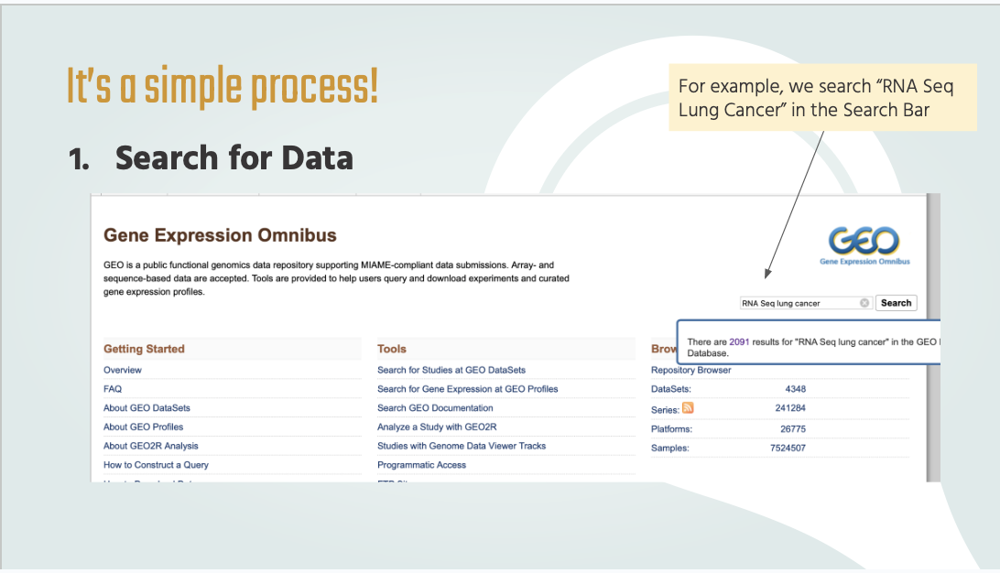
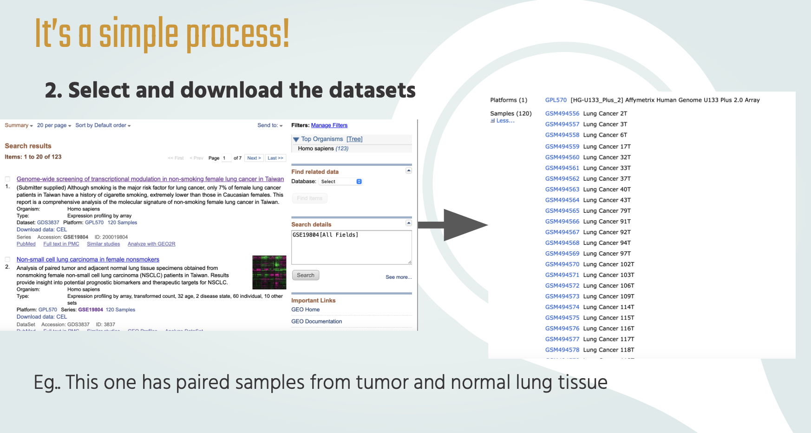
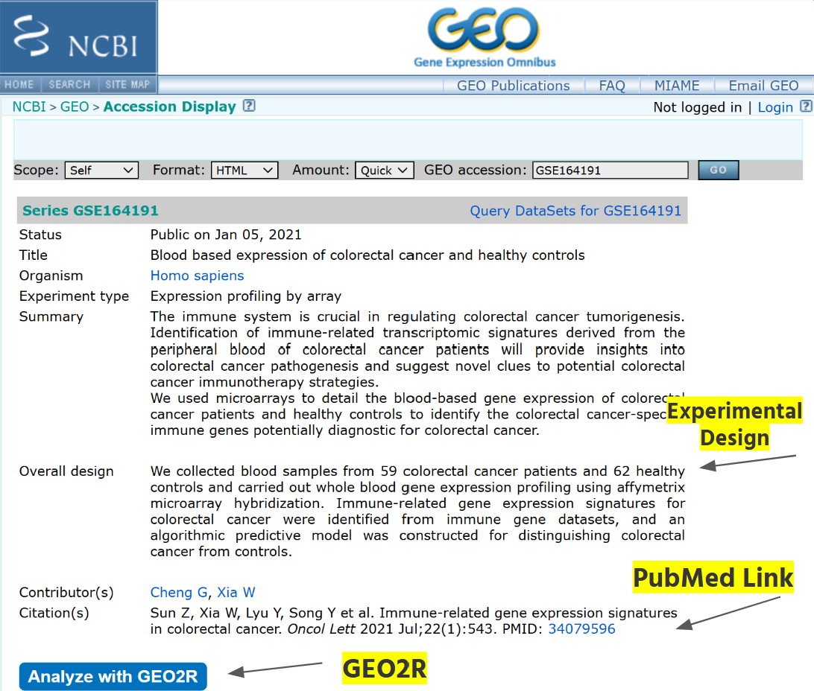

# BENG183-Final-Paper-Omnibus
This is the repositry for the final paper for BENG 183. Done by Jade Chng, Kayla Cooper, Shannon Saad

PIDS: Jade Chng (A16998881), Kayla Cooper (A16852807), Shannon Saad (A17321836)

## Gene Expression Overview
### What is Gene Expression Omnibus? 
Gene Expression Ombinus (GEO) is a public repositry that contains large datasets of high throughput gene epxression data and hybridization array, chips, microarrays. It supports MIAME-complaint data submissions. MIAME stands for Minimum Information About a Microarray Experiment. It is a set of guidelines developed by the Microarray Gene Expression Data (MGED) Society to enusure data from microarray experiments that can be easily interpreed, reproduced, and re-analyzed by other researchers. 

Essentially, it is a public databse that contains gene expression data that is very widely used by bioinformatitians. It is also maintained by the National Center for Biotechnology infomration (NCBI) 

### Significance of Gene Expression Omnibus
It is a publiclly Accesssible database that allows scientists to get data internationally. It essentially serves as a centrailized location for data with its methodoloy, experiment design and accessible data. It can be used for a myriad of tasks, that can be used for personal projects, analysis and research. This way, scientists can spend more time analyzing  data than simply obtaining and measuring it.

## What is Gene Expression Data? 
Gene expression is when genetic information from DNA is transcribed into RNA and translated into protiens. We use gene expression data when we want to compare two cell types and their pressense of disease, to do so, we compare their gene expression levels. 

### Types of Gene Expression Data
1. Mircoarray Data:
Gene expression data obtianed from a microarray experiment. It is presented as a matrix of rows representing samples and columns representing genes, with each cell indicating the expression level of a specific gene. 

   
3. RNA-Seq Data:
RNA Sequencing is a technique that uses next-generation sequencing. It shows which genes in our DNA is transcribed or "turned on". The output is presented as read counts or normalized metrics such as TPM (Transcrits per Million), RPKM (Reads Per Kilobase) and FPKM (Fragments Per kilobase of transcript per Million)

5. Other Data Types:
Some other datatypes include Single-Cell RNA-Seq(scRNA-Seq), Spatial Transcruptomics and many more!

## How do we use Gene Expression Ombinus? 
It is a very straight forward process!
### 1. Search for Data
We just have to type in the search bar of the datasets we are interesed in. In this example,  we are interested in lung cancer. Hence, in the search bar, we would include "RNA Seq Lung Cancer"

### 2. Select and download datasets
We would then want to select and download the appropriate dataset we would like to analyze. Look out for datasets that contains a description that it contains two different sets of differentially experessed genes. For example, we chose the data set "Genome-wide screening of trancriptional modulation in non-smoking female lung cancer in Taiwan" and from there it would provide use a large dataset of samples 

### 3. Analyze using bioinformatic tools 
Some Examples: 
   1. GEO2R: tool within GEO

   2. R packages:
      
         a. Limma: for microarray data
      
         b. ggplot2: for publication quality visualizations
      
         c. Seurat: analysis, visualization and exploration of single-cell RNA sequencing
      
         d. DESeq2: For RNA-seq count data to identify differentially
      
         e. edgeR: For RNA-Seq differential expression analysis

## Example Study: Gene Expression Profiling in Blood Samples for Colorectal Cancer
The National Engineering Center for Biochip in Shanghai, China did a study [(1)](https://pmc.ncbi.nlm.nih.gov/articles/PMC8157333/) analyzing gene expression differences between patients with and without colorectal cancer. They compared gene expression levels in 59 colorectal patients and 62 healthy  patients, and shared their data using GEO. The raw data can be downloaded as a *.tar file, and can even be analyzed using GEO2R.

## How to Use GEO & GEO2R
To begin using GEO, you can use keywords like "lung cancer", "homo sapien", and "RNAseq" to search for specific studies tailored to your interests. Each study has a unique GEO accession code assigned to it, which can also be used to search for or refer back to a study. 
For example, the aforementioned colorectal cancer study has a GEO accession code of GSE164191. Once a study has been found, it will have a GEO webpage containing all necessary information, such as date of publish, experimental design, location of the lab, and any supplementary documents or data. 

From here, we can select _Analyze with GEO2R_ to use GEO's built in tool to analyze our samples and determine any differentially expressed genes.

### Using GEO2R Tool
1. Group your samples into experimental and control groups:
   

2. Change the settings from the default, such as making adjustments to normalization, p-values, and significance cuttoffs:
   

3. Once GEO2R analyzes the data, it will show you various graph visualizations of the data, as well as a table of the most significantly differentially expressed genes.
   

### How To Interpret the Generated Volcano Plot
Each point in the graph represents a gene that appears in both the control and experimental group.

Axes:
   - x-axis: the extent of differential expression (log2(fold change) between experimental and control groups
   - y-axis: the extent of significance of the genes (-log10(Pvalue)). Genes with the lowest p-values are at the top while genes with the highest p-values are at the bottom.
     
Point Colors:
   - Dark Grey: genes that are not significantly differentially expressed in the experimental group (p-values are above the significance cutoff)
   - Blue: significantly downregulated genes in the experimental group (p-values are below the significance cutoff)
   - Red: significantly upregulated genes in the experimental group (p-values are below the significance cutoff)

### Upregulated Gene Example: NACA
The NACA gene is highly significant and upregulated as it is represented by a red dot that is high on the plot. The NACA gene codes for integrin-linked kinase (ILK) which is a protein involved in pathways linked to cell migration and proliferation (crucial for cancer metastasis). Therefore, this gene is upregulated in many cancers.  

### Downregulated Gene Example: APP
The APP gene is highly significant and downregulated as it is represented by a blue dot that is high on the plot. The APP gene is involved in pathways that induce apoptosis, given the cell has become diseased (cancer cells avoid this). Therefore, this gene is downregulated in many cancers. 

## References
1. Sun, Zhenqing et al. “Immune-related gene expression signatures in colorectal cancer.” Oncology letters vol. 22,1 (2021): 543. doi:10.3892/ol.2021.12804
2. The GeneCards Suite: From Gene Data Mining to Disease Genome Sequence Analyses Current Protocols in Bioinformatics (2016), 54:1.30.1 - 1.30.33.doi: 10.1002 / cpbi.5 

