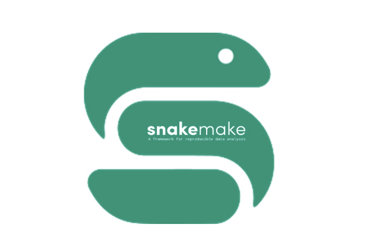
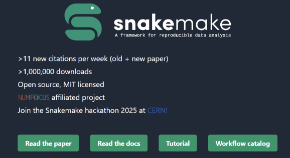
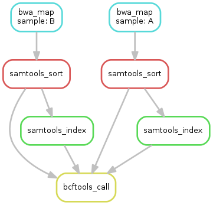
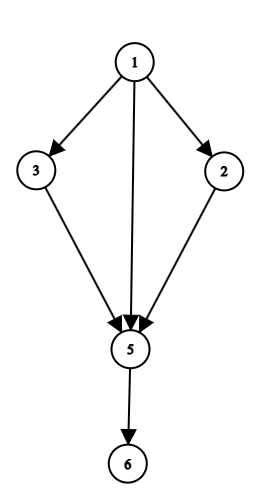
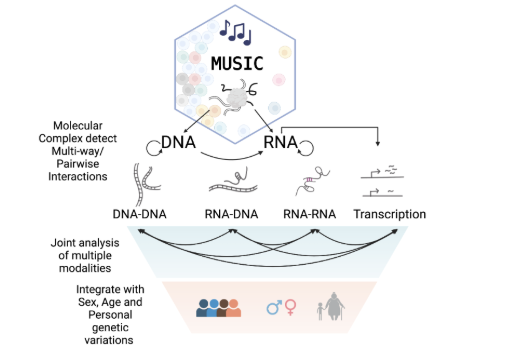

# Snakemake
Hugh (Trevor) Redford, Noah Skinner, and Yifei Ding





## Table of Contents

1. [What is Snakemake](#what-is-snakemake)  
2. [Background](#background)  
3. [How to Use Snakemake](#how-to-use-snakemake)  
4. [Key Features of Snakemake](#key-features-of-snakemake)  
5. [Writing a Snakemake Workflow](#writing-a-snakemake-workflow)  
6. [Key Syntax To Use In A Workflow](#key-syntax-to-use-in-a-workflow)  
   - [Wildcards](#wildcards)  
   - [The All Rule](#the-all-rule)  
7. [How is Snakemake Used at UCSD](#how-is-snakemake-used-at-ucsd)  
8. [Significance of Music](#significance-of-music)  
9. [Summary](#summary)
10. [References](#references)  


## What is Snakemake



Snakemake is a workflow management system designed to produce reproducible data analyses that is highly adaptable with powerful tools for generalization. It is an important framework that enables researchers and data scientists to create, manage, and execute complex computational workflows with precision and reliability.

## Background
Snakemake is utilized a lot in bioinformatics. It significantly enhances research efficiency by allowing researchers to focus on data analysis and interpretation rather than managing complex workflows or troubleshooting dependency issues. By automating repetitive tasks, it reduces the time and effort required to conduct analyses. It also ensures data integrity and accuracy through clear documentation of inputs, outputs, and steps, which enhances transparency and trust in the results. Additionally, Snakemake only re-runs affected tasks when changes occur, ensuring consistent and reliable outputs.

Collaboration is made easier with Snakemake's declarative workflows, which enable researchers from different institutions or disciplines to share and run identical workflows, fostering interdisciplinary research. This also supports open science by lowering barriers to entry for less experienced users, democratizing access to powerful data analysis tools. Snakemake optimizes resource allocation and avoids unnecessary computations, reducing the environmental footprint of large-scale analyses.

In summary, Snakemake transforms data analysis by promoting reproducibility, minimizing manual errors, and streamlining processes across diverse computational environments. Its profound impact spans fields like bioinformatics and machine learning, improving the quality, transparency, and efficiency of research.

## How to Use Snakemake 

The following example install Snakemake in a virutual environment `snakemake_env` and execute an example workflow that create two files containing `Hello World`.

1. Install Snakemake via Conda
  ```bash
  # create and enable conda environemnt for snake make
  conda create -n snakemake_env python=3
  conda activate snakemake_env
  # install bioconda and snakemake
  conda install -c bioconda snakemake
  ```
2. Create a workflow directory
```bash
mkdir workflow
cd workflow
```
3. Implement a workflow in the snakemake file (Snakefile)
```bash
cat << 'EOF' > Snakefile
# Exmample workflow:
rule all:
    input:
        "hello_output.txt"  # Final output file

# Write "Hello World" to helloworld.txt
rule write_hello:
    output:
        "helloworld.txt"
    shell:
        "echo 'Hello World' > {output}"

# Read and echo content in helloworld.txt into hello_output.txt
rule read_hello:
    input:
        "helloworld.txt"
    output:
        "hello_output.txt"
    shell:
        "cat {input} > {output}"
EOF
```
4. Organize input data (Optional)
5. Execute workflow
```bash
snakemake -n
snakemake --cores 1
```


## Key Features of Snakemake 


### Python-like Syntax

Snakemake workflows are written in a Python-based syntax, making them easy to learn, especially for those familiar with Python, while remaining beginner-friendly due to their readability. The syntax is both flexible and extendable, allowing users to integrate custom logic and Python functions directly into workflows, enabling dynamic adaptation to varying datasets. Its declarative structure ensures workflows are clear, easy to understand, and maintainable, with rules that explicitly define inputs, outputs, and commands.

This example rule utilize a python snippet to iteratively write output files using python:

```python
rule NAME:
    input: "path/to/inputfile", "path/to/other/inputfile"
    output: "path/to/outputfile", somename = "path/to/another/outputfile"
    run:
        for f in input:
            ...
            with open(output[0], "w") as out:
                out.write(...)
        with open(output.somename, "w") as out:
            out.write(...)

```

### Workflow Nesting

Snakemake can create nessting workflow with sub-workflow. It enable workflows to be reused. A workflow can be directly reused across multiple workflows, enable commonly used steps to be shared by multiple workflows. By dividing complex workflows into smaller sub-workflows, it mitigates the headache of maintaining large and complex worfklows.



#### Modeling Dependencies and Workflow Chaining in Snakemake

To chain multiple rules together in a workflow, Snakemake examines the `input` and `outputs` of each rule to determine which rules have "dependencies" (ie. which rules depend on the outputs of others). These dependencies can be modeled with a directed acyclic graph. A directed acyclic graph (DAG) is a "directed graph that has no cycles". In terms of Snakemake, each node represents a rule and each edge represents a dependency between two rules, where an edge leaving the node represents the output of the rule and a edge leading in to the node represents an input to that rule. 



For a graph such as the one above, we can see that rule 6 is the only node with no outbound edges, meaning that it must be the target rule. The only edge leading to it comes from 5, meaning that rule 6 is dependent on the output of rule 5.
### Integration

Snakemake integrates seamlessly into various computational environments to enhance workflow efficiency and portability. 

Supported integrations:

- **Containerization**
  - Snakemake files can define isolated conda environments or docker for each workflow step, ensuring reproducibility and compatibility across systems.
- **HPC and cloud integration**
  - Snakemake can run workflows on HPC clusters like SLURM or cloud platforms such as AWS Batch, enabling scalability and efficient resource utilization. 
- **Version Control**
  - Snakemake with its modularity and Snakedeploy enable users to easily deploy and adapt pre-built workflows from repositories, making it straightforward to reuse and customize workflows for specific needs.
- **Storage**
  - Snakemake work seamlessly with AWS S3, NFS, and other storage types for big data applications.

### Scalable 

Snakemake is highly scalable, making it suitable for workflows of any size. It automatically parallelizes tasks by running independent steps simultaneously, maximizing the use of available computational resources. Users can also specify the resources needed for each rule, such as memory, CPU cores, or runtime, ensuring efficient resource management and preventing system overload. Also, Snakemake includes a checkpointing feature that allows workflows to restart from where they stopped in case of interruptions, saving time and ensuring seamless execution. These capabilities make Snakemake an ideal choice for both small-scale projects and large, resource-intensive workflows.


## Writing a Snakemake Workflow

To write a Snakemake workflow, you first must create a Snakefile. This is the file where the workflow will be defined. Workflows are written in terms of rules, where each rule performs a specific task or operation.
A basic rule would look like this:

```python
rule example:
  input:
    "data.gz"
  output:
    directory("data/")
  shell:
    """
    mkdir -p {output}
    pigz -d {input} > {output}
    """
```

In Snakemake, rule are typically assigned an name (`Example`), an input (`data.gz`), an output (`data/`), and a shell.

Here, our shell is written as `pigz -d {input} > {output}`.
The `pigz -d` command will decompress a file with the `.gz ` ending.
The `{input}` and `{output}` in the shell command are variables respresenting the defined inputs and outputs. This means that the shell command will take the `data.gz` file and decompress it into the `data/` directory. Additionally, while shell uses terminal commands, you can replace `shell:` with `run:` to use Python code instead.

While this workflow performs the operation correctly, it has potential to be far more useful.

## Key Syntax To Use In A Workflow

### Wildcards

Wildcards are a fundamental part of Snakemake. They allow for the generalization of rules to fit a variety of inputs/outputs. For example, this modified version of the rule above used wildcards to process every `*.gz` file and create directory for each of them:

```python
rule example_with_wc:
  input:
    "{data}.gz"
  output:
    directory("{data}/")
  shell:
    """
    mkdir -p {output}
    pigz -d {input} > {output}
    """
```

If the working directory contains files `set_one.gz`, `set_two.gz`, and `set_three.gz`, running the workflow with this new wildcard functionality would yield the `set_one/`, `set_two/` , and `set_three/` directories.

### The `All` rule

According to the Snakemake documentation, "Snakemake always wants to execute the first rule in the snakefile". This allows for the use of the all rule. The all rule signals Snakemake that this is the target rule. This works regardless of the position of the rule in the workflow. With regards to the previous workflow, it could be written using an all rule. 
      
```python
datasets= glob_wildcards("{data}.gz").data

rule all:
  input:
    expand("{data}/", data=datasets)
  
rule example_with_wc:
  input:
    "{data}.gz"
  output:
    directory("{data}/")
  shell:
    """
    mkdir -p {output}
    pigz -d {input} > {output}
    """
```
This workflow will perform the same as the previous workflow, but this new workflow showcases an interesting feature of Snakemake. 
The `expand() ` takes the target files / files with a variable placeholder (note that the `{data}` in the input of the all rule is NOT a wildcard) and provides each output based on the set provided. In this case, we create a dictionary using `glob_wildcards` to take any file in the working directory with the `.gz` ending. This dictionary is named `datasets` and is specified to be used by the `data=datasets`. 


## How is Snakemake used at UCSD?

At UCSD, Professor Zhong's lab uses Snakemake as the workflow management system for MUSIC, a bioinformatics tool designed to analyze specific types of biological data. Snakemake ensures that MUSIC's workflows are efficient, reproducible, and easy to manage by automating tasks, handling dependencies, and streamlining complex data analyses. This integration allows researchers in the lab to focus on scientific insights rather than the logistical challenges of managing computational pipelines.

### Significance of Music 

MUSIC is a powerful tool for analyzing molecular interactions, such as DNA-DNA, RNA-DNA, and RNA-RNA. What makes it stand out is its ability to incorporate factors like sex, age, and genetics into a joint analysis, offering deeper insights into chromatin and RNA interactions. To handle these workflows efficiently, Snakemake comes into play. It automates and scales the process, ensuring reproducibility and managing complex tasks seamlessly. Together, they create a robust framework for exploring the intricate relationships in human genetics and aging.




## Summary

Snakemake is a powerful and versatile workflow management system that automates complex computational workflows. Designed for reproducibility and efficiency, Snakemake simplifies tasks by using Python-like syntax, modular workflows, and integrations with various computational environments, such as HPC cluters and cloud platforms, making it suitable for projects of all sizes.

By promoting transparency, adaptability, and reproducibility, Snakemake has become an indispensable tool in research and data science, empowering users to focus on discovery and insights rather than the intricacies of workflow management. In practical applications, such as its implementation in MUSIC, Snakemake demonstrates its capacity to streamline complex analytical pipelines, while improving reproducibility and efficiency. This makes it essential for researchers and data scientists who require robust workflow management without sacrificing flexibility or scalability.
## References

1. [Mirchandani, C. D., Shultz, A. J., Thomas, G. W. C., Smith, S. J., Baylis, M., Arnold, B., Corbett-Detig, R., Enbody, E., & Sackton, T. B. (2023). *A fast, reproducible, high-throughput variant calling Workflow for population genomics*. Molecular Biology and Evolution, 41(1).](https://doi.org/10.1093/molbev/msad270)

2. [Snakemake | Snakemake 8.25.5 documentation. (n.d.)](https://snakemake.readthedocs.io/en/stable/)

3. [Zhong-Lab-Ucsd. (n.d.). *GitHub - Zhong-Lab-UCSD/MUSIC-Tools*. GitHub.](https://github.com/Zhong-Lab-UCSD/MUSIC-tools)

4. [Wikimedia Foundation. (2024, December 6). Directed acyclic graph. Wikipedia.](https://en.wikipedia.org/wiki/Directed_acyclic_graph#:~:text=A%20directed%20acyclic%20graph%20is,a%20path%20with%20zero%20edges). 
   
