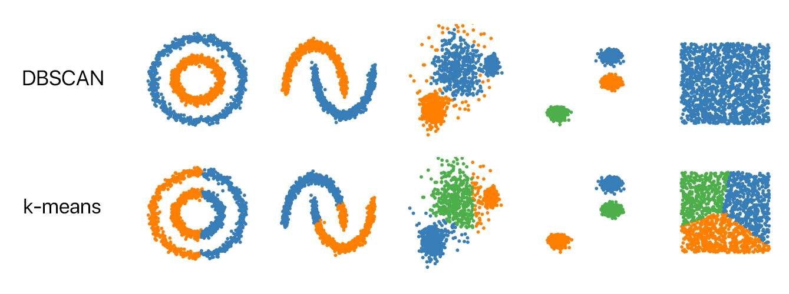

# DBSCAN: Density Based Spatial Clustering of Applications With Noise
Presented by Group 33: Jack Kissinger, Julia Nguyen, & Sujana Sreenivasan

BENG 183 - Applied Genomic Technologies

10 December 2024

## Introduction to DBSCAN:
Clustering is a widely used bioinformatics technique that uses an unsupervised machine learning model to partition datasets into groups based on recognized patterns or characteristics. This concept was first brought about in the 1950’s when Stuart Lloyd at Bell labs introduced the K-Means algorithm. From that point on, K-means became the standard algorithm for clustering, characterized by its iterative and effectively scalable model. By providing the groundwork for clustering, the development of numerous advanced algorithms were able to emerge into bioinformatics. DBSCAN, for instance, was formally published in the 1990s and introduced a new method of clustering that could handle arbitrarily shaped clusters while effectively dealing with noise within datasets. The Density-Based Spatial Clustering of Applications with Noise algorithm became a new popular unsupervised machine learning algorithm capable of identifying clusters. 

DBSCAN can be distinguished by three main features: it is density-based, does not require pre-defined clusters, and can effectively handle noise. Rather than clustering points solely based on distance, DBSCAN groups points together based on whether they are within a similar, densely packed region. While highly-dense regions are formed into clusters, low-density regions are categorized as outliers by the algorithm. In addition, DBSCAN does not require the number of clusters to be specific beforehand as opposed to other algorithms such as K-Means. In doing so, the algorithm implements an adaptive method to identify the number of clusters based on how the points are naturally distributed throughout the dataset [^5]. 

---

## Algorithm Overview:
### **Step 1: Parameter Selection**

The two key parameters for DBSCAN are ε and MinPts.
- ε (epsilon) refers to the maximum radius, or neighborhood size, around a point
- MinPts (minimum points) refers to the minimum number of points with a neighborhood to form a cluster

Both of these parameters influence how many clusters DBSCAN finds. Therefore it is critical that these parameters are properly selected in order to produce accurate and proper results [^5]. 

A common approach for identifying appropriate parameter values is to use a k-distance plot. This graph shows the distance (m) to the nearest kth nearest neighbor for each point within the data. The “elbow” of the plot, which refers to the point at which the slope of the curve increases sharply (boxed in red), indicates where the density of the points start to lower. The distance at the “elbow” point is therefore a candidate for the ε (epsilon) parameter. The k value used in the k-distance plot is often used to set the MinPts parameter. This value is typically a small integer, often 4 or 5, which will increase for datasets with high-dimensionality.

### **Step 2: Classification of all points**
  
  The algorithm will initially select a random point from the dataset. Using the provided parameters, DBSCAN can assign each point into three possible classifications until all points are properly identified:
  
**1. Core Point:** A core point has at least a minimum number of neighbors (MinPts) within a certain distance (ε).

**2. Edge Point:** An edge point is located within the ε neighborhood of the core point; however, unlike the core point, it does not have enough neighbors to form its own cluster.

**3. Noise Point:** A noise point is neither a core nor edge point. Rather, this point is classified as an outlier because it is not located near any core points and there are not enough points around it to form its own cluster. 

### **Step 3: Cluster Formation**
  
  For each core point, DBSCAN will cluster it with all the points that are within radius ε. The process will recursively go through each neighbor of the core point until they are properly grouped into the same cluster. To complete the cluster, the algorithm will then assign each unclustered edge point to the cluster of the nearest core point. 

### **Step 4: Mark noise**

  If a point does not meet the conditions for being a core point or an edge point, DBSCAN will label that point as noise. Properly identifying and labeling points as outliers improves the quality of clusters while allowing the algorithm to handle arbitrary cluster shapes. The algorithm is terminated once all points have been assigned to a cluster or classified as noise [^5]. 

---

## Comparison with k-means Clustering:
With so many clustering algorithms available to choose from, a researcher may wonder why someone would use the DBSCAN over another option, such as hierarchical clustering or k-means clustering. Each algorithm has a unique set of strengths and drawbacks, and it is important to choose a strategy that complements your specific dataset, workflow, and experimental goals. 

### Advantages of DBSCAN:
* **The number of clusters does not need to be preset beforehand:**
DBSCAN is much more flexible as an algorithm, since it dynamically determines the optimal number of clusters for a given dataset at runtime, while k-means must have the number of clusters *k* set before beginning the algorithm[^4]. This means that the user needs to have more information about the dataset, or try multiple different runs of clustering to determine the best number of k-means clusters, while the same process is unneccesary with DBSCAN.
* **Irregularly-shaped clusters are more easily identified:**
Since k-means clustering is completely dependent on distances from datapoints to the set of mean vectors, clusters are generally polygonal, with straight lines serving as cluster boundaries. While this could be useful with some datasets, other cases may require the recognition of more complex patterns and shapes, that are not easily separated by straight lines or flat planes. DBSCAN would be a better fit for these examples, since cluster recognition is based on the local density of datapoints, rather than the distance from a fixed point[^4].
* **Continuous clusters are favored over clusters with gaps:**
Much like single-linkage hierarchical clustering, DBSCAN favors clusters that are continuous, meaning there are no large gaps between sections of a cluster. This could be useful for applications where spatial separations within the dataset represent significant differences in data characteristics. However, with some datasets this could also be considered a drawback.

### Limitations of DBSCAN:
* **Outlier datapoints are not clustered:**
While it may be an advantage in some cases for outlier datapoints to be excluded from clustering, some workflows may require that all datapoints be assigned to a cluster, so this characteristic could be seen as a drawback. 

* **More computationally intensive:**
A major disadvantage for large datasets would be that DBSCAN's runtime is significantly slower than a typical k-means clustering run, since the algorithm is more complex[^4]. Assigning points to the closest mean vector is a much simpler series of calculations than performing an analysis of data density near a certain point. Although there are more factors to consider, such as the dimensionality of the data, and the number of total clusters, k-means is generally *O(n)* when a finite number of iterations are specified beforehand, while DBSCAN is *O(nlogn)*.

### Figure 1.1: Practical Examples

Some of the key differences between DBSCAN and k-means clustering can be seen in the examples in Figure 1.1 above. For example, in the first two comparisons, DBSCAN identifies each concentric circle and half circle as its own cluster, with a clear spatial separation between each one. In contrast, k-means clustering's limited ability to manage irregularly-shaped clusters is on full display. Since cluster assignments are based purely on the distance from the nearest mean vector, some parts of both sections are classified as belonging to different clusters, even though there is a clear separation between the sections when viewed with the human eye. 

Additionally, in the fifth comparison (rightmost column in Figure 1.1), DBCSAN's flexible cluster number is clearly highlighted. Since this run of k-means clustering was initialized with k = 3, this square of datapoints had to be separated into three different clusters, even though there are no clear patterns to speak of. This results in cluster boundaries that are relatvely arbitrary, and highly-dependent on the initial positions of each mean vector. In contrast, since DBSCAN is able to determine the appropriate number of clusters at runtime, it classifies the entire square as being part of the same cluster, which makes sense as there are no defining characteristics that would set apart any one section of the data.

---

## Bioinformatics Applications:
Why is DBSCAN an important algorithm for bioinformatics? Through our overview of the algorithm we have established that DBSCAN performs well for use cases involving an uneven cluster size with non-Euclidean geometry, in order to conduct a spatial analysis[^1]. In simpler terms, we would like to apply DBSCAN to datasets with irregular shapes or varying densities.

There are several problems in bioinformatics that fall under these categories and could be addressed using machine learning and density-based clustering. For example, researchers might be interested in identifying target protein motifs for gene regulation through spatial analysis of cell clusters or molecules to study protein-protein interactions as well as interactions involving DNA or RNA. DBSCAN can also be used to identify clusters of cells in RNA sequencing data to classify cells into distinct functional groups based on their gene expression profiles. It is additionally effective in microbial community analysis, where it can cluster similar metagenomic sequences to identify distinct species within the community. Another application of density-based clustering is image analysis; for example, DBSCAN can be used on MRI scan data to visually segment images based on the presence of certain cell growths or patterns within tissue organization[^1].

By handling noise, grouping data points based on density, and not requiring the number of clusters to be predefined, DBSCAN is ideal for the spatial analysis of complex biological datasets. In the next section, we will elaborate on an algorithm that extends the DBSCAN algorithm to be more applicable to cell culture and tissue analysis, a data type that is often used to answer bioinformatics questions.

## DBSCAN-CellX (An Extension of DBSCAN):
We will now provide an overview of DBSCAN-CellX, a newly developed algorithm that extends the original DBSCAN software to be more appropriate for analysis of cell culture experimental datasets. This software serves as a highly useful tool for bioinformatics analysis, with the source code available here on Github as an open-source Python package with embedded visualization tools to understand the dataset[^2]. The software can alternatively be run through an application, providing a graphical user interface for those who prefer it. 

Why do we care? The rationale behind DBSCAN-CellX is to introduce three extensions to the DBSCAN algorithm such that resulting analysis of cell tissue is improved. The original algorithm relies on predefined input parameters to produce an output; however, cell cultures are prone to varying cell densities that impact both the size and proximity of cells within the tissue sample, which requires these parameters to be carefully selected. Standard DBSCAN approaches also fall short in providing a consistently accurate identification of individual cell positions[^2].

To combat these common challenges, DBSCAN-CellX offers three corrections to provide a more accurate analysis of the spatial relationships within cell tissues:
* **Automated Parameter Identification:**
The algorithm examines the local density of cells in the sample and selectively chooses a radius and minimum cell number (the input parameters for standard DBSCAN) to generate clusters by. This helps adjust for any individual cell clusters in the sample as well as cells that might have more loosely connected expression profiles by ensuring that these relationships do not go undetected because the chosen radius is too large or small.
* **Cluster Edge Identification:**
The algorithm evaluates the angle between a reference line and surrounding cells to identify edge vs. core cells based on how balanced or unbalanced the distribution of surrounding cell positions might be. This is useful for cell culture experiments, when the density of cell groups might vary from cluster to cluster. The original DBSCAN algorithm classifies a cell as a core cell if the number of surrounding cells within the radius is at least equal to the minimum cell number parameter. This can often lead to edge cells being classified as core cells due to the disregard of spatial positioning of neighboring cells, which is difficult when interpreting cell-cell relationships in a culture experiment. The DBSCAN-CellX extension ensures that cells are given a more accurate label based on their position in the sample and that more intercellular relationships can be identified.
* **Cell Parameter Characterization:**
The algorithm determines the extent to which cells are embedded in a cluster by assigning edge degree values to determine at what iteration the cell would be classified as an edge cell. This shows how far connected the cell is in the cluster. In other words, this represents how much access a cell has to the surrounding environment, which in turn determines its reactivity or susceptibility to external factors such as intercellular signals, temperature changes, and chemical exposure, to name a few. This information is useful to understand how the cell behaves within the tissue pathway as well as its greater function in the organism.

To assess the performance of this model, we can apply metrics such as benchmarking with other common clustering algorithms, such as k-means above, visually representing the original dataset in a reduced format such as principal components to evaluate how well-separated the groups are, and evaluating the presence of clusters within known biological functional groups such as regulatory pathways, cell types, or gene families.

Understanding relative cell positioning is important for biological applications such as microbial community analysis, developmental functions of organisms, and spatial transcriptomics. DBSCAN-CellX provides a means of improving the classification of cell positioning within culture samples by addressing common shortcomings of the original DBSCAN algorithm when analyzing tissue monolayers. The goal of this extension is to improve the accuracy and usability of density-based clustering for future analyses of complex biological datasets, and provide the framework to achieve a stronger understanding of the influence of spatial relationships on cellular functionality within different tissues and organisms[^2].

---
## Image Credits:
https://dsworld.org/content/images/2021/10/dbscan.png

## References:

1. [PMC Article](https://pmc.ncbi.nlm.nih.gov/articles/PMC7820885/)  
2. [Nature Article](https://www.nature.com/articles/s41598-023-45190-4)  
3. [Georgia Tech Article](https://sites.gatech.edu/omscs7641/2024/03/10/evolution-taxonomy-of-clustering-algorithms/)  
4. [New Horizons Article](https://www.newhorizons.com/resources/blog/dbscan-vs-kmeans-a-guide-in-python)  
5. [Datacamp Article](https://www.datacamp.com/tutorial/dbscan-clustering-algorithm)  
6. [Medium Article: Clustering Like a Pro - A Beginner's Guide to DBSCAN](https://medium.com/@sachinsoni600517/clustering-like-a-pro-a-beginners-guide-to-dbscan-6c8274c362c4)

---

