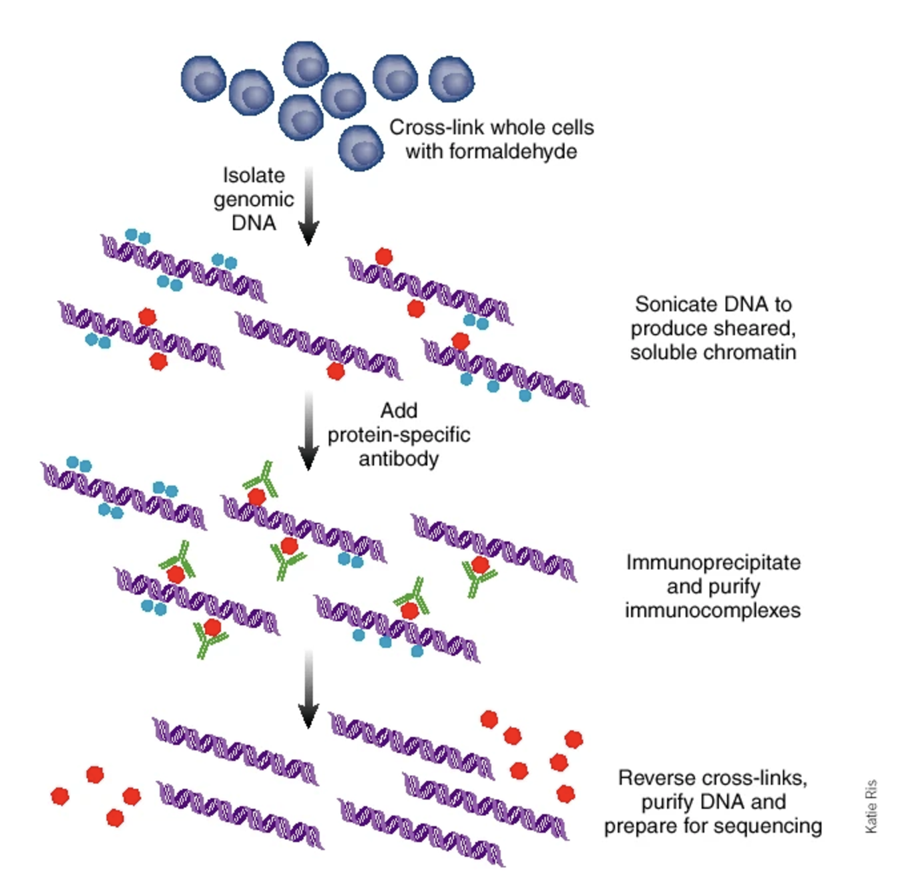
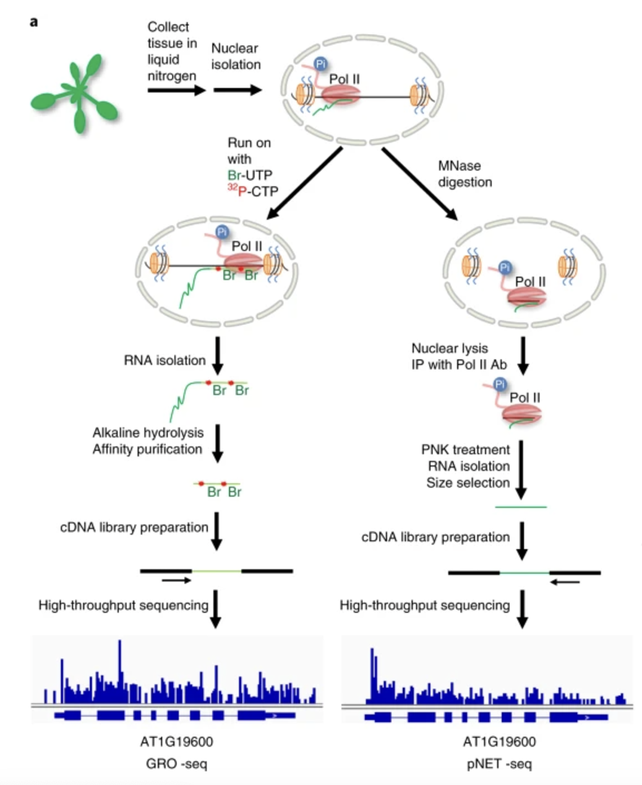
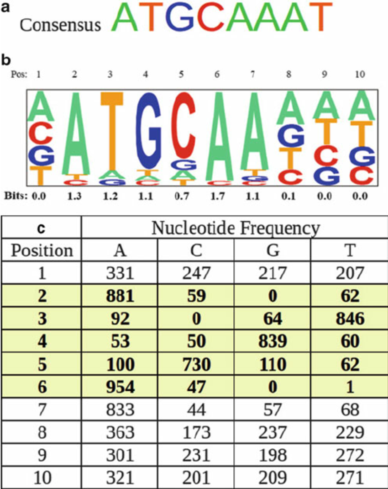
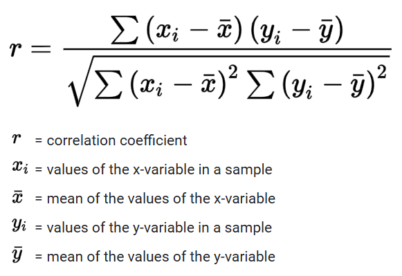
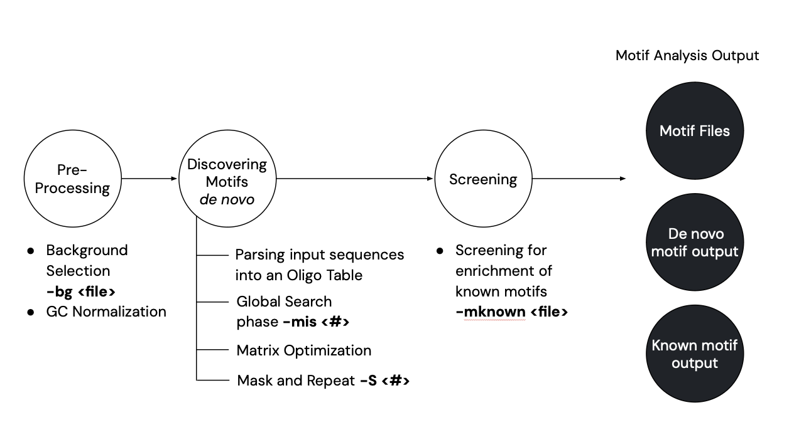
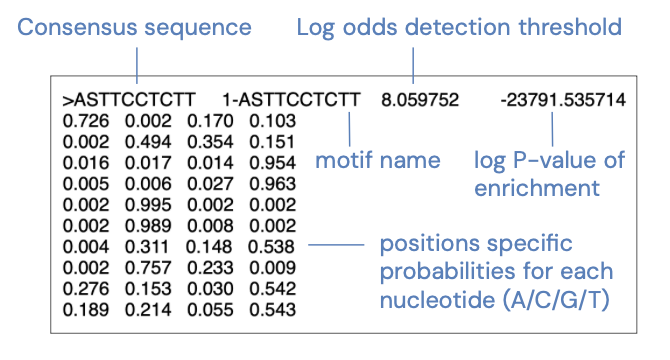
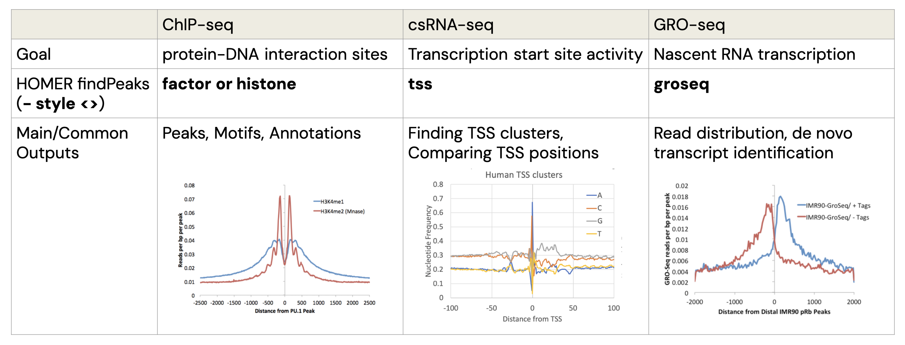
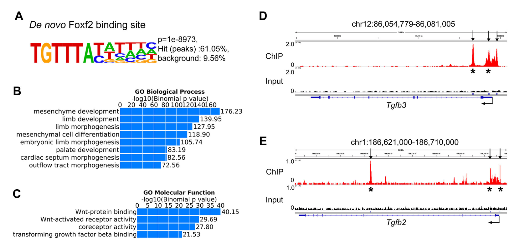

# HOMER: Motif Discovery and ChIP-Seq, csRNA-seq, GRO-Seq Analysis

Hypergeometric Optimization of Motif EnRichment, referred to as HOMER, is a de novo motif discovery algorithm that looks for motifs with differential enrichment between a set of target sequences and background sequences. First, we will introduce DNA motifs and the common RNA-seq technologies that HOMER is used for. Then we will dive into the design and implementation of HOMER.

## 1. What are Motifs?

In the context of HOMER software, motifs are short 5-20bp long DNA sequences that are enriched in a set of DNA sequences compared to the appropriate background sequences [1]. Motifs are candidates for functionally important sites in the genome and are usually associated with DNA-binding sites for transcription factors, nucleases, and other proteins. When HOMER identifies motifs that are over-represented in one set of sequences compared to another, they are in the form of sequence logos. Below is an example of a sequence logo for a motif that HOMER discovered:

  

In each position of the motif, the size of the nucleotide corresponds to the relative frequency of each nucleotide at that position in the sequence. The bigger the nucleotide, the more likely you are to find that base at that position in your sequences. The overall height of the stack of letters in a specific position represents the conservation of that position, where a tall stack indicates that that position has remained relatively unchanged during evolution and is typically important for the sequence’s function. 

## 2. Background into RNA-seq Technologies that Commonly use HOMER

HOMER is highly adaptable and can be used in conjunction with many different motif discovery next-gen sequencing experiments. We will be diving into how HOMER can be used in three different RNA-seq technologies. Before we do that, we will briefly provide context into how these technologies work and what they achieve.

### 2.1 ChIP-Seq

   
Chromatin immunoprecipitation followed by sequencing (ChIP-Seq) is used to study protein-DNA interactions [2]. ChIP-Seq works by cross-linking proteins and their bound DNA, typically with formaldehyde, then sonicating, purifying, and sequencing fragments selected with a protein-specific antibody for your target protein. These fragments correspond to motifs where your target protein binds to DNA.
    

### 2.2 cs-RNA seq

  
cs-RNA seq stands for capped-small RNA sequencing [3]. This technology targets RNA that has been transcribed a short distance and has a 5’ cap. 5’ caps are added onto RNA transcripts early in the process while they are still being synthesized. After decapping and sequencing these RNA transcripts, HOMER can be used to identify transcription start sites (TSS) and their activity for both stable and unstable RNAs.
    

### 2.3 GRO-seq

  
Global-run-on sequencing (GRO-seq) identifies the location and the relative levels of transcriptionally active RNA Pol II by combining next-gen deep sequencing and the nuclear run-on assay [4]. This method involves temporarily halting transcription to introduce radioactively labeled nucleotides and then allows transcription to run on in vitro for a short amount of time. The nascent (currently synthesized) RNA is sequenced, identified with HOMER, and quantified to reveal the location of transcriptionally active RNA polymerases and rates of transcription at that specific site in the genome. *GRO-seq image[5]

     

## 3. What is HOMER and How Does It Work?

HOMER is used for analyzing genomic data to identify and understand DNA sequence motifs and their enrichment. It is a suite of tools useful in a multitude of situations, including ChIP-Seq, RNA-Seq, Hi-C, and more due to the flexibility of its application. It was developed at the Benner Lab at UCSD in collaboration with the Glass Lab and the Integrative Genomics and Bioinformatics Core at Salk Institute. First released in 2010, it has seen many updates since then that have upgraded sequence logo production, Hi-C analysis capabilities, and much more [6]. The name pays homage to Homer Simpson, and the show is referenced throughout the documentation website.

### 3.1 What tools does HOMER have?

HOMER has many different programs within the suite, including those involved with FASTA file Motif Discovery, Gene/Promoter-based Analysis, Next-Gen Sequencing/Genomic Position Analysis, Motif Manipulation, Hi-C Analysis Programs, and more [6]. A few of these programs are included in the diagram below.

  

Some key programs of note in the motif identification process are included in the chart below. findMotifsGenome.pl finds DNA sequence motifs that are enriched in the provided genomic regions, which is commonly used for ChIP-seq analysis to identify motifs that may represent the binding sites of transcription factors or other regulatory elements. findPeaks identifies enriched regions, also called peaks, in sequencing data such as ChIP-seq, and is used to detect binding sites for transcription factors, histone modifications, or other genomic features based on read coverage. compareMotifs.pl compares the occurrence of DNA motifs between different sets of genomic regions, which is useful for identifying similarities or differences in the motifs that are enriched in multiple sets of data.

  

### 3.2 How are Motifs Compared?

HOMER compares different motifs to each other at various points in the motif identification and creation workflow. As mentioned earlier, each colorful motif sequence logo is actually just the visual representation of a matrix that holds information on nucleotide frequency. The taller the letter, the higher the likelihood that the nucleotide is in that position [8]. These matrices are analyzed, such as when they are compared to each other for redundancy purposes prior to further analysis and when the data-generated motifs are compared to known motifs for more clarity. This is done using Pearson’s correlation coefficient, which measures the degree of linear relationship between the matrices [9]. This is performed according to the equation found below. 

  
  

## 4. Motif Discovery Workflow
HOMER identifies regulatory motifs in genomic or promoter sequences by following a workflow, using the three main programs (findMotifsGenome.pl, findPeaks, compareMotifs.pl):
1. Preprocessing
    * Sequence Extraction: Extracts DNA sequences from genomic regions or promoter sequences based on provided inputs.
    * Background Selection: Automatically generates GC% matched background sequences or uses custom backgrounds for comparisons.
    * GC Normalization: Matches GC% distributions between target and background sequences to avoid GC-rich bias.
    * Autonormalization: Adjusts background sequence weights to balance oligo frequency differences (e.g., due to experimental bias).
2. De Novo Motif Discovery
      * Oligo Table Creation: Parses input sequences into oligos, counting their occurrences in target and background data for efficient motif searching.
    * Global Search Phase: Screens oligos for enrichment, including mismatched variants, to identify enriched motifs.
    * Matrix Optimization: Refines enriched oligos into position-specific probability matrices, optimizing thresholds for motif detection.
    * Mask and Repeat: Masks detected motifs and repeat analysis to identify additional motifs, avoiding redundancy by masking adjacent oligos.
3. Screening for Known Motifs
    * Load Motif Library: Searches against a library of known motifs, with options to include custom motifs.
    * Screen Motifs: Scans sequences for known motif matches and calculates enrichment using ZOOPS counting and hypergeometric/binomial statistics.

  

4. Motif Analysis Output: Motif Files
    * The "*.motif" files contain the information necessary to identify future instances of motifs. Some essential information for each motif includes the motif name, log odds detection threshold (used to determine bound vs. unbound sites), log P-value of enrichment, and the positions specific probabilities for each nucleotide (A/C/G/T). 

  

## 5. ChIP-Seq, csRNA-seq, GRO-Seq Analysis using HOMER
HOMER provides tools for analyzing data from various high-throughput sequencing techniques, including ChIP-Seq, csRNA-seq, and GRO-Seq. These workflows differ based on the nature of the data and the biological questions being addressed. Below is a comparison of how HOMER can be used for these analyses:
### 5.1 ChIP-Seq analysis 
  * Purpose: Identifies protein-DNA interaction sites, typically transcription factor binding sites or histone modifications.
  * HOMER findPeaks (- style <>): factor or histone
  * Key Outputs: Peak files, Motif enrichment data, Genomic annotation of peaks.
### 5.2 cs-RNA Seq analysis
  * Purpose: Maps transcription start sites (TSS) and measures nascent RNA production.
  * HOMER findPeaks (- style <>): tss
  * Key Outputs: Finding TSS clusters, Comparing TSS positions
### 5.3 GRO-Seq analysis
  * Purpose: Measures nascent RNA transcription, including paused or elongating RNA polymerase activity.
  * HOMER findPeaks (- style <>): groseq
  * Key Outputs: Read distribution, de novo transcript identification

  

## 6. HOMER Implementation in Research Paper
### 6.1 Goal
To explore how Foxf1 and Foxf2 regulate tendon formation and myogenic cell differentiation in tongue development. [10]
### 6.2 Method
ChIP-seq on E12.5 Foxf2FLAG/FLAG embryos
### 6.3 Results
Figure A: A core motif was enriched in 61.05% of Foxf2 target sites.
Figure B, C: Gene Ontology (GO) analysis revealed that Foxf2-binding sites are associated with biological processes like mesenchyme, limb, and palate development, as well as genes in the TGFβ signaling pathway.
Figure D, E: Foxf2 was shown to directly bind to the promoter regions of the Tgfb2 and Tgfb3 genes, confirming these as direct downstream targets involved in tongue development.

  

## References

  [1] D'haeseleer, P. What are DNA sequence motifs?. Nat Biotechnol 24, 423–425 (2006). https://doi.org/10.1038/nbt0406-423 
  
  [2] Mardis, E. ChIP-seq: welcome to the new frontier. Nat Methods 4, 613–614 (2007). https://doi.org/10.1038/nmeth0807-613 
  
  [3] Duttke SH, Chang MW, Heinz S, Benner C. Identification and dynamic quantification of regulatory elements using total RNA. Genome Res 11, 1836-1846 (2019). https://genome.cshlp.org/content/29/11/1836 
  
  [4] Tzerpos P, Daniel B, Nagy L. Global Run-on Sequencing (GRO-Seq). Methods Mol Biol. 2021;2351:25-39. doi: 10.1007/978-1-0716-1597-3_2. PMID: 34382182.
  
  [5] Zhu, J., Liu, M., Liu, X. et al. RNA polymerase II activity revealed by GRO-seq and pNET-seq in Arabidopsis. Nature Plants 4, 1112–1123 (2018). https://doi.org/10.1038/s41477-018-0280-0 
  
  [6] Benner, C. (2010). Homer (v5.1, 7-16-2024). Homer Software and Data Download. http://homer.ucsd.edu/homer/ 
  
  [7] Dey, K.K., Xie, D. & Stephens, M. A new sequence logo plot to highlight enrichment and depletion. BMC Bioinformatics 19, 473 (2018). https://doi.org/10.1186/s12859-018-2489-3
  
  [8] Kennedy BA, Lan X, Huang TH, Farnham PJ, Jin VX. Using ChIPMotifs for de novo motif discovery of OCT4 and ZNF263 based on ChIP-based high-throughput experiments. Methods Mol Biol. 2012;802:323-334. doi:10.1007/978-1-61779-400-1_21
  
  [9] Schober P, Boer C, Schwarte LA. Correlation Coefficients: Appropriate Use and Interpretation. Anesth Analg. 2018;126(5):1763-1768. doi:10.1213/ANE.0000000000002864 
  
  [10] Xu J, Liu H, Lan Y, Jiang R. The transcription factors Foxf1 and Foxf2 integrate the SHH, HGF and TGFβ signaling pathways to drive tongue organogenesis. Development. 2022;149(21):dev200667. doi:10.1242/dev.200667
