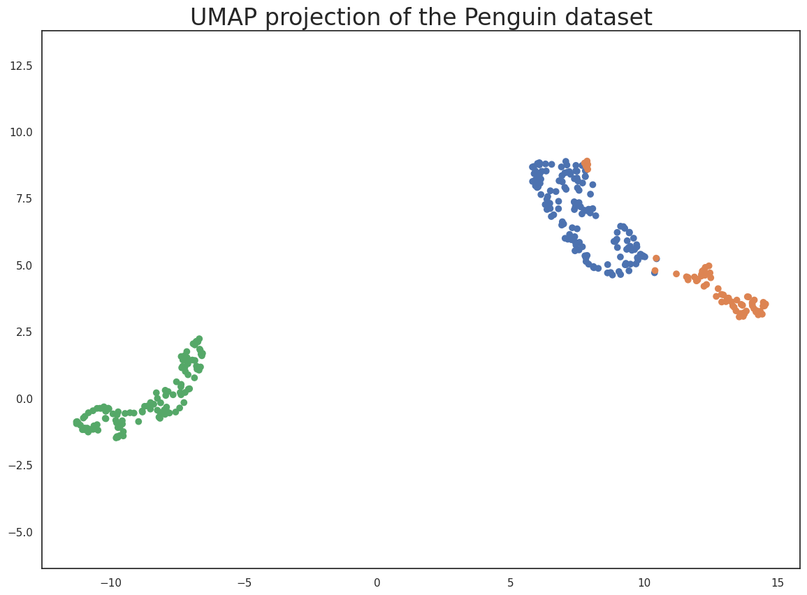
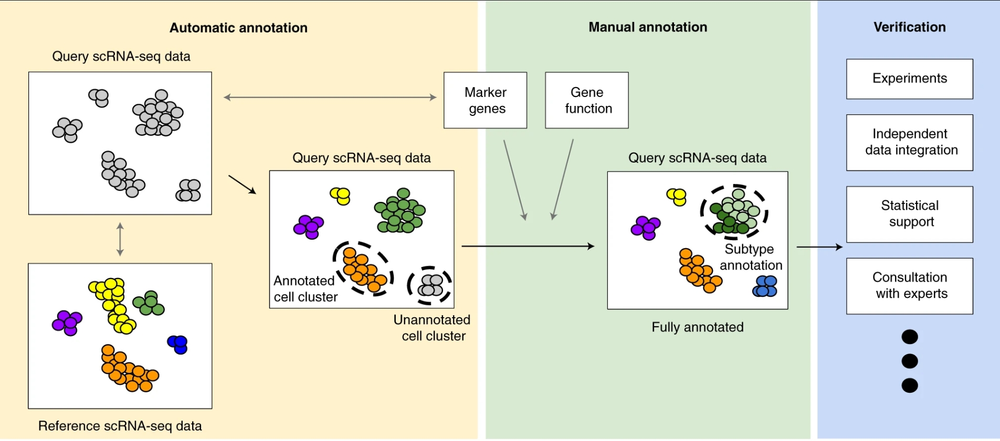
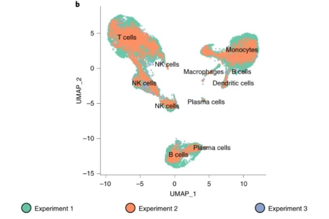
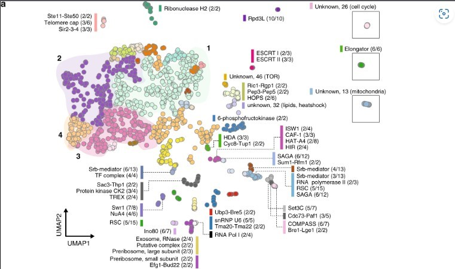
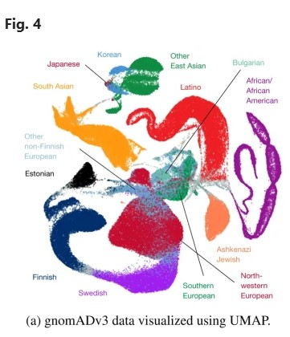

# UMAP

##### Group 3: Richard Xu, Eugene Kong, Jonathan Lam

## **Introduction**

What is a dimension? Most of us are familiar with the idea of a line as one-dimensional, a plane as two-dimensional, and space as three-dimensional. Analytically, dimensions represent measurable quantities or features of a dataset. We often use X and Y axes to plot data on a plane and add Z to represent three-dimensional space. What happens when there are more? How do we handle 4, 5, or even 20,000 dimensions?

This challenge is common in fields like genomics and transcriptomics. For example, the human genome contains roughly 20,000 protein-coding genes where each gene can be considered a "dimension" influencing biological outcomes. Visualizing patterns or relationships in such high-dimensional data is not something our human brains—or even our poor 2 dimensional computer monitors—can handle intuitively. If you could, please contact us immediately. 

Fortunately, we have tools like UMAP (Uniform Manifold Approximation and Projection) to help us. Developed by McInnes et al., UMAP is a cutting-edge dimensionality reduction technique widely used in data science and bioinformatics. It excels at taking complex, high-dimensional data and projecting it into a lower-dimensional space—often 2D or 3D—while preserving as much meaningful structure as possible.

## **How it works**

The key to UMAP's effectiveness lies in its approach. It models high-dimensional data as a weighted graph, where each data point is a node, and edges represent similarities between points. The goal is to create a low-dimensional representation that can retain both local relationships (e.g., nearest neighbors) and global structures (e.g., clusters), resulting in a clean and interpretable 2D or 3D graph. 

Think of a crumpled piece of paper. It exists in three dimensions, right? Now imagine uncrumpling it and flattening it out: it’s essentially two-dimensional. While this analogy is oversimplified, UMAP similarly reduces dimensions but relies on mathematical graphs rather than physical manipulation.

UMAP starts by modeling the high-dimensional data as a graph. Each data point is treated as a node (a 0-simplex), and connections (edges) are formed with its nearest neighbors to create 1-simplexes. These connections may also extend to form higher-dimensional structures like 2-simplexes (triangles) based on the data’s topology. Simply speaking, UMAP calculates distances between each data point and its neighbors with the main parameters being n-neighbors. The n-neighbors parameter defines the number of nearest neighbors to consider for each point, controlling the balance between local versus global structure. A large n value includes more neighbors, emphasizing global structure by preserving broader patterns across the dataset. A smaller n value focuses more on the local relationships, helping to preserve smaller clusters and finer details in the data. For a chosen n value UMAP assigns each node the smallest variable radius that can encompass its closest  n-neighbors. In dense areas, the nearest neighbors are closer, leading to tighter graph structures. In sparse areas, the nearest neighbors are farther apart, resulting in a looser graph structure. 

Once the high-dimensional graph is constructed, UMAP minimizes a cost function using an optimization algorithm. This process aims to find a low-dimensional representation that best preserves the local and global relationships in the data. By balancing the preservation of local neighborhoods with broader global patterns, UMAP produces an effective and interpretable 2D or 3D visualization.

## **Libraries Used**

Before using UMAP for dimensionality reduction, we need to import the necessary libraries and load a dataset. This section covers how to import relevant libraries, read data from a file, and inspect it.

---

### **1. Importing Libraries**  

We’ll use the following libraries:  

- **`numpy`**: For numerical operations.  
- **`pandas`**: For loading and managing data.  
- **`sklearn`**: For scaling and transforming data.  
- **`matplotlib` & `seaborn`**: For data visualization.  
- **`umap`**: For applying dimensionality reduction.  

### **Code Example**  
```python
# Import essential libraries
import numpy as np
import pandas as pd
from sklearn.preprocessing import StandardScaler
import matplotlib.pyplot as plt
import seaborn as sns
import umap
```

## **Preparing Data for UMAP**  

Proper data preparation is essential for running UMAP effectively. UMAP expects a clean, numeric matrix where rows represent samples (observations) and columns represent features (variables).[^UMAP_doc] Below are key steps for formatting the data correctly:

### **1. Data Format**  
- **File Types:** Use common file formats like `.csv` or `.txt`.  
- **Structure:** Organize the data as a matrix:  
  - **Rows:** Samples (e.g., individual cells in scRNA-seq).  
  - **Columns:** Features (e.g., gene expression values).  

---

### **2. Cleaning the Data**  
- **Remove Missing Values:** Handle missing data by filling in averages or removing incomplete entries.  
- **Filter Irrelevant Features:** Drop features that don’t provide meaningful variation (e.g., constant columns).  

---

### **3. Normalization**  
UMAP is sensitive to data scaling, so normalization ensures all features contribute equally:  

- **Standard Scaling:** Use z-scores to adjust values to have a mean of 0 and a standard deviation of 1.  
  ```python
  from sklearn.preprocessing import StandardScaler
  
  # Example: Standardize the dataset
  scaled_data = StandardScaler().fit_transform(data)
  ```
### **4. Example: Cleaning and Normalizing Data**  

Here’s a simple code snippet demonstrating how to clean and normalize data using Python:  

```python
# Import libraries
import numpy as np
import pandas as pd
from sklearn.preprocessing import StandardScaler
import matplotlib.pyplot as plt
import seaborn as sns
import umap

# Load the dataset
data = pd.read_csv("data.csv")

# Clean the data
# Drop rows with missing values
cleaned_data = data.dropna()

# Remove features with zero variance
cleaned_data = cleaned_data.loc[:, cleaned_data.std() > 0]

# Normalize the data using StandardScaler
scaler = StandardScaler()
normalized_data = scaler.fit_transform(cleaned_data)

# Print a preview of the cleaned and normalized data
print(pd.DataFrame(normalized_data, columns=cleaned_data.columns).head())
```
## **Running UMAP**  
UMAP follows the scikit-learn API, making it easy to use. We instantiate a UMAP reducer and fit-transform the scaled penguin data to reduce it to two dimensions. 

```python
# Create a reducer
reducer = umap.UMAP()

# Fit and transform the data
embedding = reducer.fit_transform(scaled_penguin_data)

# Check the shape of the transformed data
embedding.shape
```
## **Putting It All Together: Running UMAP**  

This section provides a complete example of applying UMAP to the Palmer Penguins dataset provided by the UMAP documentation website.[^UMAP_doc] We’ll load the data, clean and normalize it, apply UMAP, and visualize the results in one seamless workflow. 

---

### **Full Code Example**  

```python
# Import libraries
import numpy as np
import pandas as pd
from sklearn.preprocessing import StandardScaler
import matplotlib.pyplot as plt
import seaborn as sns
import umap

# Configure Seaborn for visualization
%matplotlib inline
sns.set(style='white', context='notebook', rc={'figure.figsize': (14, 10)})

# Load a dataset 
penguins = pd.read_csv("https://raw.githubusercontent.com/allisonhorst/palmerpenguins/main/inst/extdata/penguins.csv")

# Inspect the first few rows
print(penguins.head())

# Drop missing values for simplicity
penguins = penguins.dropna()

# Count the number of samples per species
print(penguins.species.value_counts())

# Visualize pairwise relationships between features
sns.pairplot(penguins.drop("year", axis=1), hue="species")

# Extract relevant numeric features
penguin_data = penguins[
    ["bill_length_mm", "bill_depth_mm", "flipper_length_mm", "body_mass_g"]
].values

# Standardize the data (mean=0, std=1)
scaled_penguin_data = StandardScaler().fit_transform(penguin_data)

# Create a UMAP reducer
reducer = umap.UMAP()

# Apply UMAP for dimensionality reduction
embedding = reducer.fit_transform(scaled_penguin_data)

# Check the shape of the resulting embedding
print(f"Embedding Shape: {embedding.shape}")

# Create a scatterplot of the UMAP output
plt.scatter(
    embedding[:, 0],
    embedding[:, 1],
    c=[sns.color_palette()[x] for x in penguins.species.map({"Adelie": 0, "Chinstrap": 1, "Gentoo": 2})]
)
plt.gca().set_aspect("equal", "datalim")
plt.title("UMAP Projection of the Penguin Dataset", fontsize=24)
plt.show()
```


## Interpretations of UMAP

Thus, interpreting the outputted graphs from UMAP is vital in order to get accurate results. Below is a typical workflow post clustering as for annotation and verification in the context of single-cell RNA sequencing(scRNA-seq). [^SC_interpretation]



In the perspective of scRNA-seq data, your goal is to quantify the different cell types using marker genes or gene functions. Typically, the data enters in as a "gene-by-cell" matrix, in which UMAP conducts dimensionality reduction. If certain cell types are known, or a reference is on hand, automatic annotation can be conducted to mark these particular clusters. Then, dependent on the cluster's trend as compared to data (i.e combination of marker genes, pathway analysis, etc) the data can further be annotated to mark any unlabeled clusters or intermediate regions. [^SC_interpretation] As such, the core idea of this is the content of each cluster, we're not necessarily looking at individual data points, we're looking at clusters at a whole. Thus this core concept and steps can be applied to any set of data you wish to process.

## Example: scRNA-seq Context

Thus, let us look at an example of a UMAP clustering graph, the following is taken from the Clarke. et al. paper. [^SC_interpretation]



The following UMAP was created post batch correction using harmony, from three different datasets(three different experiments respectively). The plot isn't too hard to interpret-- starting off, the X and Y axis represent arbitrary distances to seperate the clusters based one "how related they are", this being dependent on the clustering technique and experimental parameters as mentioned earlier. [^UMAP_doc] Visually, we can see three distinct clusters consisting of the different cell types. The main point to consider is the content of your clusters in relation to distances between clusters, as ones that are closer together are likely to be more related, this again being in terms of the such arbitrary distance given by the UMAP. From here you can cross reference this to your data, let us take the upper left cluster with T cells and NK cells for example. The creation of NK cells involves CD127+, a common innate lymphoid progenitor, notably, this is just slightly downstream of another common lymphoid progenitor which makes T cells amongst other types. [^NK_cells] 

## Tips and Common Misconceptions

As such, there are some common misconceptions to be considered:

1. Hyperparameters and thresholds are important <br>
**True**, as previously mentioned, you must test different thresholds that you input to your UMAP to see how your data is affected through different values. Does it lead to more clusters getting blended together? Can you effectively label your clusters? [^Misconceptions]

2. Cluster sizes matter <br>
**False**, the number of datapoints within your cluster doesn't necessarily correlate to anything. With changing hyperparameters and clustering techniques, one individual datapoint in your UMAP plot could just as easily be associated with another cluster. [^Misconceptions]

3. Cluster Distance always matters <br>
**False**, while the above example mentioned different cell types and how they potentially may be related, the distance between clusters could just as easily be unrelated. In essence, you must check the background of your data and annotations to see if you can draw conclusions from these clusters. [^Misconceptions] However, for example if you have a lot of datapoints(and in turn a lot of clusters), the clusters can just as easily start blending together and thus makes it impossible for you to associate one cluster versus another in terms of distance. Really, if anything the content of your clusters is of most importance when looking at any graphs. 

## Applications

The premise of UMAP is that, if you have data from any context and you want to identify groups, UMAP is applicable. **As for biological contexts,** here are some different applications of UMAP.

**1. scRNA-seq**

As mentioned rigorously, UMAP is commonly used in scRNA-seq data interpretation. Their goal is to characterize some sort of gene expression in relation to some sort of factor. To elaborate, by plotting out the different cell types, analysis can be conducted to find out if any cell-type groups of interest are being affected by your experimental conditions. For example, scRNA-seq involves different library preperation techniques before sequencing. These plots aimed to characterize how the different methods affected clustering and their cell type expression.[^scRNA-seq_example]

 

**2. Proteomics**

Another scenario involves the context of proteins and proteomics, their goal is to characterize difference in the structures of these proteins either by mutations or variances within the genome. For example, below, a UMAP plot was generated for 1484 single-gene deletion strains based on their similarity of transcriptional effects. In this scenario distance actually matters, figure a show characterizes the clusters by how closely they are together. [^proteomic_ex]

 

**3. Population Genetics**

Population genetics is another prime example of UMAP's visualization power and characterization. The goal here is to characterize the different genomes behind populations be it identifying any major risk factors(i.e ones that lead to higher rate of cancer), or simple SNPs(single nucleotide polymophisms) that are relatively harmless and lead to different encodings of their associated protein structures. An example can be seen below, where UMAP was used to cluster data from the Genome Aggreation Database, characterizing ancestral diversity. Their goal was to showcase the relationships between the populations on a contential and subcontential level. [^population_gen_ex]

 

### References

[^SC_interpretation]: Clarke, Z.A., Andrews, T.S., Atif, J. et al. Tutorial: guidelines for annotating single-cell transcriptomic maps using automated and manual methods. Nat Protoc 16, 2749–2764 (2021). https://doi.org/10.1038/s41596-021-00534-0

[^Misconceptions]: Coenen, Andy, and Adam Pearce. “Understanding Umap.” PAIR Page Redirection, pair-code.github.io/understanding-umap/.

[^scRNA-seq_example]: Mary Piper, Meeta Mistry. “Single-Cell RNA-Seq: Integration.” Introduction to Single-Cell RNA-Seq, 21 Nov. 2020, hbctraining.github.io/scRNA-seq_online/lessons/06_integration.html. 

[^UMAP_doc]: “Basic UMAP Parameters.” Basic UMAP Parameters - Umap 0.5 Documentation, umap-learn.readthedocs.io/en/latest/parameters.html. Accessed 7 Dec. 2024. 

[^NK_cells]: Wikipedia contributors. "Natural killer cell." Wikipedia, The Free Encyclopedia. Wikipedia, The Free Encyclopedia, 16 Oct. 2024. Web. 8 Dec. 2024.

[^proteomic_ex]: Dorrity, M.W., Saunders, L.M., Queitsch, C. et al. Dimensionality reduction by UMAP to visualize physical and genetic interactions. Nat Commun 11, 1537 (2020). https://doi.org/10.1038/s41467-020-15351-4

[^population_gen_ex]: Diaz-Papkovich, A., Anderson-Trocmé, L. & Gravel, S. A review of UMAP in population genetics. J Hum Genet 66, 85–91 (2021). https://doi.org/10.1038/s10038-020-00851-4
