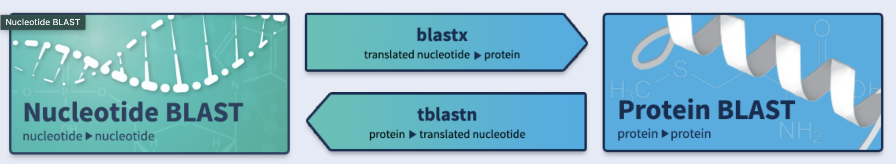
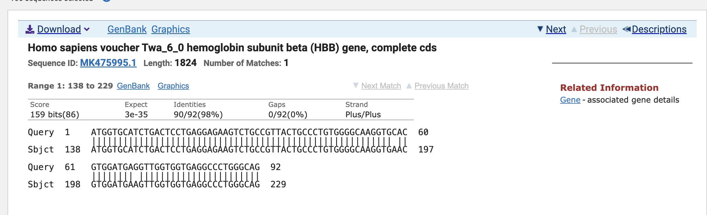
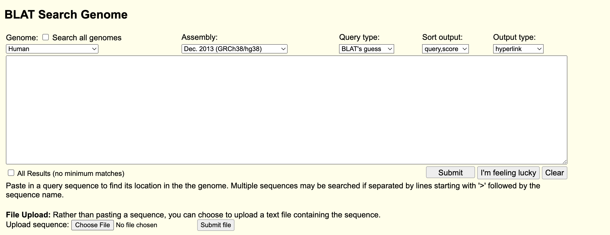
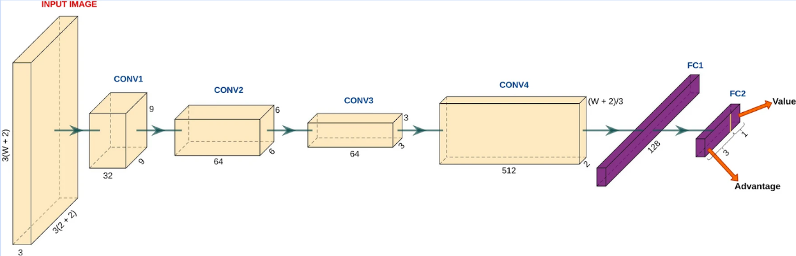

# Sequence Alignment Algorithms
**Team 40:** Prajit Rajkumar, Vedika Harnathka, Sean Smith

## **Table of Contents**
1. [Introduction](#introduction)
   - [What are Sequence Alignment Algorithms?](#what-are-sequence-alignment-algorithms)
   - [Why do we need them?](#why-do-we-need-them)
2. [BLAST (Basic Local Alignment Search Tool)](#blast-basic-local-alignment-search-tool)
   - [How it works](#how-it-works)
   - [Types of BLAST](#types-of-blast)
3. [Other Algorithms](#other-algorithms)
   - [BLAT (BLAST-Like Alignment Tool)](#blat-blast-like-alignment-tool)
     - [How does it work?](#how-does-it-work)
     - [When do we use it?](#when-do-we-use-it)
   - [EdgeAlign](#edgealign)
     - [How does it work?](#how-does-it-work-1)
     - [When do we use it?](#when-do-we-use-it-1)
4. [Conclusion](#conclusion)

## Introduction
### What are Sequence Alignment Algorithms?

Sequence alignment algorithms are computational techniques used to identify regions of similarity between biological sequences such as DNA, RNA, or protein sequences. These similarities may indicate functional, structural, or evolutionary relationships between the sequences.

The goal of alignment is to arrange sequences in a way that highlights regions of homology, which may result from gene duplication, horizontal gene transfer, or common ancestry.

Sequence alignment can be classified into two main types:
* Global Alignment: Aligns sequences from start to finish, useful when the sequences are of similar length
* Local Alignment: Identifies regions of similarity within parts of larger sequences, ideal for comparing a short sequence to a longer one.

### Why do we need them?
Sequence alignment algorithms are essential for a wide range of applications in bioinformatics, molecular biology. It tends to be the first step taken before any other bioinformatics tools are used, so it is extremely important.

Possible applications of sequence alignment algorithms include:

1. Identification of genes in a new genome by comparing them to reference genomes. They can predict protein-coding regions, regulatory elements, etc.
2. Identification of orthologs (the same gene in different species) and paralogs (gene duplications in the same species)
3. Measure evolutionary distance by tracking the similarities and differences across species
4. Predict protein function by finding similarly sequences proteins in a reference database
5. Identification of motifs such as transcription factor binding sites 
6. Mutation and SNP identification by comparing an individual’s genome to a reference genome
7. RNA-seq alignment to tell which genes are actively being transcribed

As sequence alignment is a fundamental step in bioinformatics, it is crucial to have efficient tools that can handle large datasets with optimal time and space complexity. Among these tools, BLAST has emerged as one of the most widely used and effective solutions for sequence alignment.

## BLAST (Basic Local Alignment Search Tool)

Developed and designed by Eugene Myers, Stephen Altshul, Warren Gish, David J. Lipman, and Web Miller at the NIH was published in J. Mol. Biol. in 1990. It was based on other heuristic algorithms that came before it such as the FASTP program. In BLAST’s foundation, it takes advantage of how maximal segment pair scores can be approximated under an appropriate random sequence model. With this one can estimate the frequencies of paired residues in maximal segments. So by focusing on the most significant patterns in sequences, BLAST was able to achieve a better space and time complexity than its predecessors. Though BLAST can not guarantee optimal alignment of query and database sequences, like FASTP can, in most cases BLAST would perform well enough. 

### How it works

1. **Seeding:** BLAST identifies short ‘words’ of fixed length in the query sequence. It is typically 11 in DNA and 3 for proteins. These words are compared to the database for short, exact matches. This is faster than using the entire query sequence.

2. **Extension:** Once a seed is matched, BLAST extends the alignment in both directions to find the longest region of similarity. First, this extension occurs without gaps. It extends until the score (based on a scoring matrix) drops below a certain threshold. This way, only promising alignments are extended.

3. **Gapped Alignment:** Once an alignment seems promising, BLAST introduces gaps allowing for indels (insertions and deletions) between the query and database sequences. This is done using a dynamic programming approach that is more computationally expensive. Gaps are added in places that maximize the alignment score.

4. **Scoring and Filtering:** Using the aforementioned scoring matrix (BLOSUM, nucleotide matches, or PAM), the algorithm assigns a score. It rewards matches and penalizes mismatches, gaps, and gap extensions. The score is compared to an E-value, i.e expectation value, which is the number of times that an alignment of that score would occur by chance in a random database. A lower E-value means that the match is more statistically significant.

5. **Results:** The output of BLAST includes information about the alignment, including the aligned sequences, alignment scores, and E-values. The most significant appears at the top (the one with the lowest E-value).

Above is a sample output from BLASTn!

### Types of BLAST
There are 5 types of BLAST. They differ in terms of query sequence or the database being searched on.

1. **BLASTn:** Aligns *nucleotide sequences* against *nucleotide sequence databases*. Used to find highly similar nucleotide sequences in a database.
2. **BLASTp:** Aligns a *protein sequence* against a *protein database*. Used to identify homologous proteins in other organisms, to predict the function of a novel protein, to detect conserved protein domains, or to identify protein mutations.
3. **BLASTx:** *Translates a nucleotide sequence* in all six reading frames and aligns the resulting protein sequences against a *protein sequence database*. It is used to identify potential protein-coding genes in nucleotide sequences, to identify potential open reading frames, etc. It is especially useful in de novo genome annotation.
4. **tBLASTn:** Aligns a *protein query* against a *translated nucleotide database*. It is useful when you have a protein sequence but your target database only has nucleotide sequences. Note that it is significantly slower than the above as it requires six-frame translations of all database sequences.
5. **tBLASTx:** *Translates both the query and database* sequences into six possible reading frames and compares the resulting protein sequences. This is useful when you want to compare two unannotated nucleotide datasets to identify homologous coding regions, or when you want to identify regions of high evolutionary divergence. It is used to detect conserved coding regions between species.

Note that all use the BLOSUM62 scoring matrix, except BLASTn which uses a match/mismatch scoring algorithm.

## Other Algorithms
While BLAST is powerful and widely used, it is not perfect, and the limitations have driven the development of alternative algorithms. BLAST is quite computationally expensive, so something like aligning millions of short reads becomes quite difficult. BLAST is also not good at high-throughput analysis like RNA-seq data. It is also a local-alignment tool, so whole genome alignment is not possible through BLAST. It also has a high memory requirement as it has to be run against a large number of databases, requiring large amounts of RAM. This is where the other algorithms come in.

### BLAT (BLAST-Like Alignment Tool)

BLAST is a fast alignment algorithm used to search nucleotide or protein sequences against a genomic or protein database. Unlike BLAST, which identifies seeds from the query in the database, BLAT builds an index of the target database and scans the query against it. It thus ends up being much faster at performing whole-genome searches than BLAST.

#### How does it work?

1. Indexing: BLAT creates an index of the entire database containing all non-overlapping k-mers of size 11 from the reference.
2. Query Processing: The query is divided into overlapping k-mers and looked up in the pre-built index. Exact matches are thus found very fast.
3. Alignment Assembly: BLAT extends initial hits in both directions by connecting nearby word matches to each other (as long as they are under a certain gap threshold). After significant alignment regions are identified, dynamic programming is used to optimize the alignment.
4. Scoring: BLAT then calculates the alignment scores and reports the best hits.

#### When do we use it?

BLAT works best when the query sequence is highly similar to the database, so it is best for intra-species alignment and whole genome analysis. It works best for long queries such as full genomes, cDNA sequences, or RNA-seq reads, against large reference genomes. The pre-built index allows for fast lookups, making BLAT effective for high-throughput tasks such as mapping millions of short reads from RNA-seq experiments. Once the index is built, each search is highly efficient, as BLAT can search for multiple 11-mer anchor points from the query and connect them into larger alignments.

It is also helpful for intron/exon mapping, as BLAT is good at handling large and varying gaps. As BLAT divides the query into smaller fragments, matches them, and then reassembles them, it is a good tool for analyzing splice junctions, as lengths between introns for example occur between introns, since each part of the query is searched for on the database.

However, the trade-off for BLAT’s speed is its memory usage. Since BLAT builds an index of the entire reference genome and stores it, it requires significantly more RAM than BLAST. This means that it is less effective for cross-species alignments. For that BLAST or other search tools are preferred, as they are more adept at finding distant homology and handling evolutionary divergence.

### EdgeAlign
EdgeAlign is a deep reinforcement learning based algorithm that is designed to be used on edge devices in lower-power environments. Examples of edge devices include microcontrollers and FPGA boards. 

#### How does it work?

EdgeAlign applies a DQN, or Deep Q Network, a network developed by researchers from Google Deepmind for reinforcement learning. This network is designed to replicated the scoring strategies that are used by BLAST. The model operates on a subsequence that can be used to perform alignment on, called a window, and it determines whether to move forward, perform an insertion, or perform a deletion at each step.

The reward given to the model uses the traditional BLAST scoring algorithm, after applying rescaling to an interval between -1 and 1. Before rescaling, the reward and penalty values are +1 for matches, -3 for mismatches, -5 for gap creation, and -2 for gap extension. Alignment starts at the longest common substring found between the two sequences to align and is bidirectionally extended from this substring. However, the time complexity to find the longest common substring is O(mn), where m and n are the lengths of the two sequences to align. Sequences that are of high length are thus expensive to find the starting point of, so in this case, the algorithm instead starts alignment at the beginning of the two sequences and performs extension unidirectionally.

The overall architecture of EdgeAlign first passes nucleotide sequences through a convolutional neural network (CNN) head, after which the resulting output of the CNN is passed into the DQN. The nucleotides are represented as 3x3 color pixels, and this representation allows the convolutional neural network to extract features from the sequence data that are not just constrained to individual nucleotides and instead more richly represent local regions of the sequences to align. 

#### When do we use it?
The motivation behind EdgeAlign is that sequencing alignment algorithms may often need to be applied to data sequenced directly from patients. Since sequencing alignment algorithms are generally quite computationally demanding, this typically requires data to be uploaded to cloud computing services, which can be an issue in terms of privacy for healthcare data. As such, EdgeAlign provides an alternative method, in which sequencing algorithms can be cheaply deployed locally, in order to quickly and cheaply sequence patients' genomic data.

## Conclusion
Overall, there exist a variety of different sequence alignment algorithms that can be applied to processing and aligning genomic data. The types of algorithms that should be considered for a given use case depend heavily on the constraints for that particular use case, including the type of sequence to be used, sequence lengths, the expected sequence similarity, accuracy requirements, speed of the algorithm, memory availability, and power or energy efficiency requirements. Careful consideration of which algorithms to apply should rely on just benchmarks reported by algorithm developers, but also on knowledge of how each algorithm works, which is particularly helpful given that benchmarks may often be misleading or incorrect when applied to specific use cases. 

## References
### **Bibliography**

1. **Altschul, S. F., Gish, W., Miller, W., Myers, E. W., & Lipman, D. J. (1990). Basic Local Alignment Search Tool.** *Journal of Molecular Biology, 215(3), 403-410.*  
   - **DOI**: [https://doi.org/10.1016/S0022-2836(05)80360-2](https://doi.org/10.1016/S0022-2836(05)80360-2)  

2. **Camacho, C., Coulouris, G., Avagyan, V., Ma, N., Papadopoulos, J., Bealer, K., & Madden, T. L. (2009). BLAST+: Architecture and applications.** *BMC Bioinformatics, 10(1), 421.*  
   - **DOI**: [https://doi.org/10.1186/1471-2105-10-421](https://doi.org/10.1186/1471-2105-10-421)  

3. **Kent, W. J. (2002). BLAT—The BLAST-like alignment tool.** *Genome Research, 12(4), 656-664.*  
   - **DOI**: [https://doi.org/10.1101/gr.229202](https://doi.org/10.1101/gr.229202)  

4. **Shen, L., Wang, W., & Tang, Y. (2020). EdgeAlign: Alignment of biological sequences on edge devices using reinforcement learning.**  
   - **Available on ArXiv**: [https://arxiv.org/](https://arxiv.org/)  

5. **Mnih, V., Kavukcuoglu, K., Silver, D., et al. (2015). Human-level control through deep reinforcement learning.** *Nature, 518(7540), 529-533.*  
   - **DOI**: [https://doi.org/10.1038/nature14236](https://doi.org/10.1038/nature14236)  

6. **BLAST: at the core of a powerful and diverse set of sequence analysis tools.** *PubMed Central (PMC).*  
    - **Available at**: [https://www.ncbi.nlm.nih.gov/pmc/articles/PMC187518/](https://www.ncbi.nlm.nih.gov/pmc/articles/PMC187518/)  

7. **Altschul, S. F., Gish, W., Miller, W., Myers, E. W., & Lipman, D. J. (1990). Altschul.pdf.**  
    - **Available at**: [https://pmc.ncbi.nlm.nih.gov/articles/PMC187518/](https://pmc.ncbi.nlm.nih.gov/articles/PMC187518/)  

8. **Explanation of BLAST output.** *QIAGEN Bioinformatics Manual.*  
    - **Available at**: [https://resources.qiagenbioinformatics.com/manuals/clcgenomicsworkbench/650/Explanation_BLAST_output.html](https://resources.qiagenbioinformatics.com/manuals/clcgenomicsworkbench/650/Explanation_BLAST_output.html)  

9. **Zhao, X., Huang, Y., Gao, J., et al. (2023). An updated look at sequence alignment algorithms: Advances and future perspectives.** *Scientific Reports, 13(1), 1-20.*  
    - **DOI**: [https://doi.org/10.1038/s41598-023-29277-6](https://doi.org/10.1038/s41598-023-29277-6)  

