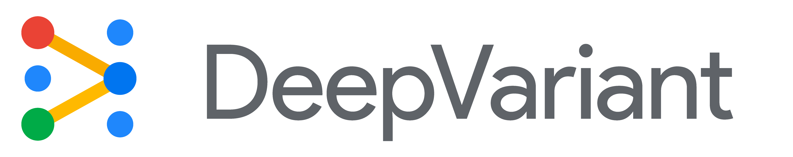

# DeepVariant: Transforming Genomics with AI



* [Introduction](#Introduction) 
* [The Challenge of Variant Calling](#The Challenge of Variant Calling) 
* [How DeepVariant Works](#How DeepVariant Works) 
* [Challenges and Improvements](#Challenges and Improvements)
* [Advantages of DeepVariant](#Advantages of DeepVariant) 
* [Future Directions](#Future Directions)
* [Conclusion](#Conclusion) 
* [References](#references)

---

## 1. Introduction
### 1.1 What Are Genetic Variants?
Genetic variants are small differences in DNA sequences compared to a reference genome. These differences make each individual unique. Some variants affect traits like height, while others influence disease risk or evolutionary relationships.

### 1.2 What is Variant Calling?
Variant calling is the process of detecting genetic variants from sequencing data. It provides critical insights into genetic traits, disease susceptibility, and more. However, sequencing data is noisy, making it difficult to distinguish true variants from errors.

---

## 2. The Challenge of Variant Calling
When sequencing a genome, the output is not a perfect read of DNA but rather noisy data. Distinguishing real genetic variants from sequencing errors is akin to finding a needle in a haystack.

### 2.1 Sources of Difficulty
Traditional tools like GATK (Genome Analysis Toolkit) address this using statistical models such as Hidden Markov Models. While effective in some cases, they have limitations:
- **Assumptions about error patterns:** These models rely on predefined assumptions about sequencing errors, which may not apply universally.
- **Need for tuning:** Different sequencing platforms and technologies require manual adjustments to the models.

### 2.2 DeepVariant: An AI-Based Solution
DeepVariant replaces traditional statistical models with a deep learning-based approach using a convolutional neural network (CNN). This enables it to learn directly from data, eliminating the need for domain-specific tuning.

#### 2.2.1 What Is Deep Learning?
Deep learning is a subset of machine learning that uses artificial neural networks with multiple layers. Each layer processes input data, extracting features before passing it to the next layer. This approach removes the need for manual feature engineering.

#### 2.2.2 What Is a Convolutional Neural Network (CNN)?
A CNN is a type of neural network designed for structured data like images. It is particularly effective at recognizing patterns such as edges, shapes, and textures.

---

## 3. How DeepVariant Works

### **3.1 Candidate Variant Identification**
DeepVariant begins by scanning aligned reads to identify candidate variant sites—single-nucleotide polymorphisms (SNPs) and insertions/deletions (indels). These candidates are selected with high sensitivity but low specificity, ensuring that true variants are retained even at the cost of including false positives. For each genomic site, overlapping reads are analyzed to decode alleles, which are classified into reference-matching bases, mismatches, insertions, or deletions. The algorithm filters out unusable reads, such as those marked as duplicates or failing quality checks, while retaining alleles with high base quality (≥10). This step ensures a comprehensive list of potential variant sites.

### **3.2 Encode Variants as Pileup Images**
For every candidate variant site, DeepVariant encodes the read data and reference genome into an RGB image called a "pileup image." Each channel represents essential information:
- **Red Channel**: Reference genome bases.
- **Green and Blue Channels**: Sequencing reads supporting reference or alternate alleles, including quality scores and alignment features.

This image format converts complex genomic information into a format suitable for image classification by deep learning models. Very high coverage regions are downsampled using reservoir sampling to maintain balance input representation.

### **3.3 CNN Processing**
The pileup images are analyzed by a convolutional neural network (CNN) based on the Inception v2 architecture. The CNN processes the encoded images to compute genotype likelihoods for three diploid states:
1. **Homozygous Reference (Hom-Ref)**.
2. **Heterozygous (Het)**.
3. **Homozygous Alternate (Hom-Alt)**.

The CNN is trained using stochastic gradient descent with labeled images and ground-truth genotypes. Multiple training cycles are ran to optimize the network parameters. After convergence, the trained model is frozen and deployed for inference.

### **3.4 Variant Calling**
Now, the trained CNN predicts genotype probabilities for each candidate site. A variant call is given if the most probable genotype is heterozygous or homozygous alternate with a confidence score exceeding a threshold. The outputs are formatted in standard Variant Call Format (VCF) for downstream analysis.

### **3.5 Accessing DeepVariant**
DeepVariant is available as open-source software on GitHub. It allows users to preprocess sequencing data, train models on custom datasets, and call variants using trained CNNs.

To run DeepVariant, you can use the following Docker command:

```bash
BIN_VERSION="1.8.0"
docker run \
  -v "YOUR_INPUT_DIR:/input" \
  -v "YOUR_OUTPUT_DIR:/output" \
  google/deepvariant:"${BIN_VERSION}" \
  /opt/deepvariant/bin/run_deepvariant \
  --model_type=WGS \
  --ref=/input/YOUR_REF \
  --reads=/input/YOUR_BAM \
  --output_vcf=/output/YOUR_OUTPUT_VCF \
  --output_gvcf=/output/YOUR_OUTPUT_GVCF \
  --num_shards=$(nproc) \
  --vcf_stats_report=true
```

Replace `YOUR_INPUT_DIR`, `YOUR_OUTPUT_DIR`, `YOUR_REF`, and `YOUR_BAM` with appropriate paths and filenames for your data. For additional customization, refer to the [DeepVariant GitHub repository](https://github.com/google/deepvariant?tab=readme-ov-file).

---


*Figure 1: Overview of the DeepVariant workflow. This image illustrates the pipeline, from identifying candidate variants to producing final variant calls using a CNN.*

---

## 4. Performance
### 4.0 Interpreting Performance Metrics
- **F1 Score**: This metric combines precision (how many identified variants are correct) and recall (how many true variants are identified) into a single measure.
- **Positive Predictive Value (PPV)**: PPV measures the proportion of called variants that are true positives. 

### 4.1 Key Metrics
- **Primary Training and Testing**:
  - Trained on CEPH NA12878 and tested on unseen Ashkenazi male NA24385.
  - Achieved:
    - **SNP F1 Score**: 99.95%.
    - **Indel F1 Score**: 98.98%.
- **Error Reduction**:
  - Over 50% fewer errors compared to GATK, FreeBayes, SAMtools, 16GT, and Strelka.

### 4.2 Robustness Across Applications
- **Genome Builds**:
  - GRCh37 → GRCh38: F1 = 99.45%.
  - GRCh38 → GRCh38: F1 = 99.53%.
  - Demonstrates generalizability across references.
- **Cross-Species Generalization**:
  - Human-trained model achieved F1 = 98.29% on mouse data.
  - Outperformed mouse-trained models (F1 = 97.84%).
- **Sequencing Platforms**:
  - Performs well with:
    - Illumina TruSeq (50× 2 × 148 bp reads on HiSeq 2500).
    - Custom mouse sequencing (27× 2 × 100 bp reads on Genome Analyzer II).

---

## 5. Challenges and Improvements
### 5.1 Challenges
- Exome datasets present difficulties:
  - Fewer variants (~20k–30k vs. ~4–5M in whole genomes).
  - Non-uniform coverage and sequencing errors increase false positives.

### 5.2 Improvements
- **Whole-Genome Sequencing (WGS)**:
  - Retrained models achieved:
    - **SOLiD**: PPV = 99.0% (candidates 82.5%, final 76.6% sensitivity).
    - **PacBio**: PPV = 97.3% (candidates 93.4%, final 88.5% sensitivity).
- **Exome Performance**:
  - Ion Ampliseq PPV improved from 8.1% to 99.7%.
  - TruSeq PPV improved from 65.3% to 99.3%.
  - Small sensitivity reductions:
    - Ion Ampliseq: 91.9% → 89.3%.
    - TruSeq: 94.0% → 92.6%.
- **Preprocessing**:
  - Preprocessing steps contributed to significant accuracy improvements.

### 5.3 Summary
DeepVariant’s retraining and preprocessing strategies have effectively addressed many challenges, particularly for exomes and diverse sequencing platforms. These advancements enhance its robustness for whole-genome sequencing and show progress in managing more complex datasets.

---

## 6. Advantages of DeepVariant
- **Accuracy**:
  - Near-perfect F1 scores for SNPs and indels.
  - 50% fewer errors than other tools.
- **Generalizability**:
  - Consistent performance across genome builds, species, and platforms.
- **Adaptability**:
  - Effective cross-species applications, e.g., human to mouse.
- **Versatility**:
  - Compatible with various sequencing platforms and protocols.
- **Efficiency**:
  - Eliminates reliance on handcrafted statistical models through deep learning.

---

## 7. Future Directions
### 7.1 Expanding Applications
- DeepVariant has shown exceptional performance in variant calling for whole-genome sequencing, but its framework can be extended to other genomic domains:
  - **Transcriptomics**: Applying DeepVariant to RNA sequencing data could help identify splice variants and RNA editing events with higher accuracy.
  - **Epigenomics**: Incorporating chromatin accessibility or methylation data could open avenues for epigenetic variant analysis.

### 7.2 Improving Sensitivity for Challenging Datasets
- Exomes and datasets with non-uniform coverage or fewer variants remain challenging for DeepVariant.
- Future improvements in sensitivity could make the tool more reliable for:
  - Exome sequencing projects.
  - Data from less-common sequencing platforms or protocols.

### 7.3 Leveraging Diverse Training Data
- Training DeepVariant on a wider variety of datasets can enhance its generalizability and robustness:
  - Non-human species with limited genomic resources.
  - Low-quality or sparse sequencing data from clinical samples.
- Leveraging larger and more diverse datasets could also improve performance across varying genome builds, platforms, and experimental designs.

### 7.4 Summary
By expanding its scope, improving sensitivity, and incorporating diverse training data, DeepVariant has the potential to become a universal tool for genomic and epigenomic analysis, applicable across a broad range of research and clinical settings.

---

## 8. Conclusion

---

## References
- DeepVariant GitHub: [https://github.com/google/deepvariant](https://github.com/google/deepvariant)
- Nature Biotechnology Paper: [DeepVariant Paper](https://www.nature.com/articles/nbt.4235)
