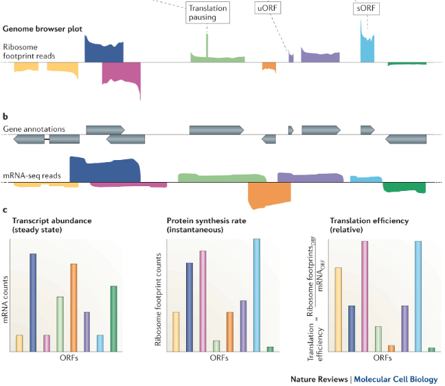
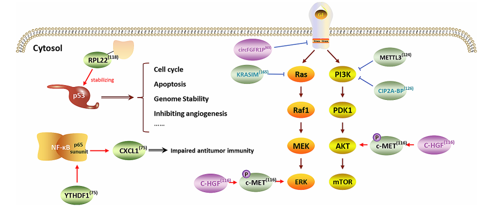
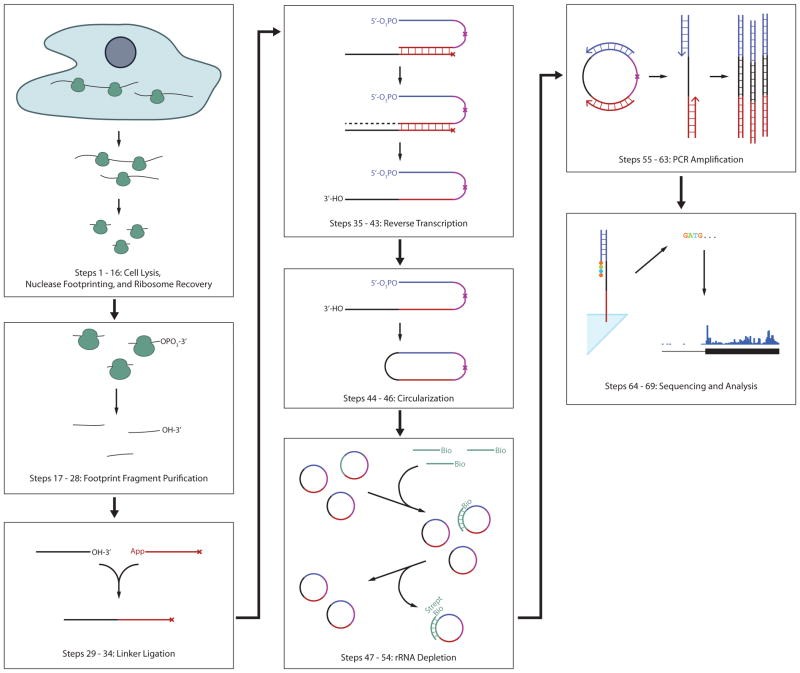
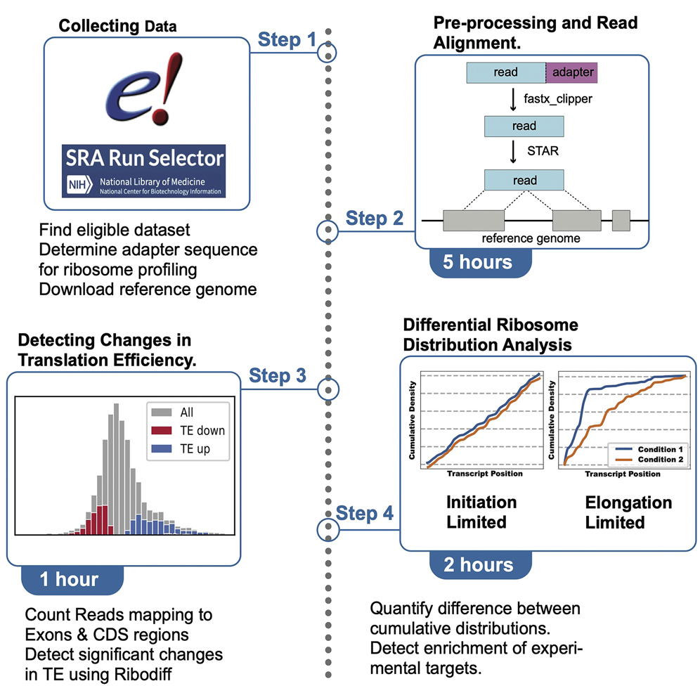
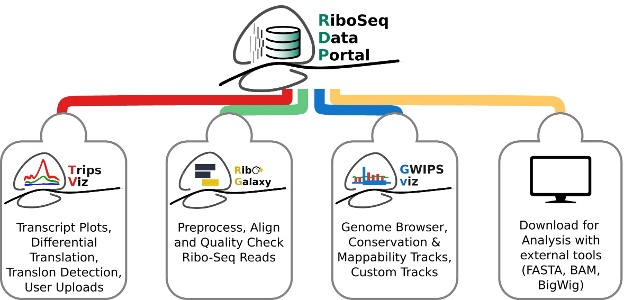

# Ribosome Profiling 
**Written by Group 5: Zhuolin Jiang, Zeting Li, Keguang Zhang** 
## Introduction
<div style="text-align: justify;">
Ribosome profiling, also known as Ribo-seq, is a revolutionary technique that enables genome-wide analysis of translation by mapping ribosome-protected mRNA fragments. This powerful method provides unparalleled insights into gene expression at the level of translation, complementing transcriptomics and proteomics to offer a comprehensive view of cellular function.
</div>

## Why Ribosome Profiling?
<div style="text-align: justify;">
The technique emerged as a solution to a long-standing challenge in molecular biology: precisely monitoring protein translation. RNA-seq, while effective at measuring mRNA levels, fails to capture the complexity of translation due to the lack of correlation between mRNA abundance and protein synthesis rates. Similarly, mass spectrometry, though valuable for identifying and quantifying proteins, provides a static view of already synthesized proteins, missing the dynamic process of translation. Ribosome profiling addresses these shortcomings by capturing translation events in real-time, offering dynamic and positional resolution of ribosome activity.<br>
     
Based on a core that translating ribosomes strongly protects about 30 nucleotides of an mRNA from nuclease activity. Sequencing of these ribosome-protected fragments or ribosome footprints, thus provides a precise record of the position of the ribosome at the time when translation was halted. By collecting and analyzing the data, we are able to know the rate of protein synthesis and the identity of translation products. The distribution of ribosome footprints also provides information of regulatory translational pauses and translated upstream open reading frames. 

Translation, a highly energy-intensive process, is crucial for cellular function. Dysregulation of translation is associated with diseases such as anemia, autism spectrum disorders, Alzheimer’s disease, and cancer. Since its introduction in 2009 by Ingolia et al., ribosome profiling has advanced our ability to study translation with codon-level precision, offering a more comprehensive understanding of cellular biology compared to RNA-seq and mass spectrometry.
</div>

## Applications of Ribosome Profiling
1. Global Translation Analysis

Ribosome profiling offers a genome-wide view of translation, allowing researchers to quantify translation rates across the entire transcriptome. Unlike RNA-seq, which provides data on transcript abundance, ribosome profiling focuses on actively translated mRNAs, delivering a more accurate picture of gene expression at the protein synthesis level. This approach has been pivotal in studying cell-specific protein production under different conditions, such as stress or developmental stages.

2. Discovery of Alternative ORFs

Ribosome profiling has redefined our understanding of open reading frames (ORFs). It has revealed the widespread presence of upstream ORFs (uORFs) and noncanonical initiation codons, previously undetected by traditional techniques. These findings have significant implications for gene regulation and protein diversity, as uORFs can influence downstream translation. For example, ribosome profiling has identified regulatory mechanisms in cancer biology, where translation from alternative ORFs contributes to tumor progression. Small ORFs (sORFs), previously considered nonfunctional, have also been shown to encode bioactive peptides involved in key cellular processes like metabolism and stress responses.

3. Ribosome Dynamics and Translational Pauses

This technique allows for precise tracking of ribosome movement along mRNA, uncovering codon-specific pauses that are often regulatory. Ribosome profiling has been used to study co-translational folding of nascent polypeptides and how these pauses affect protein structure and function. Pausing can also reveal regulatory mechanisms like feedback loops in biosynthetic pathways, such as the regulation of arginine biosynthesis through ribosome stalling.



4. Insights into ncRNAs and cancer researches

There are many gene expression changes in cancer, and ribosome profiling provides a unique window into understanding these changes at the translational level. One key area is the translational potential of transcripts previously classified as noncoding RNAs (ncRNAs). For instance, studies have shown that LINC00493, annotated as ncRNA, encodes a peptide localized to mitochondria, interacting with critical mitochondrial proteins. These findings suggest that many annotated ncRNAs may have unrecognized functional roles.


In the context of cancer, ribosome profiling aids in identifying disease-specific translational changes and novel therapeutic targets. Cancer is characterized by significant changes in glucose metabolism and aberrant amino acid metabolism. By analyzing ribosome profiling data, Huang et al. speculated that HOXB-AS3, a downregulated lncRNA in colorectal cancer (CRC) tissues, might serve as a potential protein-coding template. Subsequent experiments revealed that HOXB-AS3 encodes a 55-amino acid peptide, which exerts its tumor-suppressive role by competitively impairing the binding of splicing factor heterogeneous nuclear ribonucleoprotein A1 (hnRNP A1) to PKM exon 9. This interaction favors the formation of PKM1 over PKM2, leading to impaired aerobic glycolysis and inhibition of CRC growth. Ribosome profiling has helped uncover these metabolic shifts by revealing the translational regulation behind them. For instance, it has enabled the identification of somatic mutations and dysregulated oncogenic pathways involved in tumorigenesis. These discoveries not only expand our understanding of tumor biology but also highlight potential biomarkers and drug targets. Some of the pathways revealed by ribosome profiling are shown below.

5. Integration with Other Technologies

When combined with advanced RNA immunoprecipitation techniques such as RIP-seq, MeRIP-seq, or acRIP-seq, ribosome profiling provides critical insights into how RNA-binding proteins, RNA methylation, and RNA acetylation regulate translational efficiencies of specific transcripts. These combined approaches deepen our understanding of gene regulation at the translational level, enabling precise modulation of translational machinery. When integrated with CRISPR-Cas9 and proteomics, ribosome profiling not only reveals intricate regulatory networks but also drives innovations in synthetic biology and personalized medicine.

## Procedures
### DNA library Preparation     
Similar to RNA-seq, the preparation of ribosome profiling libraries requires cell lysis, mRNA purification, and reverse transcription. Here's an overview of the steps:
1) We first need to freeze the translation in cells before lysing them by treating them with elongation inhibitors, such as cycloheximide. To interrogate the initiation site of translation, the cells should be treated with harringtonine, which would cause the ribosomes to accumulate at initiation codons. 
2) After appropriate treatments, the cell should now be ready to be lysed by lysis reagents. For animal-derived samples, such as tissues that need to be physically disrupted, it is a robust approach to cryogenically pulverize the tissues and then thaw the tissues in the translation inhibitors. Note that these first two steps may vary depending on the types of samples and species.
3) Nuclease would then be used to digest regions on mRNA that are not protected by ribosomes. 
4) Next, an ultracentrifuge needs to be performed to spin down and separate the mRNA-ribosome complex with the naked mRNA. The ribosomes would then be washed off the mRNA.
The mRNA sequences are now obtained. The next steps are to sequence them.
5) Linker sequences would first be ligated to the 3’ end of the mRNA fragments.
6) Reverse transcriptase and primers would then be added to perform a reverse transcription.
7) Among the cDNA reverse transcription products, many are rRNA contamination that needed to be eliminated by hybridizing them with biotinylated sense strand oligonucleotides and then treating with streptavidin which would bind to the biotin. Note that contamination may be still present after this step, further elimination of this contamination would need to be done in the later bioinformatics data analysis.
8) The rest of the cDNA would next be PCR amplified to create a ribosome footprint library.




### Data Analysis  
The bioinformatics data analysis of ribosome profiling has many overlaps with that of RNA-seq, and many pipelines and packages have been established for different analysis purposes. 
The graph below shows an overview of a STAR Protocol of ribosome profiling data analysis pipeline specialized in ribosome pausing analysis ([link to this protocol](https://star-protocols.cell.com/protocols/1899)):
1) Preparation: raw read fastq files and reference genome of the species need to be downloaded (previously published datasets can be downloaded from SRA). 
2) Preprocessing: similar to RNA-seq, before the alignment we also need to trim off the adapter sequence from the reads and do quality control. One extra step is that we need to discard reads that are too short because they might be ncRNA contamination. These can be done in one step using fastx_toolkit using fastx_clipper command with various options:
   ```
   fastx_clipper -Q<phred_score> -a <adapter_sequence> -l <minimum_read_length_to_keep> -i <input.fastq> -o <output.fastq>
   ```
4) Read alignment: to further eliminate contamination from ncRNA, the raw reads need to be first aligned to the ncRNA reference genome, and discard the aligned reads 
The creation of ncRNA indices and the alignment to the indices can be done using bowtie2:
   ```
   bowtie2-build <reference_ncRNA_sequences.fa> <prefix_of_output_files>
   bowtie2 -L <seed_substring_length> --un=<path_where_unmatched_reads_would_be_saved> -x <reference_ncRNA_indices> > <output.sam>
   ```
   We next use the rest of the reads to align to the reference genome. We can use STAR for the creation of reference genome indices and the alignment with a GTF annotation file:
   ```
   STAR --runMode genomeGenerate --genomeDir <reference_genome_directory> --genomeFastaFiles <reference_genome.fa> --sjdbGTFfile     <annotation_file.gtf>
   STAR --genomeDir <path_to_reference_genome_indices> --readFilesIn <input_reads.fastq> --outFileNamePrefix           <prefix_of_output_file> --outSAMtype BAM SortedByCoordinate
   ```
4) The steps after this vary depending on the purpose of the analysis, for example: <br>To detect the change in translation efficiency, both the reads from ribosome profiling and mRNA seq would be mapped to CDS regions and exons using featureCounts, and by using a package called RiboDiff, the ratio between the counts of  ribosome profiling reads and RNA-seq reads of each CDS or exon would be calculated and compared between different treatments ([manual of RiboDiff](https://github.com/ratschlab/RiboDiff)). 
<br>To determine ribosome distribution, a count array (lists that record the number of reads that are mapped to each codon of a transcript), would be generated with the bam file resulting from the genome alignment along with GTF genome annotation file using a package called Plastid. By using LOESS smoothing with the count array, we can then calculate cumulative ribosome distribution on transcripts ([manual of Plastid](https://plastid.readthedocs.io/en/latest/generated/plastid.html); [manual of LOESS](https://pypi.org/project/loess/#documentation))



The table below shows some packages and programs developed for ribosome profiling data analysis with different specialization:

| Package Name  |                 Application               |  Organism  |
|:-------------:|:-----------------------------------------:|:----------:|
| HRIBO      | Bacterial Ribosome Profiling data analysis | Prokaryotes |
| ORFik      | Translation complex profiling, ribosome complex profiling, gene expression analysis      |   Prokaryotes and eukaryotes |
| RiboA |  Calculation of accurate A-site offset values   |   Prokaryotes and eukaryotes |
|  RiboChat  |  Ribosome profiling data analysis with chat-style interface  |  Prokaryotes and eukaryotes   |
| RiboDiPA  | Find differences in pattern of ribosome footprints | Prokaryotes and eukaryotes  |
| RiboVIEW| Visualization of tranlsation elongation and estimation of codon enrichment | Prokaryotes and eukaryotes |
| smORFer | Detection of small ORFs in prokaryotes | Prokaryotes |
####

> Ever since the introduction of ribosome profiling by Ingolia et al. in 2009, the application of ribosome profiling data has been continually growing, to better integrate the data, RiboSeq.Org was recently introduced. This web browser portal curates tens of thousands of datasets from many studies and provides various data analysis and visualization tools ([link to the portal](https://rdp.ucc.ie/home)).
> 


## Advantages and Limitations

### Advantages

- High Sensitivity and Precision: Codon-level resolution of translation.

- Dynamic Measurements: Captures real-time translation events.

- Broad Applicability: Versatile across different organisms and contexts.

### Limitations

- Experimental Artifacts: Potential biases from nuclease digestion and sequencing.

- Dependency on RNA-Seq: Requires complementary data for translation efficiency calculations.

- Data Complexity: High computational demands for analysis.

## Conclusion
Ribosome profiling has transformed our understanding of protein synthesis and translational control. By bridging the gap between mRNA and protein, it has revealed intricate details of gene expression regulation. As technologies advance, ribosome profiling will continue to shape the future of molecular and cellular biology, with profound implications for research and medicine.

## References
### Papers:
Bao Y, Zhai J, Chen H, Wong CC, Liang C, Ding Y, et al. Targeting m(6)A reader YTHDF1 augments antitumour immunity and boosts anti-PD-1 efficacy in colorectal cancer. Gut. 2023;72(8):1497–509.

Brar, G. A., & Weissman, J. S. (2015). Ribosome profiling reveals the what, when, where, and how of protein synthesis. Nature Reviews Molecular Cell Biology, 16(11), 651-664.

Choi SH, Martinez TF, Kim S, Donaldson C, Shokhirev MN, Saghatelian A, et al. CDK12 phosphorylates 4E-BP1 to enable mTORC1-dependent translation and mitotic genome stability. Genes Dev. 2019;33(7–8):418–35.

Huang JZ, Chen M, Chen D, Gao XC, Zhu S, Huang H, et al. A Peptide Encoded by a Putative lncRNA HOXB-AS3 Suppresses Colon Cancer Growth. Mol Cell. 2017;68(1):171–84.e6.

Ingolia, N. T., Brar, G. A., Rouskin, S., McGeachy, A. M., & Weissman, J. S. (2012). The ribosome profiling strategy for monitoring translation in vivo by deep sequencing of ribosome-protected mRNA fragments. Nature protocols, 7(8), 1534–1550. 

Jack A S Tierney, Michał I Świrski, Håkon Tjeldnes, Anmol M Kiran, Gionmattia Carancini, Stephen J Kiniry, Audrey M Michel, Joanna Kufel, Eivind Valen, Pavel V Baranov, RiboSeq.Org: an integrated suite of resources for ribosome profiling data analysis and visualization, Nucleic Acids Research, 2024;, gkae1020.

Keegan Flanagan, Wanxin Li, Ethan J. Greenblatt, Khanh Dao Duc,End-to-end pipeline for differential analysis of pausing in ribosome profiling data,STAR Protocols,Volume 3, Issue 3,2022,101605,ISSN 2666-1667.

Mingso Sherma Limbu, Tianze Xiong, Sufang Wang, A review of Ribosome profiling and tools used in Ribo-seq data analysis, Computational and Structural Biotechnology Journal, Volume 23, 2024, Pages 1912-1918, ISSN 2001-0370.

Su, D., Ding, C., Qiu, J., Yang, G., Wang, R., Liu, Y., ... & Zhang, T. (2024). Ribosome profiling: a powerful tool in oncological research. Biomarker Research, 12(1), 11.

Wei R, Cui X, Min J, Lin Z, Zhou Y, Guo M, et al. NAT10 promotes cell proliferation by acetylating CEP170 mRNA to enhance translation efficiency in multiple myeloma. Acta Pharm Sin B. 2022;12(8):3313-25.

### Websites:
https://github.com/ratschlab/RiboDiff <br>
https://plastid.readthedocs.io/en/latest/generated/plastid.html <br>
https://pypi.org/project/loess/#documentation <br>
https://rdp.ucc.ie/home

