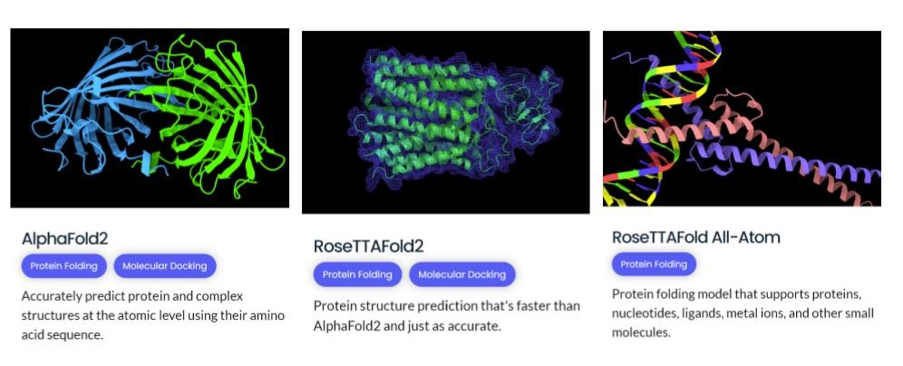
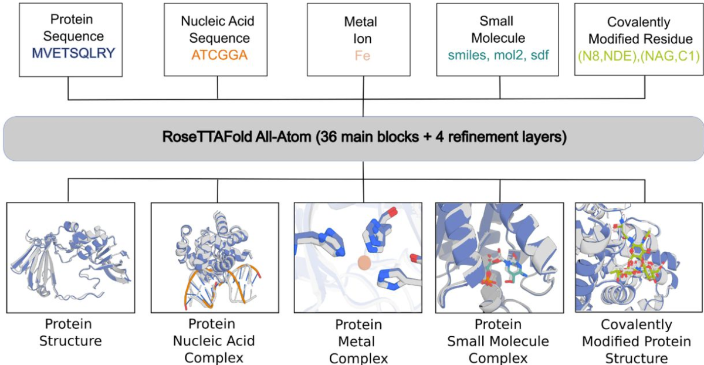
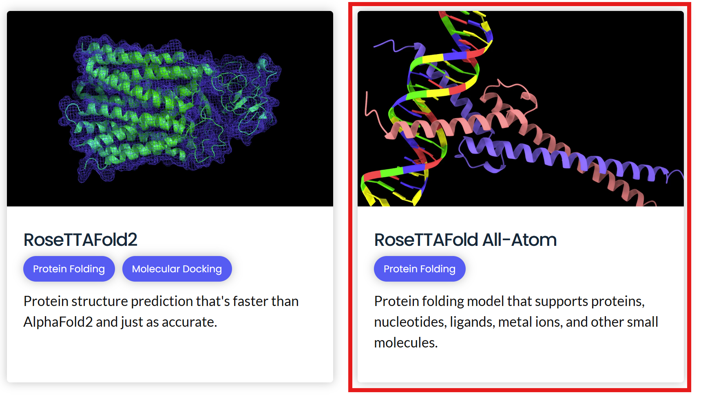
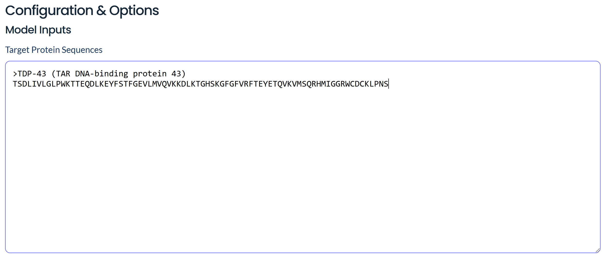
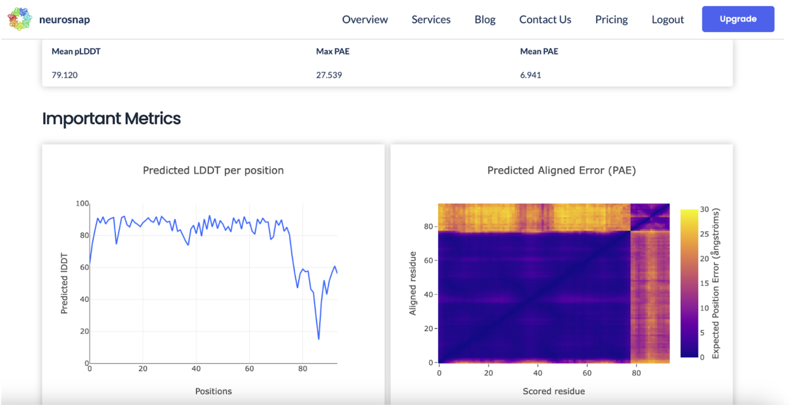

# RoseTTAFold-All Atom (RFAA) 
### Team members: Sally Ha, Mufei Li, Margaret Jones
## Table of Contents
* [Introduction](#introduction) 
* [Overview of RoseTTAFold-All Atom](#overview-of-rosettafold-all-atom)
* [How RFAA Works](#how-rfaa-works)
* [Example of RFAA Usage](#example-of-rfaa-usage)
* [References](#references)

## Introduction
In bioinformatics, computational modeling tools are powerful resources that allow researchers to simulate and analyze complex biological systems. By using algorithms and mathematical models, computational modeling tools create virtual representations of real-world processes, such as gene expression and biochemical reactions. Through these tools, we can obtain more insights into protein folding, enzyme kinetics, and cell signaling pathways. The insights gained from computational modeling tools ultimately drive advancements in medicine and bioinformatics research. 



*__Figure 1__: Some examples of known computational modeling tools. As shown above, each modeling tool has its own unique capabilities, with RoseTTAFold-All Atom having the most advanced modeling options compared to similar tools.*

Given that computational modeling tools play an important role in advancing biological discoveries, we will now take a closer look at a next-generation protein prediction tool and its application in bioinformatics and biological research: RoseTTAFold-All Atom.

## Overview of RoseTTAFold-All Atom
RoseTTAFold-All Atom (RFAA) is an advanced neural network that uses deep learning to predict and model complex biological assemblies. Developed by the [Baker Lab](https://www.bakerlab.org/) at the University of Washington, RFAA is trained using complete assemblies from the [Protein Data Bank (PDB)](https://www.rcsb.org/).

Some features of RFAA include the following:
* Ability to predict a variety of protein complexes and interactions with other molecules
* Faster performance compared to other computational methods

One of the goals of biological research is to gain a better understanding of the structure and function of various biological components, and RFAA can help in this objective because it provides a more accurate representation of protein behavior. In nature, proteins typically do not function alone and often form complexes with other proteins, interact with DNA and RNA in transcription and translation, and engage with small molecules during metabolism. Unlike other structure prediction models that are limited to predicting protein structures alone, RFAA offers a significant advancement by enabling the prediction of not only protein-protein interactions but also protein-small molecule complexes, such as those involving nucleic acids, covalent modifications, and ions. This expanded capability provides a more comprehensive understanding of biological interactions.

## How RFAA Works
RFAA was trained on a curation of complexes from Protein Data Bank, including 121,800 protein-small molecule structures, 112,546 protein-metal complexes, and 12,689 structures with covalently modified amino acids. It learned further about the general properties of small molecules with information from the Cambridge Structural Database, a comprehensive repository of experimentally determined small molecule crystal structures. The underlying model of RFAA is built on a deep learning framework, extending the principles of neural networks used in previous tools like AlphaFold2. The diversity of the training dataset combined with the robust deep learning model, allows RFAA to deliver state-of-the-art accuracy in predicting the structures and interactions of complex systems.

RoseTTAFold All-Atom (RFAA) offers advanced capabilities that distinguish itself from its predecessors, such as AlphaFold2 (AF2). Compared to AF2, RFAA can not only predict the 3D structure of a protein, but also model complex systems, including protein-nucleic acid interactions, protein-metal ion coordination, protein-small molecule binding, and covalently modified residues. For proteins and nucleic acids, RFAA accepts their respective sequences as input. Additionally, it supports metal ion specifications and uses SMILES strings for small molecule inputs, enabling versatile and precise modeling. The output for RFAA is a PDB file, which contains information about the 3D structural coordinates of the system. The PDB file can be opened in visualization software such as PyMOL, MOE, Schrödinger, ChimeraX, etc., to be further studied.



*__Figure 2__: RFAA processes input data related to the molecular composition of a biomolecular assembly. This includes information on protein amino acid and nucleic acid base sequences, metal ions, the bonded structure of small molecules, and covalent bonds between small molecules and proteins.*

## Example of RFAA Usage
To demo how RFAA works, we’re going to use a program called Neurosnap. Neurosnap is a public platform that is maintained with state of the art tools in different categories, such as protein folding, drug design, docking etc. It has an incorporated, easy to use platform, where you can explore the tools by running them with some basic information.

To follow along, first navigate to the [Neurosnap](https://neurosnap.ai/services) webpage. This allows you to then register for the free version of Neurosnap, which includes 5 jobs per month and is sufficient for this demo. Once you have created an account, navigate to the __“Services”__ tab, search for __“Rose”__, scroll down and click on __“RoseTTAFold-All Atom”__ as seen in the image below:



Here we’re using RFAA to model a protein sequence of a mutated TDP-43 protein--which is associated with neurodegenerative diseases--and its interaction with a single stranded DNA commonly used to test the binding capabilities of TDP-43. This mutated form of TDP-43 was discovered and tested in this [paper](https://www.nature.com/articles/srep21581) by Chiang, CH., Grauffel, C., Wu, LS. *et al.* The outputted results by RFAA, as you will see, are applicable in determining the effect that the mutations in this paper (e.g. D169G mutation) have in influencing TDP-43’s interaction with DNA.

### Step 1:
Input the following protein sequence of the mutated TDP-43 protein in the box labeled as __“Target Protein Sequences”__: 
```
>TDP-43 (TAR DNA-binding protein 43)
TSDLIVLGLPWKTTEQDLKEYFSTFGEVLMVQVKKDLKTGHSKGFGFVRFTEYETQVKVMSQRHMIGGRWCDCKLPNS
```


### Step 2:
Input the following ssDNA sequence in the box labeled __“Target Nucleotide Sequences”__:
```
>ssDNA
TTGAGCGT
```


### Step 3:
Leave all other parameters, scroll to the bottom of the page and click __“Run Job”__. This may take a couple minutes, but you will be able to keep track of the status of your job on the top of the screen.

### Results:
Your results should look something like the model shown below. RFAA will show you the model confidence score (pLDDT) for all parts of your model. In our case, the mutated TDP-43 protein is displayed as blue and indicates higher model confidence. On the other hand, the ssDNA is displayed as yellow and orange and indicates lower model confidence. In theory, this makes sense because with such a short strand of nucleotides, it becomes harder to determine its unique configuration. You can also click and drag the model to look at different angles or change the viewing type (ie. lower the opacity of either one of the inputs).


Moving on from the actual model itself, you can scroll further down the page to see some important statistical metrics about your model.

These include the:
* __pLDDT__: per-residue confidence score ranging from 0 to 100, indicates the reliability of the predicted structure
* __PAE (Predicted Aligned Error)__: positional error between any two residues in the protein

The mean pLDDT and PAE are listed in the box directly below the model for the entire output. You can also see these values for more specific positions in the charts below. There is also a heatmap of the PAE with the scored residue as the x axis and aligned residue as the y axis. Large blocks of blue near the diagonal indicate well-defined structural regions, such as protein domains or secondary structures. The heatmap shows the PAE at the scored residue x relative to the aligned residue y, with a low PAE represented by a darker blue color and high PAE represented by yellow. You can then zoom in and out to determine the PAE for specific regions of the aligned structure. 



This concludes our demo and lesson on RoseTTAFold-All Atom! We hope that through this demonstration, you've not only gained a deeper understanding of RFAA, but also developed a broader appreciation for various computational modeling tools and their critical role in advancing bioinformatics. These tools are essential for tackling complex biological questions, helping researchers make informed decisions, and accelerating scientific discoveries in areas like protein structure prediction, drug design, and genomics. 

## References
1. Rohith Krishna et al. ,Generalized biomolecular modeling and design with RoseTTAFold All-Atom.Science 384, eadl2528 (2024). DOI: [10.1126/science.adl2528](https://www.science.org/doi/10.1126/science.adl2528)
2. Chiang, CH., Grauffel, C., Wu, LS. et al. Structural analysis of disease-related TDP-43 D169G mutation: linking enhanced stability and caspase cleavage efficiency to protein accumulation. Sci Rep 6, 21581 (2016). https://doi.org/10.1038/srep21581
3. RFAA GitHub: https://github.com/baker-laboratory/RoseTTAFold-All-Atom/tree/main
4. Neurosnap: https://neurosnap.ai/services 