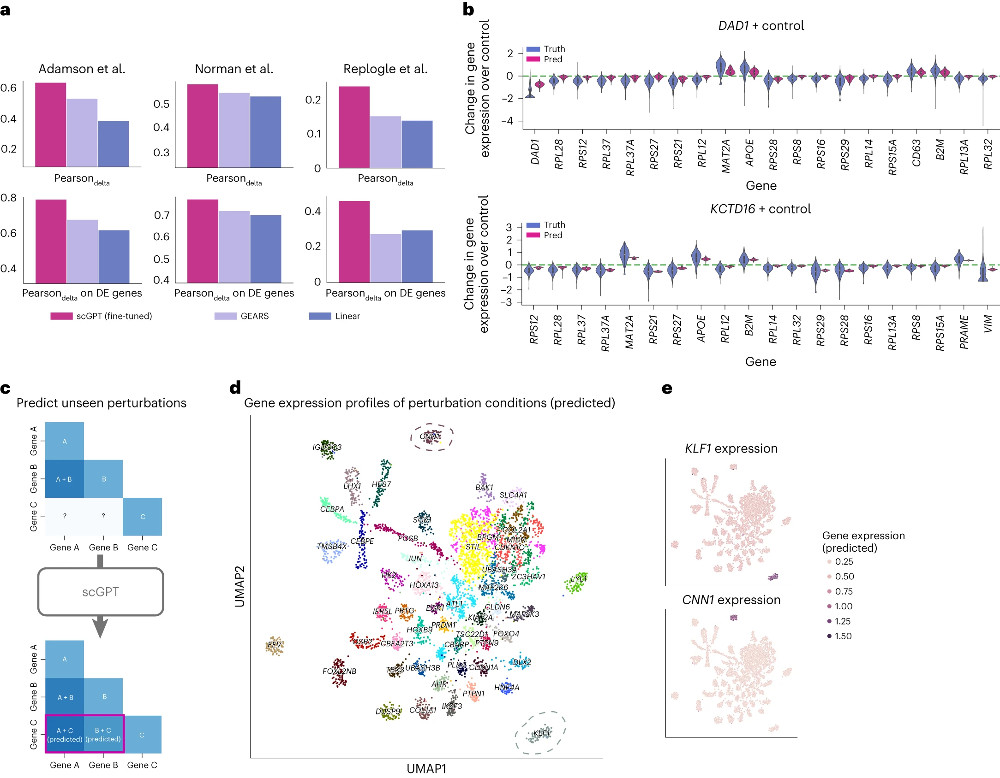
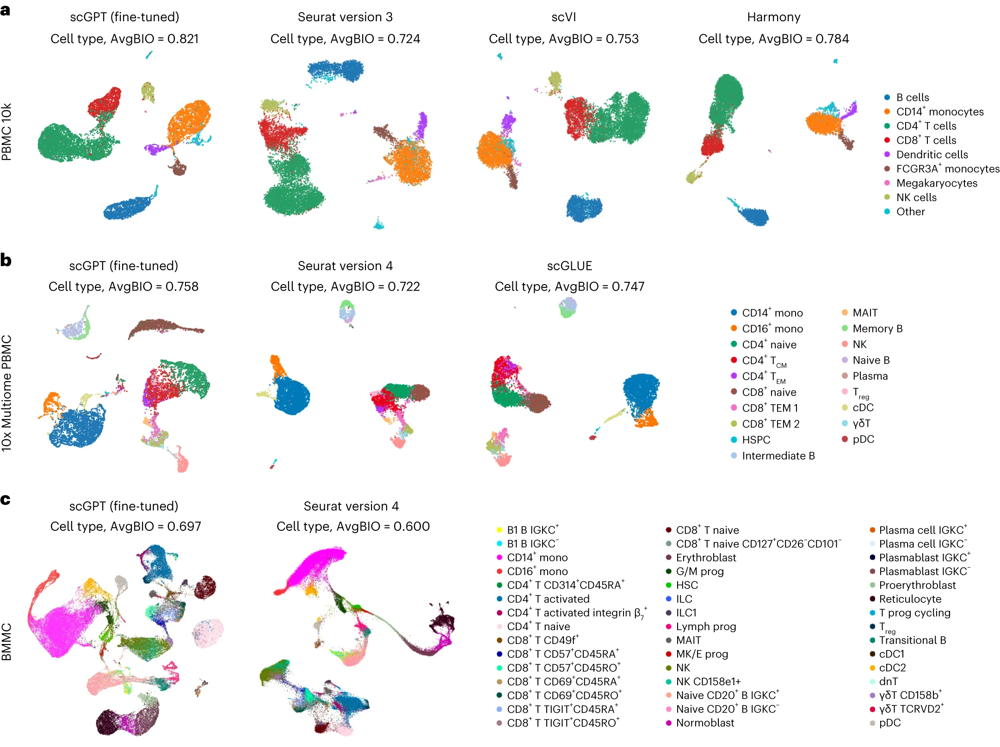
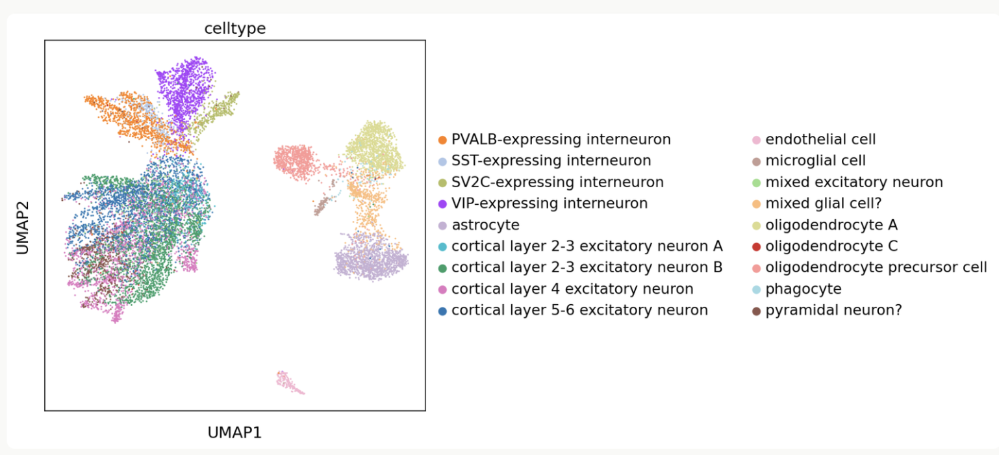
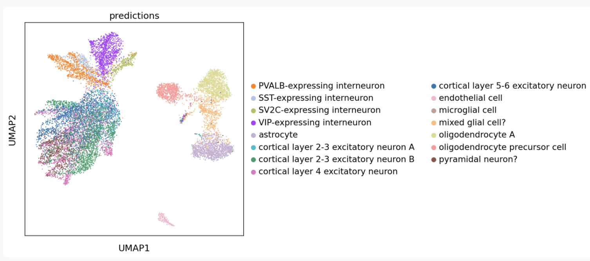
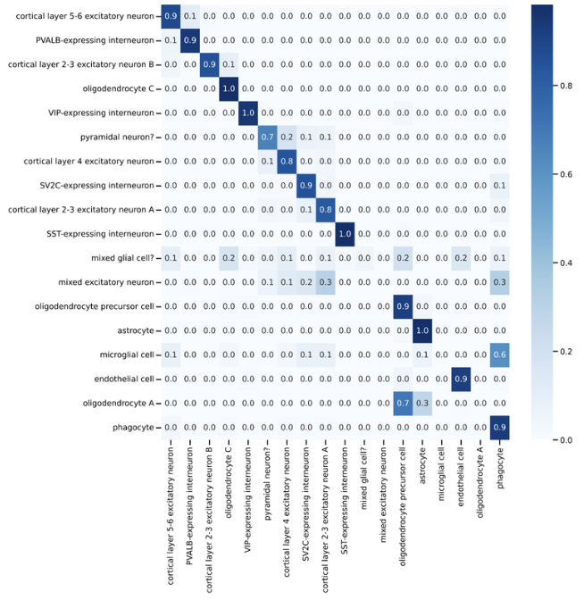
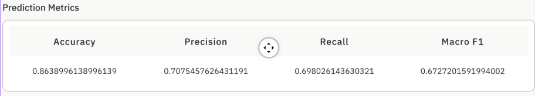

# scGPT: Generative AI Analysis of Single Cell Sequencing Data
### Team 8: Safa Saeed, Honieh Hemati, and Saara Kriplani

* [Background](#background)
* [What is scGPT?](#what-is-scgpt)
* [How does scGPT work?](#how-does-scgpt-work)
* [Application I: Gene Perturbations](#application-i-gene-perturbations)
* [Application II: Multi-Batch Integration](#application-ii-multi-batch-integration)
* [Tutorial: Cell Annotation App](#tutorial-cell-annotation-app)
* [Conclusion](#conclusion)
* [Sources](#sources)

---

## Background
Single cell RNA sequencing (scRNA-seq) is a technique used to extract and analyze RNA from an individual cell. Usually, with bulk RNA sequencing, we take RNA from a large population of cells and average gene expression values, which can lose information about the heterogeneity of individual cells. scRNA-seq provides a solution to this issue, allowing us to focus on the functions and expression patterns of distinct cell types.

The main output of scRNA-seq is a gene expression matrix, where we get values corresponding to the expression levels of specific genes within the cell of interest. We can use this expression matrix to generate an expression profile for the cell, allowing different cells to be compared and clustered together. 

---

## What is scGPT?

[Single Cell Generative Pre-Training Transformer](https://doi.org/10.1038/s41592-024-02201-0), or scGPT, is a tool introduced by the University of Toronto's Wang Lab published earlier this year. This tool is an exciting and significant advancement in single cell analysis. 

Single-cell sequencing produces a wide variety of information that must be analyzed effectively to draw conclusions about features like gene expression and gene interactions. Current ML methods of analyzing single cell data are specific to a certain task, and are thus limited in scope. In comparison, scGPT uses a **“Pretraining Universally, Fine-Tuning on Demand”** approach which enables a diverse range of downstream tasks. 

In other words, scGPT is an all-in-one tool that can be easily customized for any single-cell omics use. 

#### scGPT can be fine-tuned for a variety of downstream analyses, including...
 
- Clustering
- Batch Correction
- Cell Type Annotation 
- Gene network inference
- Multi-omics integration 
- Perturbation prediction

## How does scGPT work?
 
scGPT utilizes advanced techniques in machine learning to analyze and predict gene interactions, leveraging a vast and diverse dataset of single-cell RNA sequencing (scRNA-seq) data. To begin, researchers gathered data on 33 million cells from a cell atlas to pretain the model, including information on cell type, gene interactions, and more. 

The three main inputs taken from the scRNA-seq data are: 

- Gene name tokens
- Gene expression values
- Condition tokens (e.g. whether the cell came from a cancer patient)

These values are mapped into representative numerical vectors which are calculated by PyTorch embedding layers. Next, there is a self-attention transformer that takes in embedding vectors and calculates attention scores, which are higher for genes that are more likely to interact with each other.

After the pretraining phase, the embedding and attention process can be repeated on a smaller, focused dataset to fine-tune for specific purposes. The final attention-weighted embedding vectors for each gene now contain information that can be used for downstream analysis.

The core feature of scGPT is the **self-attention transformer**, which incorporates context, i.e. how one gene is influenced by the other genes.

## Application I: Gene Perturbations

One application of scGPT is the prediction of gene perturbation effects. In other words, it can determine how altering a gene could impact expression levels. 

Based on Section A (top left) in the figure below, fine-tuned scGPT (seen in pink) performs better than two leading methods, GEARS and Linear, at predicting gene expression changes compared to actual experimental results. 

In Section B (top right), we can see change in expression values compared to control levels for two perturbed genes, DAD1 and KCTD16. Evidently, the value predicted by scGPT (in pink) falls within the true (in blue) expression values for each gene. 

In Section D and E, we can see clusters labeled by perturbed genes, and the predicted gene expression profiles cluster distinctly based on which gene is modified. 

## Application II: Multi-Batch Integration 

Another useful application is multi-batch and multi-omic integration. It is often difficult to draw conclusions from data collected from different cell batches or different forms of expression data, and scGPT excels at identifying cell types even with this added complexity.

The datasets in the figure below are multi-batch, and the bottom two rows are multi-omic; this means they include data from sequencing techniques such as ChIP-seq and ATAC-seq in addition to RNA-seq. 

We can see that scGPT outperforms other models like Seurat and scGLUE, with the highest AvgBIO score for all datasets. Also, scGPT is better at finding distinct clusters in this multi-batch and -omic data. Looking at the second row, the brown cluster corresponding with CD8+ naive cells is not distinctly separated from the green CD4+ naive cells in the Seurat and scGLUE models. In contrast, the same cluster is completely separated in the scGPT UMAP, highlighting scGPT's high performance in classifying cells from multi-omic and multi-batch data sources. 

## Tutorial: Cell Annotation App 

scGPT can be installed locally through [the researchers' Github page](https://github.com/bowang-lab/scGPT), though the process can be confusing without knowledge of machine learning. So, the researchers have also provided links to [online interfaces](https://app.superbio.ai/apps/274?id=64d205cb980ff714de831ee0) where you can run scGPT fine-tuned on your own single cell RNA data. We will go through a tutorial on running the cell annotation app, which predicts cell types.

Below is an image of what the website looks like. You can upload your files and modify parameters if necessary. We used the demo data for the figures in this tutorial.

Here are the first few rows of the reference demo data, which contains information on gene variability. There is another file that provides cell type labels for the reference data, which get used as the training set for the test data.

Once scGPT is finished running, we get a few output figures. The first is a UMAP visualization of the control data with the prelabeled cell types.

In comparison, here are the clusters for the same data, but with cell labels predicted by the fine-tuned scGPT cell annotation model. The two UMAP plots look almost identical, with only a few small differences in labels.

The model also outputs a confusion matrix. As we can see, the strongest correlation is along the diagonal, proving that the actual cell labels usually match the predicted cell labels. We have an accuracy of 0.86, precision of 0.71, and recall of 0.7, which is quite reliable.

## Conclusion

Overall, we can see that scGPT is an extremely useful tool for processing and interpreting single cell sequencing results. Not only does it perform better than existing machine learning methods, but it also provides a wider range of downstream analyses, making it a promising development in the field of bioinformatics. 

## Sources 

bowang-lab. (2023). scGPT. *Github.* 
https://github.com/bowang-lab/scGPT

Cui, H., Wang, C., Maan, H., Pang, K., Luo, F., Duan, N., & Wang, B. (2024). scGPT: Toward building a foundation model for single-cell multi-omics using generative AI. *Nature Methods, 21*, 1470-1480. https://doi.org/10.1038/s41592-024-02201-0 

Superbio.ai (2023). scGPT: Fine-tuning on pre-trained model for cell-type annotation. https://app.superbio.ai/apps/64d205cb980ff714de831ee0