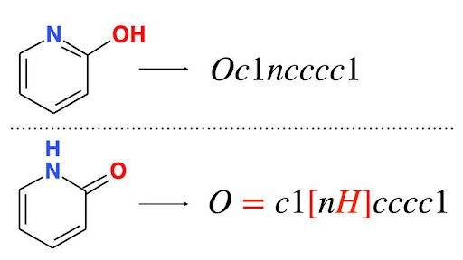
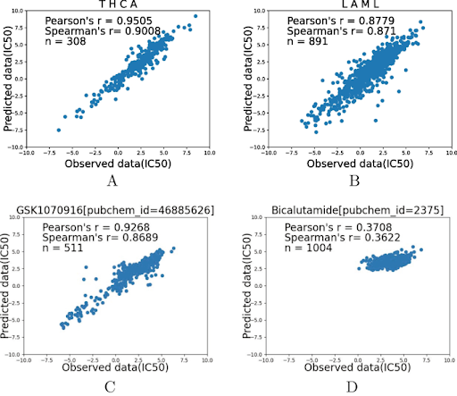

# Group 16 DeepAEG

## Introduction

### Background
Cancer is a disease that affects millions of people worldwide, and there is no single cure for cancer due to the heterogeneity of patients, the diversity of the disease itself, and the uncertainty of
drug efficacy. Because of this, it is incredibly difficult to treat resulting in losses worldwide. A hopeful solution to this issue is the idea of individualized cancer treatments, in which we can utilize
a patient's genotype and their unique drug reactions in order to improve therapeutic effect while reducing drug usage side effects. In order to efficiently narrow down treatments for patients and predict
drug responses, we can utilize machine learning. 
### Limitations of Past Models
Several models have been proposed, such as simple logistic regression models, SVMs, and more as well as more complicated models like tCNNs(maybe embed
links) and DeepTTA. However, these models face limitations that cause the model to lose vital information during feature learning. One example of this is the loss of important molecular structural information such
as charge and stereoisomerism due to the nature of the molecular fingerprinting/SMILES that is used to linearly encode drug structure. 

Due to this, graph based approaches gained popularity because the natural structure of drugs can easily be represented using a graph as well as the power of GCNs that can integrate multiple omics features.
DeepCDR is a popular graph-based model that achieves excellent results compared to traditional models, but its performance is still impeded due to the loss of molecular bond information due to the 
intricate nature of molecular edge characterization and the constraints that come with updating edges in graph-based systems. Molecular bonds are as vital as molecular structure, so the loss of this information
results in the results of the model taking a huge hit. Because of this, it is absolutely necessary to optimize and improve the edge updating fusion algorithm.

### The Advantages of DeepAEG 
To overcome the limitations described above, the Zhejiang lab proposed a novel multi-source heterogeneous graph convolutional neural network, also known as DeepAEG. 

## Procedure

### Data Processing
In order for DeepAEG to accurately predict the IC50 value (half-maximal inhibitory concentration) of the cancer treatment drugs, the model requires two types of data: drug representation data and patient genomic data. 

First, cancer drugs are represented in two different forms to accurately capture its chemical structure and detailed molecular interactions. In the graph representation of the drug, 
cancer drugs are modeled as molecular graphs, with atoms as nodes and bonds as edges. A Complete Graph Convolutional Network (CGCN) is used by the model to dynamically update both node and edge 
features to capture atom-bond interactions. It ensures that bond characteristics (e.g., type, polarity) are incorporated into the molecular representation. In sequence representation, drugs are 
represented as text using SMILES strings. 

This data is then processed by the model to capture higher-level structural information. By representing drug representation in two different forms, this increases data diversity and improves the model’s 
robustness by exposing it to different structural variations of the same molecule. 

Secondly, Deep AEG also requires patient genomic data in order to predict the drug response efficiency of cancer patients. In order to capture the dynamic and complex nature of genomic data, 
DeepAEG incorporates four different multi-omics data: gene mutations, gene expression levels, DNA methylation pattern, and copy number variations data. Each data type is then processed by a 
dedicated 1D Convolutional Neural Network (CNN). The outputs are combined using an attention mechanism to highlight the most relevant genomic features for predicting drug responses.

### Combining Features
After feature extraction, two separate drug and genomic data are concatenated into a single feature vector, which shows the comprehensive representation of the drug-cell line interaction. 
By analyzing these combined vectors, machine learning models can predict how a particular cell line will react to a specific drug, often measured as an IC50 value. This process ensures that the model integrates 
complementary information from two different sources. From the unified vector, drug features provide insights into the molecular structure and properties, and genomic features reveal how the cell line might respond 
to those properties based on the patient's genetic characteristics.

### Training and Testing 
After the feature, the acquired single drug-cell line pair vector can be used  for the training of the DeepAEG model. Zhejiang lab has acquired their training and testing datasets from Genomics of Drug 
Sensitivity in Cancer and Cancer Cell Line Encyclopedia databases. The datasets included approximately 106,500 interaction instances and 561 cancer cell lines and 221 drugs. For the training datasets, the drug-cell 
line vector is then put into the prediction network with known IC50 values (log-transformed for normalization) as a label. Beside training, the model also goes through an optimization process for better prediction 
of drug response efficiency. DeepAEG uses the AdamW optimizer, which combines adaptive learning rates with weight decay to prevent overfitting and improve convergence. The learning rate is set to 10−310−3, fine-tuned
for stable and efficient convergence. Beside optimizer the model also uses loss function to minimize the Mean Squared Error (MSE) between the predicted and true IC50 values. Once training is complete, the model can 
predict IC50 values for unseen drug-cell line pairs, guiding cancer drug efficacy assessments.

### Performance of DeepAEG
To assess the performance of the DeepAEG model, Zhejiang lab compared the method with six other methods using metrics such as Root Mean Square Error (RMSE), Pearson’s Correlation Coefficient (PCC), and 
Spearman's Correlation Coefficient (SCC). As you can see, DeepAEG showed highest accuracy predicting IC50 value among other 6 models. Compared to all other 6 models, DeepAEG showed the highest PCC and SCC values 
and lowest RMSE values; the model was able to predict the IC50 accurately and precisely with better performance.

Moreover, Zhejiang lab also assessed prediction performance on different cancers and drugs. The DeepAEG model was consistently highly performed over all cell lines, with Pearson’s correlation between 0.878 and 0.951.
It showed the best performance in thyroid carcinoma and GSK1070916 which is an ATP competitive inhibitor used for antitumor activity. 

## Application 

### Established Success
After the aforementioned training and optimization phases, the Zhejiang lab tasked the model with predicting 17,845 drug-cell line interactions that were deliberately missing from the previous 106,494 dug-cell 
line interactions that the model was trained on. From this testing, they were able to narrow down the 10 best and 10 worst drugs in terms of their ability to inhibit cancer cell growth.

This violin plot shows those testing results, from which the model was able to identify Bortezomib as the most effective drug for treating myeloma. This result is consistent with the actual drug cell line data 
which goes to show the strength of applying DeepAEG as a prediction tool once the supervised training has been done.

### Advanced Treatment Production
One promising application of DeepAEG is the use of its predictive capabilities to investigate untested drug-cell line interactions. Using this model to help determine which drugs in consideration will be the 
most effective, and would therefore be worth pursuing for advancement into costly clinical trials. This can be done with both completely new and untested drugs as well as for drug repurposing, where existing 
FDA-approved drugs are tested for application against other cancer subtypes.

### Personalized Medicine
Perhaps the most important application of DeepAEG is of course employing the model in the realm of personalized medicine. By taking in multi-omics data from the patient’s cells, DeepAEG will be able to make a 
prediction on which established drugs are best suited for that specific patient’s condition. This level of precise predicting could reduce trial-and-error approaches in oncology, greatly streamlining the process of 
creating a personal treatment plan, and improving patient outcomes and quality of care.

### Stop and Think:
How might the underlying architecture behind the DeepAEG model be repurposed and applied to other non-cancer diseases? 

## Citations
Lao C, Zheng P, Chen H, Liu Q, An F, Li Z. “DeepAEG: a model for predicting cancer drug response based on data enhancement and edge-&nbsp;&nbsp;&nbsp;&nbspcollaborative update strategies.” BMC Bioinformatics. 2024 Mar 9;25(1):105. 
doi: 10.1186/s12859-024-05723-8. PMID: 38461284; PMCID: PMC10925015.

