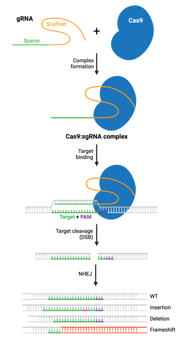
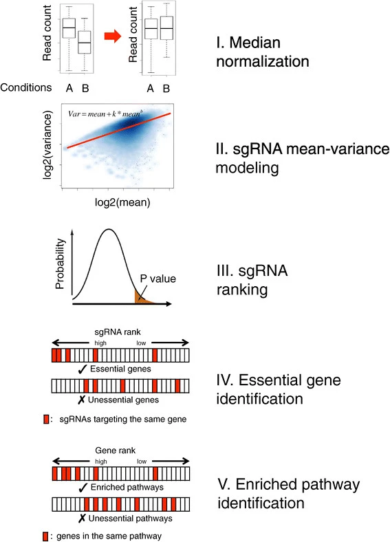

# CRISPR and MAGeCK: Advances in Genome Editing and Functional Genomics Analysis

## Table of Contents

- [CRISPR](#11-crispr)
- [CRISPR Workflow](#12-crispr-workflow)
- [MAGeCK](#13-mageck)
- [Applications](#14-applications)
   - [Identifying Disease Related Genes](#14-applications) 
   - [Synthetic Lethality Studies](#14-applications) 
   - [Functional Annotation of Genes in Biological Pathways](#14-applications) 
   
## 1.1 CRISPR
CRISPR (Clustered Regularly Interspaced Short Palindromic Repeats) is a genome-editing tool that allows researchers to make precise changes to DNA in cells. The most common type of CRISPR utilizes the enzyme Cas-9 to target specific DNA regions, where it cuts the DNA and creates a “double-stranded break” to facilitate edits, insertions, or deletions of the DNA. Let’s take a closer dive into the workflow of the CRISPR machinery and how it is able to accurately target specific DNA sequences and make changes quickly yet effectively.

*Figure 1: CRISPR Overview.*

## 1.2 CRISPR Workflow
The first step involves creating a large-scale CRISPR library that contains [guide RNAs](https://genomebiology.biomedcentral.com/articles/10.1186/s13059-015-0784-0) (gRNAs) that target thousands of genes across the entire genome of the target organism. Each gRNA has been designed to guide the Cas9 enzyme and machinery to a specific gene and knock it out. Once this CRISPR library has been created, it can be introduced into a population of thousands of cells, typically using a viral delivery system. The goal here is that each cell takes up a unique gRNA, and thus in each cell, a different targeted gene is knocked out.

In our population of cells, each cell contains a different knocked-out gene. Researchers can then take these modified cells and expose them to specific environmental conditions such as drug treatment or environmental stressors such as extreme heat, and observe how the gene knockouts affect cell survival, growth, or abnormal behavior in response. After the experiment has been completed (typically a general amount of time set by the researcher or upon observation of a specific result in the population of cells), researchers can sequence the remaining gRNAs to determine which genes were essential for survival or conferred resistance. 

*Figure 2: CRISPR workflow*

## 1.3 MAGeCK
[MAGeCK](https://genomebiology.biomedcentral.com/articles/10.1186/s13059-014-0554-4) (Model-Based Analysis of Genome-Wide CRISPR-Cas9 Knockout) is a bioinformatics tool designed to analyze the data collected from the CRISPR screens. The goal is to identify genes that significantly affect a particular phenotype, such as cell survival or drug resistance. The tool performs statistical tests to determine which genes show significant enrichment or depletion in those environmental conditions.

Going into more detail, the tool uses a negative binomial model to handle the count-based data generated by the CRISPR screens. This model is necessary to ensure robust handling of variability that could be present within the data and normalization across experimental replicates. The tool uses these tests to rank genes by their importance based on how their knockouts impact the cells under study and provides a list of the most influential genes in the condition tested.

Alternate versions of MAGeCK such as [MAGeCK-VISPR](https://genomebiology.biomedcentral.com/articles/10.1186/s13059-015-0843-6) or [MAGeCKFlute](https://pubmed.ncbi.nlm.nih.gov/30710114/) can add additional capabilities for quality control and visualization of CRISPR screen data. These upgrades allow researchers to assess experimental quality, model gene essentiality under multiple conditions, and interactively explore results.

*Figure 3: MAGeCK overview.*

## 1.4 Applications

### 1) Identifying Disease Related Genes
MAGeCK is most commonly used in functional genomics to help identify genes that are essential for the survival of disease-causing cells like cancer cells. By performing CRISPR screens on these cells and analyzing the data with MAGeCK, researchers can identify potential therapeutic target genes whose disruption could selectively kill or inhibit cancer cells, leading to novel treatment approaches.

### 2) Synthetic Lethality Studies
MAGeCK is used to explore synthetic lethality, where the combination of two gene knockouts leads to cell death, but neither gene alone is lethal. This method of approach is significant in cancer research as it is used for targeting genetic vulnerabilities specific to cancer cells. MAGeCK helps pinpoint gene pairs where one gene's knockout is lethal only in the presence of another knockout, offering a pathway for designing the targeted cancer treatments.

### 3) Functional Annotation of Genes in Biological Pathways
MAGeCK can identify genes involved in specific cellular pathways by analyzing CRISPR screens under varying conditions, such as stress, nutrient deprivation, or immune challenges. This helps in mapping out the functions of less-understood genes and understanding how complex biological networks work, especially in diseases where these pathways are disrupted.

## 

After MAGeCK helps prioritize and rank these genes based on their impact on cell viability or response to treatment, relevant genes can be treated in vivo. Cas9 cleaves the DNA, at which point CRISPR allows scientists to add, remove, or alter specific genes at the cut site. This enables the correction of genetic mutations, the knockout of certain genes, or the insertion of new genetic information, allowing for a range of applications from basic research to potential therapies.

# References
Addgene. "CRISPR Guide: A Resource for Understanding and Using CRISPR Technology." Addgene, https://www.addgene.org/guides/crispr/.

Li, W., Xu, H., Xiao, T. et al. MAGeCK enables robust identification of essential genes from genome-scale CRISPR/Cas9 knockout screens. Genome Biol 15, 554 (2014). https://doi.org/10.1186/s13059-014-0554-4

Novatein Biosciences. "CRISPR Explained." Novatein Biosciences, https://novateinbio.com/content/96-crispr-explained.
